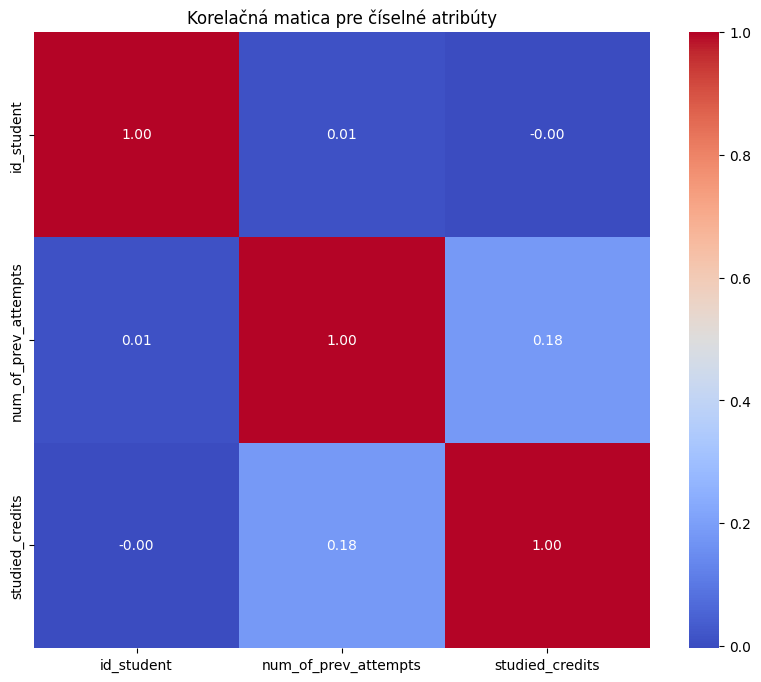
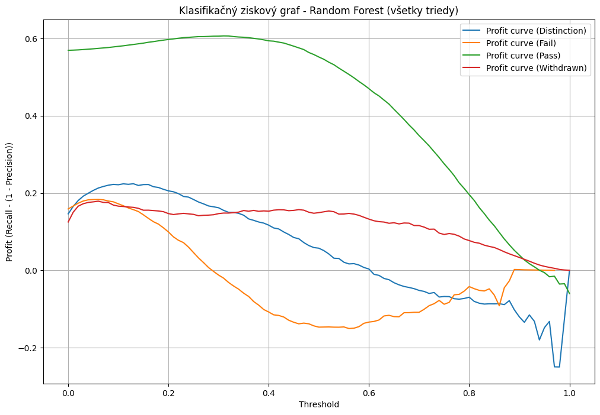
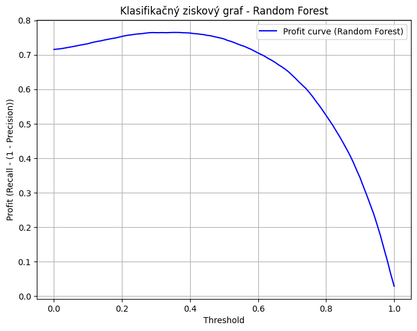

```python
# Import necessary libraries
import pandas as pd

# Load the datasets provided by the user
assessment = pd.read_csv('data/assessments.csv')
courses = pd.read_csv('data/courses.csv')
student_assessment = pd.read_csv('data/studentAssessment.csv')
student_info = pd.read_csv('data/studentInfo.csv')
student_registration = pd.read_csv('data/studentRegistration.csv')
student_vle = pd.read_csv('data/studentVle.csv')
vle = pd.read_csv('data/vle.csv')
```


```python
# Display basic information about each dataset to understand their structure
assessment_info = assessment.info()
courses_info = courses.info()
student_assessment_info = student_assessment.info()
student_info_info = student_info.info()
student_registration_info = student_registration.info()
student_vle_info = student_vle.info()
vle_info = vle.info()

```

    <class 'pandas.core.frame.DataFrame'>
    RangeIndex: 206 entries, 0 to 205
    Data columns (total 6 columns):
     #   Column             Non-Null Count  Dtype  
    ---  ------             --------------  -----  
     0   code_module        206 non-null    object 
     1   code_presentation  206 non-null    object 
     2   id_assessment      206 non-null    int64  
     3   assessment_type    206 non-null    object 
     4   date               195 non-null    float64
     5   weight             206 non-null    float64
    dtypes: float64(2), int64(1), object(3)
    memory usage: 9.8+ KB
    <class 'pandas.core.frame.DataFrame'>
    RangeIndex: 22 entries, 0 to 21
    Data columns (total 3 columns):
     #   Column                      Non-Null Count  Dtype 
    ---  ------                      --------------  ----- 
     0   code_module                 22 non-null     object
     1   code_presentation           22 non-null     object
     2   module_presentation_length  22 non-null     int64 
    dtypes: int64(1), object(2)
    memory usage: 660.0+ bytes
    <class 'pandas.core.frame.DataFrame'>
    RangeIndex: 173912 entries, 0 to 173911
    Data columns (total 5 columns):
     #   Column          Non-Null Count   Dtype  
    ---  ------          --------------   -----  
     0   id_assessment   173912 non-null  int64  
     1   id_student      173912 non-null  int64  
     2   date_submitted  173912 non-null  int64  
     3   is_banked       173912 non-null  int64  
     4   score           173739 non-null  float64
    dtypes: float64(1), int64(4)
    memory usage: 6.6 MB
    <class 'pandas.core.frame.DataFrame'>
    RangeIndex: 32593 entries, 0 to 32592
    Data columns (total 12 columns):
     #   Column                Non-Null Count  Dtype 
    ---  ------                --------------  ----- 
     0   code_module           32593 non-null  object
     1   code_presentation     32593 non-null  object
     2   id_student            32593 non-null  int64 
     3   gender                32593 non-null  object
     4   region                32593 non-null  object
     5   highest_education     32593 non-null  object
     6   imd_band              31482 non-null  object
     7   age_band              32593 non-null  object
     8   num_of_prev_attempts  32593 non-null  int64 
     9   studied_credits       32593 non-null  int64 
     10  disability            32593 non-null  object
     11  final_result          32593 non-null  object
    dtypes: int64(3), object(9)
    memory usage: 3.0+ MB
    <class 'pandas.core.frame.DataFrame'>
    RangeIndex: 32593 entries, 0 to 32592
    Data columns (total 5 columns):
     #   Column               Non-Null Count  Dtype  
    ---  ------               --------------  -----  
     0   code_module          32593 non-null  object 
     1   code_presentation    32593 non-null  object 
     2   id_student           32593 non-null  int64  
     3   date_registration    32548 non-null  float64
     4   date_unregistration  10072 non-null  float64
    dtypes: float64(2), int64(1), object(2)
    memory usage: 1.2+ MB
    <class 'pandas.core.frame.DataFrame'>
    RangeIndex: 10655280 entries, 0 to 10655279
    Data columns (total 6 columns):
     #   Column             Dtype 
    ---  ------             ----- 
     0   code_module        object
     1   code_presentation  object
     2   id_student         int64 
     3   id_site            int64 
     4   date               int64 
     5   sum_click          int64 
    dtypes: int64(4), object(2)
    memory usage: 487.8+ MB
    <class 'pandas.core.frame.DataFrame'>
    RangeIndex: 6364 entries, 0 to 6363
    Data columns (total 6 columns):
     #   Column             Non-Null Count  Dtype  
    ---  ------             --------------  -----  
     0   id_site            6364 non-null   int64  
     1   code_module        6364 non-null   object 
     2   code_presentation  6364 non-null   object 
     3   activity_type      6364 non-null   object 
     4   week_from          1121 non-null   float64
     5   week_to            1121 non-null   float64
    dtypes: float64(2), int64(1), object(3)
    memory usage: 298.4+ KB


```python
assessment
```


<div>
<style scoped>
    .dataframe tbody tr th:only-of-type {
        vertical-align: middle;
    }

    .dataframe tbody tr th {
        vertical-align: top;
    }

    .dataframe thead th {
        text-align: right;
    }
</style>
<table border="1" class="dataframe">
  <thead>
    <tr style="text-align: right;">
      <th></th>
      <th>code_module</th>
      <th>code_presentation</th>
      <th>id_assessment</th>
      <th>assessment_type</th>
      <th>date</th>
      <th>weight</th>
    </tr>
  </thead>
  <tbody>
    <tr>
      <th>0</th>
      <td>AAA</td>
      <td>2013J</td>
      <td>1752</td>
      <td>TMA</td>
      <td>19.0</td>
      <td>10.0</td>
    </tr>
    <tr>
      <th>1</th>
      <td>AAA</td>
      <td>2013J</td>
      <td>1753</td>
      <td>TMA</td>
      <td>54.0</td>
      <td>20.0</td>
    </tr>
    <tr>
      <th>2</th>
      <td>AAA</td>
      <td>2013J</td>
      <td>1754</td>
      <td>TMA</td>
      <td>117.0</td>
      <td>20.0</td>
    </tr>
    <tr>
      <th>3</th>
      <td>AAA</td>
      <td>2013J</td>
      <td>1755</td>
      <td>TMA</td>
      <td>166.0</td>
      <td>20.0</td>
    </tr>
    <tr>
      <th>4</th>
      <td>AAA</td>
      <td>2013J</td>
      <td>1756</td>
      <td>TMA</td>
      <td>215.0</td>
      <td>30.0</td>
    </tr>
    <tr>
      <th>...</th>
      <td>...</td>
      <td>...</td>
      <td>...</td>
      <td>...</td>
      <td>...</td>
      <td>...</td>
    </tr>
    <tr>
      <th>201</th>
      <td>GGG</td>
      <td>2014J</td>
      <td>37443</td>
      <td>CMA</td>
      <td>229.0</td>
      <td>0.0</td>
    </tr>
    <tr>
      <th>202</th>
      <td>GGG</td>
      <td>2014J</td>
      <td>37435</td>
      <td>TMA</td>
      <td>61.0</td>
      <td>0.0</td>
    </tr>
    <tr>
      <th>203</th>
      <td>GGG</td>
      <td>2014J</td>
      <td>37436</td>
      <td>TMA</td>
      <td>124.0</td>
      <td>0.0</td>
    </tr>
    <tr>
      <th>204</th>
      <td>GGG</td>
      <td>2014J</td>
      <td>37437</td>
      <td>TMA</td>
      <td>173.0</td>
      <td>0.0</td>
    </tr>
    <tr>
      <th>205</th>
      <td>GGG</td>
      <td>2014J</td>
      <td>37444</td>
      <td>Exam</td>
      <td>229.0</td>
      <td>100.0</td>
    </tr>
  </tbody>
</table>
<p>206 rows × 6 columns</p>
</div>


```python
courses
```


<div>
<style scoped>
    .dataframe tbody tr th:only-of-type {
        vertical-align: middle;
    }

    .dataframe tbody tr th {
        vertical-align: top;
    }

    .dataframe thead th {
        text-align: right;
    }
</style>
<table border="1" class="dataframe">
  <thead>
    <tr style="text-align: right;">
      <th></th>
      <th>code_module</th>
      <th>code_presentation</th>
      <th>module_presentation_length</th>
    </tr>
  </thead>
  <tbody>
    <tr>
      <th>0</th>
      <td>AAA</td>
      <td>2013J</td>
      <td>268</td>
    </tr>
    <tr>
      <th>1</th>
      <td>AAA</td>
      <td>2014J</td>
      <td>269</td>
    </tr>
    <tr>
      <th>2</th>
      <td>BBB</td>
      <td>2013J</td>
      <td>268</td>
    </tr>
    <tr>
      <th>3</th>
      <td>BBB</td>
      <td>2014J</td>
      <td>262</td>
    </tr>
    <tr>
      <th>4</th>
      <td>BBB</td>
      <td>2013B</td>
      <td>240</td>
    </tr>
    <tr>
      <th>5</th>
      <td>BBB</td>
      <td>2014B</td>
      <td>234</td>
    </tr>
    <tr>
      <th>6</th>
      <td>CCC</td>
      <td>2014J</td>
      <td>269</td>
    </tr>
    <tr>
      <th>7</th>
      <td>CCC</td>
      <td>2014B</td>
      <td>241</td>
    </tr>
    <tr>
      <th>8</th>
      <td>DDD</td>
      <td>2013J</td>
      <td>261</td>
    </tr>
    <tr>
      <th>9</th>
      <td>DDD</td>
      <td>2014J</td>
      <td>262</td>
    </tr>
    <tr>
      <th>10</th>
      <td>DDD</td>
      <td>2013B</td>
      <td>240</td>
    </tr>
    <tr>
      <th>11</th>
      <td>DDD</td>
      <td>2014B</td>
      <td>241</td>
    </tr>
    <tr>
      <th>12</th>
      <td>EEE</td>
      <td>2013J</td>
      <td>268</td>
    </tr>
    <tr>
      <th>13</th>
      <td>EEE</td>
      <td>2014J</td>
      <td>269</td>
    </tr>
    <tr>
      <th>14</th>
      <td>EEE</td>
      <td>2014B</td>
      <td>241</td>
    </tr>
    <tr>
      <th>15</th>
      <td>FFF</td>
      <td>2013J</td>
      <td>268</td>
    </tr>
    <tr>
      <th>16</th>
      <td>FFF</td>
      <td>2014J</td>
      <td>269</td>
    </tr>
    <tr>
      <th>17</th>
      <td>FFF</td>
      <td>2013B</td>
      <td>240</td>
    </tr>
    <tr>
      <th>18</th>
      <td>FFF</td>
      <td>2014B</td>
      <td>241</td>
    </tr>
    <tr>
      <th>19</th>
      <td>GGG</td>
      <td>2013J</td>
      <td>261</td>
    </tr>
    <tr>
      <th>20</th>
      <td>GGG</td>
      <td>2014J</td>
      <td>269</td>
    </tr>
    <tr>
      <th>21</th>
      <td>GGG</td>
      <td>2014B</td>
      <td>241</td>
    </tr>
  </tbody>
</table>
</div>


```python
student_assessment
```


<div>
<style scoped>
    .dataframe tbody tr th:only-of-type {
        vertical-align: middle;
    }

    .dataframe tbody tr th {
        vertical-align: top;
    }

    .dataframe thead th {
        text-align: right;
    }
</style>
<table border="1" class="dataframe">
  <thead>
    <tr style="text-align: right;">
      <th></th>
      <th>id_assessment</th>
      <th>id_student</th>
      <th>date_submitted</th>
      <th>is_banked</th>
      <th>score</th>
    </tr>
  </thead>
  <tbody>
    <tr>
      <th>0</th>
      <td>1752</td>
      <td>11391</td>
      <td>18</td>
      <td>0</td>
      <td>78.0</td>
    </tr>
    <tr>
      <th>1</th>
      <td>1752</td>
      <td>28400</td>
      <td>22</td>
      <td>0</td>
      <td>70.0</td>
    </tr>
    <tr>
      <th>2</th>
      <td>1752</td>
      <td>31604</td>
      <td>17</td>
      <td>0</td>
      <td>72.0</td>
    </tr>
    <tr>
      <th>3</th>
      <td>1752</td>
      <td>32885</td>
      <td>26</td>
      <td>0</td>
      <td>69.0</td>
    </tr>
    <tr>
      <th>4</th>
      <td>1752</td>
      <td>38053</td>
      <td>19</td>
      <td>0</td>
      <td>79.0</td>
    </tr>
    <tr>
      <th>...</th>
      <td>...</td>
      <td>...</td>
      <td>...</td>
      <td>...</td>
      <td>...</td>
    </tr>
    <tr>
      <th>173907</th>
      <td>37443</td>
      <td>527538</td>
      <td>227</td>
      <td>0</td>
      <td>60.0</td>
    </tr>
    <tr>
      <th>173908</th>
      <td>37443</td>
      <td>534672</td>
      <td>229</td>
      <td>0</td>
      <td>100.0</td>
    </tr>
    <tr>
      <th>173909</th>
      <td>37443</td>
      <td>546286</td>
      <td>215</td>
      <td>0</td>
      <td>80.0</td>
    </tr>
    <tr>
      <th>173910</th>
      <td>37443</td>
      <td>546724</td>
      <td>230</td>
      <td>0</td>
      <td>100.0</td>
    </tr>
    <tr>
      <th>173911</th>
      <td>37443</td>
      <td>558486</td>
      <td>224</td>
      <td>0</td>
      <td>80.0</td>
    </tr>
  </tbody>
</table>
<p>173912 rows × 5 columns</p>
</div>


```python
student_info
```


<div>
<style scoped>
    .dataframe tbody tr th:only-of-type {
        vertical-align: middle;
    }

    .dataframe tbody tr th {
        vertical-align: top;
    }

    .dataframe thead th {
        text-align: right;
    }
</style>
<table border="1" class="dataframe">
  <thead>
    <tr style="text-align: right;">
      <th></th>
      <th>code_module</th>
      <th>code_presentation</th>
      <th>id_student</th>
      <th>gender</th>
      <th>region</th>
      <th>highest_education</th>
      <th>imd_band</th>
      <th>age_band</th>
      <th>num_of_prev_attempts</th>
      <th>studied_credits</th>
      <th>disability</th>
      <th>final_result</th>
    </tr>
  </thead>
  <tbody>
    <tr>
      <th>0</th>
      <td>AAA</td>
      <td>2013J</td>
      <td>11391</td>
      <td>M</td>
      <td>East Anglian Region</td>
      <td>HE Qualification</td>
      <td>90-100%</td>
      <td>55&lt;=</td>
      <td>0</td>
      <td>240</td>
      <td>N</td>
      <td>Pass</td>
    </tr>
    <tr>
      <th>1</th>
      <td>AAA</td>
      <td>2013J</td>
      <td>28400</td>
      <td>F</td>
      <td>Scotland</td>
      <td>HE Qualification</td>
      <td>20-30%</td>
      <td>35-55</td>
      <td>0</td>
      <td>60</td>
      <td>N</td>
      <td>Pass</td>
    </tr>
    <tr>
      <th>2</th>
      <td>AAA</td>
      <td>2013J</td>
      <td>30268</td>
      <td>F</td>
      <td>North Western Region</td>
      <td>A Level or Equivalent</td>
      <td>30-40%</td>
      <td>35-55</td>
      <td>0</td>
      <td>60</td>
      <td>Y</td>
      <td>Withdrawn</td>
    </tr>
    <tr>
      <th>3</th>
      <td>AAA</td>
      <td>2013J</td>
      <td>31604</td>
      <td>F</td>
      <td>South East Region</td>
      <td>A Level or Equivalent</td>
      <td>50-60%</td>
      <td>35-55</td>
      <td>0</td>
      <td>60</td>
      <td>N</td>
      <td>Pass</td>
    </tr>
    <tr>
      <th>4</th>
      <td>AAA</td>
      <td>2013J</td>
      <td>32885</td>
      <td>F</td>
      <td>West Midlands Region</td>
      <td>Lower Than A Level</td>
      <td>50-60%</td>
      <td>0-35</td>
      <td>0</td>
      <td>60</td>
      <td>N</td>
      <td>Pass</td>
    </tr>
    <tr>
      <th>...</th>
      <td>...</td>
      <td>...</td>
      <td>...</td>
      <td>...</td>
      <td>...</td>
      <td>...</td>
      <td>...</td>
      <td>...</td>
      <td>...</td>
      <td>...</td>
      <td>...</td>
      <td>...</td>
    </tr>
    <tr>
      <th>32588</th>
      <td>GGG</td>
      <td>2014J</td>
      <td>2640965</td>
      <td>F</td>
      <td>Wales</td>
      <td>Lower Than A Level</td>
      <td>10-20</td>
      <td>0-35</td>
      <td>0</td>
      <td>30</td>
      <td>N</td>
      <td>Fail</td>
    </tr>
    <tr>
      <th>32589</th>
      <td>GGG</td>
      <td>2014J</td>
      <td>2645731</td>
      <td>F</td>
      <td>East Anglian Region</td>
      <td>Lower Than A Level</td>
      <td>40-50%</td>
      <td>35-55</td>
      <td>0</td>
      <td>30</td>
      <td>N</td>
      <td>Distinction</td>
    </tr>
    <tr>
      <th>32590</th>
      <td>GGG</td>
      <td>2014J</td>
      <td>2648187</td>
      <td>F</td>
      <td>South Region</td>
      <td>A Level or Equivalent</td>
      <td>20-30%</td>
      <td>0-35</td>
      <td>0</td>
      <td>30</td>
      <td>Y</td>
      <td>Pass</td>
    </tr>
    <tr>
      <th>32591</th>
      <td>GGG</td>
      <td>2014J</td>
      <td>2679821</td>
      <td>F</td>
      <td>South East Region</td>
      <td>Lower Than A Level</td>
      <td>90-100%</td>
      <td>35-55</td>
      <td>0</td>
      <td>30</td>
      <td>N</td>
      <td>Withdrawn</td>
    </tr>
    <tr>
      <th>32592</th>
      <td>GGG</td>
      <td>2014J</td>
      <td>2684003</td>
      <td>F</td>
      <td>Yorkshire Region</td>
      <td>HE Qualification</td>
      <td>50-60%</td>
      <td>35-55</td>
      <td>0</td>
      <td>30</td>
      <td>N</td>
      <td>Distinction</td>
    </tr>
  </tbody>
</table>
<p>32593 rows × 12 columns</p>
</div>


```python
student_registration
```


<div>
<style scoped>
    .dataframe tbody tr th:only-of-type {
        vertical-align: middle;
    }

    .dataframe tbody tr th {
        vertical-align: top;
    }

    .dataframe thead th {
        text-align: right;
    }
</style>
<table border="1" class="dataframe">
  <thead>
    <tr style="text-align: right;">
      <th></th>
      <th>code_module</th>
      <th>code_presentation</th>
      <th>id_student</th>
      <th>date_registration</th>
      <th>date_unregistration</th>
    </tr>
  </thead>
  <tbody>
    <tr>
      <th>0</th>
      <td>AAA</td>
      <td>2013J</td>
      <td>11391</td>
      <td>-159.0</td>
      <td>NaN</td>
    </tr>
    <tr>
      <th>1</th>
      <td>AAA</td>
      <td>2013J</td>
      <td>28400</td>
      <td>-53.0</td>
      <td>NaN</td>
    </tr>
    <tr>
      <th>2</th>
      <td>AAA</td>
      <td>2013J</td>
      <td>30268</td>
      <td>-92.0</td>
      <td>12.0</td>
    </tr>
    <tr>
      <th>3</th>
      <td>AAA</td>
      <td>2013J</td>
      <td>31604</td>
      <td>-52.0</td>
      <td>NaN</td>
    </tr>
    <tr>
      <th>4</th>
      <td>AAA</td>
      <td>2013J</td>
      <td>32885</td>
      <td>-176.0</td>
      <td>NaN</td>
    </tr>
    <tr>
      <th>...</th>
      <td>...</td>
      <td>...</td>
      <td>...</td>
      <td>...</td>
      <td>...</td>
    </tr>
    <tr>
      <th>32588</th>
      <td>GGG</td>
      <td>2014J</td>
      <td>2640965</td>
      <td>-4.0</td>
      <td>NaN</td>
    </tr>
    <tr>
      <th>32589</th>
      <td>GGG</td>
      <td>2014J</td>
      <td>2645731</td>
      <td>-23.0</td>
      <td>NaN</td>
    </tr>
    <tr>
      <th>32590</th>
      <td>GGG</td>
      <td>2014J</td>
      <td>2648187</td>
      <td>-129.0</td>
      <td>NaN</td>
    </tr>
    <tr>
      <th>32591</th>
      <td>GGG</td>
      <td>2014J</td>
      <td>2679821</td>
      <td>-49.0</td>
      <td>101.0</td>
    </tr>
    <tr>
      <th>32592</th>
      <td>GGG</td>
      <td>2014J</td>
      <td>2684003</td>
      <td>-28.0</td>
      <td>NaN</td>
    </tr>
  </tbody>
</table>
<p>32593 rows × 5 columns</p>
</div>


```python
student_vle
```


<div>
<style scoped>
    .dataframe tbody tr th:only-of-type {
        vertical-align: middle;
    }

    .dataframe tbody tr th {
        vertical-align: top;
    }

    .dataframe thead th {
        text-align: right;
    }
</style>
<table border="1" class="dataframe">
  <thead>
    <tr style="text-align: right;">
      <th></th>
      <th>code_module</th>
      <th>code_presentation</th>
      <th>id_student</th>
      <th>id_site</th>
      <th>date</th>
      <th>sum_click</th>
    </tr>
  </thead>
  <tbody>
    <tr>
      <th>0</th>
      <td>AAA</td>
      <td>2013J</td>
      <td>28400</td>
      <td>546652</td>
      <td>-10</td>
      <td>4</td>
    </tr>
    <tr>
      <th>1</th>
      <td>AAA</td>
      <td>2013J</td>
      <td>28400</td>
      <td>546652</td>
      <td>-10</td>
      <td>1</td>
    </tr>
    <tr>
      <th>2</th>
      <td>AAA</td>
      <td>2013J</td>
      <td>28400</td>
      <td>546652</td>
      <td>-10</td>
      <td>1</td>
    </tr>
    <tr>
      <th>3</th>
      <td>AAA</td>
      <td>2013J</td>
      <td>28400</td>
      <td>546614</td>
      <td>-10</td>
      <td>11</td>
    </tr>
    <tr>
      <th>4</th>
      <td>AAA</td>
      <td>2013J</td>
      <td>28400</td>
      <td>546714</td>
      <td>-10</td>
      <td>1</td>
    </tr>
    <tr>
      <th>...</th>
      <td>...</td>
      <td>...</td>
      <td>...</td>
      <td>...</td>
      <td>...</td>
      <td>...</td>
    </tr>
    <tr>
      <th>10655275</th>
      <td>GGG</td>
      <td>2014J</td>
      <td>675811</td>
      <td>896943</td>
      <td>269</td>
      <td>3</td>
    </tr>
    <tr>
      <th>10655276</th>
      <td>GGG</td>
      <td>2014J</td>
      <td>675578</td>
      <td>896943</td>
      <td>269</td>
      <td>1</td>
    </tr>
    <tr>
      <th>10655277</th>
      <td>GGG</td>
      <td>2014J</td>
      <td>654064</td>
      <td>896943</td>
      <td>269</td>
      <td>3</td>
    </tr>
    <tr>
      <th>10655278</th>
      <td>GGG</td>
      <td>2014J</td>
      <td>654064</td>
      <td>896939</td>
      <td>269</td>
      <td>1</td>
    </tr>
    <tr>
      <th>10655279</th>
      <td>GGG</td>
      <td>2014J</td>
      <td>654064</td>
      <td>896939</td>
      <td>269</td>
      <td>1</td>
    </tr>
  </tbody>
</table>
<p>10655280 rows × 6 columns</p>
</div>


```python
vle
```


<div>
<style scoped>
    .dataframe tbody tr th:only-of-type {
        vertical-align: middle;
    }

    .dataframe tbody tr th {
        vertical-align: top;
    }

    .dataframe thead th {
        text-align: right;
    }
</style>
<table border="1" class="dataframe">
  <thead>
    <tr style="text-align: right;">
      <th></th>
      <th>id_site</th>
      <th>code_module</th>
      <th>code_presentation</th>
      <th>activity_type</th>
      <th>week_from</th>
      <th>week_to</th>
    </tr>
  </thead>
  <tbody>
    <tr>
      <th>0</th>
      <td>546943</td>
      <td>AAA</td>
      <td>2013J</td>
      <td>resource</td>
      <td>NaN</td>
      <td>NaN</td>
    </tr>
    <tr>
      <th>1</th>
      <td>546712</td>
      <td>AAA</td>
      <td>2013J</td>
      <td>oucontent</td>
      <td>NaN</td>
      <td>NaN</td>
    </tr>
    <tr>
      <th>2</th>
      <td>546998</td>
      <td>AAA</td>
      <td>2013J</td>
      <td>resource</td>
      <td>NaN</td>
      <td>NaN</td>
    </tr>
    <tr>
      <th>3</th>
      <td>546888</td>
      <td>AAA</td>
      <td>2013J</td>
      <td>url</td>
      <td>NaN</td>
      <td>NaN</td>
    </tr>
    <tr>
      <th>4</th>
      <td>547035</td>
      <td>AAA</td>
      <td>2013J</td>
      <td>resource</td>
      <td>NaN</td>
      <td>NaN</td>
    </tr>
    <tr>
      <th>...</th>
      <td>...</td>
      <td>...</td>
      <td>...</td>
      <td>...</td>
      <td>...</td>
      <td>...</td>
    </tr>
    <tr>
      <th>6359</th>
      <td>897063</td>
      <td>GGG</td>
      <td>2014J</td>
      <td>resource</td>
      <td>NaN</td>
      <td>NaN</td>
    </tr>
    <tr>
      <th>6360</th>
      <td>897109</td>
      <td>GGG</td>
      <td>2014J</td>
      <td>resource</td>
      <td>NaN</td>
      <td>NaN</td>
    </tr>
    <tr>
      <th>6361</th>
      <td>896965</td>
      <td>GGG</td>
      <td>2014J</td>
      <td>oucontent</td>
      <td>NaN</td>
      <td>NaN</td>
    </tr>
    <tr>
      <th>6362</th>
      <td>897060</td>
      <td>GGG</td>
      <td>2014J</td>
      <td>resource</td>
      <td>NaN</td>
      <td>NaN</td>
    </tr>
    <tr>
      <th>6363</th>
      <td>897100</td>
      <td>GGG</td>
      <td>2014J</td>
      <td>resource</td>
      <td>NaN</td>
      <td>NaN</td>
    </tr>
  </tbody>
</table>
<p>6364 rows × 6 columns</p>
</div>


```python
#pip install pandas matplotlib seaborn

```


```python
import matplotlib.pyplot as plt
import seaborn as sns
```

POCHOPENIE DÁT [2. FÁZA CRISP-DM]

assessments.csv


```python
print("Základné štatistiky:")
print(assessment[['date', 'weight']].describe())

```

    Základné štatistiky:
                 date      weight
    count  195.000000  206.000000
    mean   145.005128   20.873786
    std     76.001119   30.384224
    min     12.000000    0.000000
    25%     71.000000    0.000000
    50%    152.000000   12.500000
    75%    222.000000   24.250000
    max    261.000000  100.000000


```python
assessment
```


<div>
<style scoped>
    .dataframe tbody tr th:only-of-type {
        vertical-align: middle;
    }

    .dataframe tbody tr th {
        vertical-align: top;
    }

    .dataframe thead th {
        text-align: right;
    }
</style>
<table border="1" class="dataframe">
  <thead>
    <tr style="text-align: right;">
      <th></th>
      <th>code_module</th>
      <th>code_presentation</th>
      <th>id_assessment</th>
      <th>assessment_type</th>
      <th>date</th>
      <th>weight</th>
    </tr>
  </thead>
  <tbody>
    <tr>
      <th>0</th>
      <td>AAA</td>
      <td>2013J</td>
      <td>1752</td>
      <td>TMA</td>
      <td>19.0</td>
      <td>10.0</td>
    </tr>
    <tr>
      <th>1</th>
      <td>AAA</td>
      <td>2013J</td>
      <td>1753</td>
      <td>TMA</td>
      <td>54.0</td>
      <td>20.0</td>
    </tr>
    <tr>
      <th>2</th>
      <td>AAA</td>
      <td>2013J</td>
      <td>1754</td>
      <td>TMA</td>
      <td>117.0</td>
      <td>20.0</td>
    </tr>
    <tr>
      <th>3</th>
      <td>AAA</td>
      <td>2013J</td>
      <td>1755</td>
      <td>TMA</td>
      <td>166.0</td>
      <td>20.0</td>
    </tr>
    <tr>
      <th>4</th>
      <td>AAA</td>
      <td>2013J</td>
      <td>1756</td>
      <td>TMA</td>
      <td>215.0</td>
      <td>30.0</td>
    </tr>
    <tr>
      <th>...</th>
      <td>...</td>
      <td>...</td>
      <td>...</td>
      <td>...</td>
      <td>...</td>
      <td>...</td>
    </tr>
    <tr>
      <th>201</th>
      <td>GGG</td>
      <td>2014J</td>
      <td>37443</td>
      <td>CMA</td>
      <td>229.0</td>
      <td>0.0</td>
    </tr>
    <tr>
      <th>202</th>
      <td>GGG</td>
      <td>2014J</td>
      <td>37435</td>
      <td>TMA</td>
      <td>61.0</td>
      <td>0.0</td>
    </tr>
    <tr>
      <th>203</th>
      <td>GGG</td>
      <td>2014J</td>
      <td>37436</td>
      <td>TMA</td>
      <td>124.0</td>
      <td>0.0</td>
    </tr>
    <tr>
      <th>204</th>
      <td>GGG</td>
      <td>2014J</td>
      <td>37437</td>
      <td>TMA</td>
      <td>173.0</td>
      <td>0.0</td>
    </tr>
    <tr>
      <th>205</th>
      <td>GGG</td>
      <td>2014J</td>
      <td>37444</td>
      <td>Exam</td>
      <td>229.0</td>
      <td>100.0</td>
    </tr>
  </tbody>
</table>
<p>206 rows × 6 columns</p>
</div>


```python
# Barplot pre kategorickú premennú assessment_type
plt.figure(figsize=(10, 5))
sns.countplot(data=assessment, x='assessment_type', palette='viridis')
plt.title('Počet hodnotení podľa typu')
plt.xlabel('Typ hodnotenia')
plt.ylabel('Počet hodnotení')
plt.show()
```

    C:\Users\majky\AppData\Local\Temp\ipykernel_17400\429887298.py:3: FutureWarning: 
    
    Passing `palette` without assigning `hue` is deprecated and will be removed in v0.14.0. Assign the `x` variable to `hue` and set `legend=False` for the same effect.
    
      sns.countplot(data=assessment, x='assessment_type', palette='viridis')


    

    


```python
# Boxplot pre atribúty date a weight
plt.figure(figsize=(12, 5))
```


    <Figure size 1200x500 with 0 Axes>


    <Figure size 1200x500 with 0 Axes>


```python
# Boxplot pre date
sns.boxplot(data=assessment, x='assessment_type', y='date', palette='viridis')
plt.title('Boxplot pre dátum odovzdania podľa typu hodnotenia')
plt.xlabel('Typ hodnotenia')
plt.ylabel('Počet dní od začatia kurzu')
```

    C:\Users\majky\AppData\Local\Temp\ipykernel_17400\2043154750.py:2: FutureWarning: 
    
    Passing `palette` without assigning `hue` is deprecated and will be removed in v0.14.0. Assign the `x` variable to `hue` and set `legend=False` for the same effect.
    
      sns.boxplot(data=assessment, x='assessment_type', y='date', palette='viridis')


    Text(0, 0.5, 'Počet dní od začatia kurzu')


    

    


```python
# Check if 'date_submitted' column exists in 'assessment' DataFrame
if 'date' in assessment.columns:
    exam_outliers = assessment[(assessment['assessment_type'] == 'Exam') & (assessment['date'] > 250)]
else:
    print("Error: 'date' column does not exist in 'assessment' DataFrame.")

```


```python
exam_outlier_counts = exam_outliers['date'].value_counts()
exam_outlier_counts #1 outlier pre Exam hodnotenie
```


    date
    261.0    1
    Name: count, dtype: int64


```python
cma_outliers = assessment[(assessment['assessment_type'] == 'CMA') & (assessment['date'] < 47)]
cma_outlier_counts = cma_outliers['date'].value_counts()
```


```python
cma_outlier_counts
```


    date
    18.0    2
    23.0    1
    Name: count, dtype: int64


```python
# Boxplot pre weight
sns.boxplot(data=assessment, x='assessment_type', y='weight', palette='viridis')
plt.title('Boxplot pre váhu hodnotenia podľa typu hodnotenia')
plt.xlabel('Typ hodnotenia')
plt.ylabel('Váha (%)')
```

    C:\Users\majky\AppData\Local\Temp\ipykernel_17400\1309698868.py:2: FutureWarning: 
    
    Passing `palette` without assigning `hue` is deprecated and will be removed in v0.14.0. Assign the `x` variable to `hue` and set `legend=False` for the same effect.
    
      sns.boxplot(data=assessment, x='assessment_type', y='weight', palette='viridis')


    Text(0, 0.5, 'Váha (%)')


    

    


```python
# Chýbajúce hodnoty
print("Missing Values in Dataset:")
print(assessment.isnull().sum())
```

    Missing Values in Dataset:
    code_module           0
    code_presentation     0
    id_assessment         0
    assessment_type       0
    date                 11
    weight                0
    dtype: int64


courses.csv


```python
print("Základné štatistiky:")
print(courses.describe())

```

    Základné štatistiky:
           module_presentation_length
    count                   22.000000
    mean                   255.545455
    std                     13.654677
    min                    234.000000
    25%                    241.000000
    50%                    261.500000
    75%                    268.000000
    max                    269.000000


```python
courses
```


<div>
<style scoped>
    .dataframe tbody tr th:only-of-type {
        vertical-align: middle;
    }

    .dataframe tbody tr th {
        vertical-align: top;
    }

    .dataframe thead th {
        text-align: right;
    }
</style>
<table border="1" class="dataframe">
  <thead>
    <tr style="text-align: right;">
      <th></th>
      <th>code_module</th>
      <th>code_presentation</th>
      <th>module_presentation_length</th>
    </tr>
  </thead>
  <tbody>
    <tr>
      <th>0</th>
      <td>AAA</td>
      <td>2013J</td>
      <td>268</td>
    </tr>
    <tr>
      <th>1</th>
      <td>AAA</td>
      <td>2014J</td>
      <td>269</td>
    </tr>
    <tr>
      <th>2</th>
      <td>BBB</td>
      <td>2013J</td>
      <td>268</td>
    </tr>
    <tr>
      <th>3</th>
      <td>BBB</td>
      <td>2014J</td>
      <td>262</td>
    </tr>
    <tr>
      <th>4</th>
      <td>BBB</td>
      <td>2013B</td>
      <td>240</td>
    </tr>
    <tr>
      <th>5</th>
      <td>BBB</td>
      <td>2014B</td>
      <td>234</td>
    </tr>
    <tr>
      <th>6</th>
      <td>CCC</td>
      <td>2014J</td>
      <td>269</td>
    </tr>
    <tr>
      <th>7</th>
      <td>CCC</td>
      <td>2014B</td>
      <td>241</td>
    </tr>
    <tr>
      <th>8</th>
      <td>DDD</td>
      <td>2013J</td>
      <td>261</td>
    </tr>
    <tr>
      <th>9</th>
      <td>DDD</td>
      <td>2014J</td>
      <td>262</td>
    </tr>
    <tr>
      <th>10</th>
      <td>DDD</td>
      <td>2013B</td>
      <td>240</td>
    </tr>
    <tr>
      <th>11</th>
      <td>DDD</td>
      <td>2014B</td>
      <td>241</td>
    </tr>
    <tr>
      <th>12</th>
      <td>EEE</td>
      <td>2013J</td>
      <td>268</td>
    </tr>
    <tr>
      <th>13</th>
      <td>EEE</td>
      <td>2014J</td>
      <td>269</td>
    </tr>
    <tr>
      <th>14</th>
      <td>EEE</td>
      <td>2014B</td>
      <td>241</td>
    </tr>
    <tr>
      <th>15</th>
      <td>FFF</td>
      <td>2013J</td>
      <td>268</td>
    </tr>
    <tr>
      <th>16</th>
      <td>FFF</td>
      <td>2014J</td>
      <td>269</td>
    </tr>
    <tr>
      <th>17</th>
      <td>FFF</td>
      <td>2013B</td>
      <td>240</td>
    </tr>
    <tr>
      <th>18</th>
      <td>FFF</td>
      <td>2014B</td>
      <td>241</td>
    </tr>
    <tr>
      <th>19</th>
      <td>GGG</td>
      <td>2013J</td>
      <td>261</td>
    </tr>
    <tr>
      <th>20</th>
      <td>GGG</td>
      <td>2014J</td>
      <td>269</td>
    </tr>
    <tr>
      <th>21</th>
      <td>GGG</td>
      <td>2014B</td>
      <td>241</td>
    </tr>
  </tbody>
</table>
</div>


```python
numeric_columns = courses.select_dtypes(include=['float64', 'int64']).columns
```


```python
correlation_matrix = courses[numeric_columns].corr()
```


```python
# Heatmap
plt.figure(figsize=(8, 6))
sns.heatmap(correlation_matrix, annot=True, cmap='coolwarm', fmt='.2f')
plt.title('Korelačná matica pre courses')
plt.show()
```


    

    


```python
# Barplot pre dĺžku modulu
plt.figure(figsize=(8, 5))
sns.countplot(data=courses, x='module_presentation_length', palette='viridis')
plt.title('Počet modulov podľa dĺžky')
plt.xlabel('Dĺžka modulu (dni)')
plt.ylabel('Počet modulov')
plt.xticks(rotation=45)
plt.show()
```

    C:\Users\majky\AppData\Local\Temp\ipykernel_17400\1465880380.py:3: FutureWarning: 
    
    Passing `palette` without assigning `hue` is deprecated and will be removed in v0.14.0. Assign the `x` variable to `hue` and set `legend=False` for the same effect.
    
      sns.countplot(data=courses, x='module_presentation_length', palette='viridis')


    

    


```python
# Boxplot pre dĺžku modulu
plt.figure(figsize=(8, 5))
sns.boxplot(data=courses, x='module_presentation_length', palette='viridis')
plt.title('Boxplot pre dĺžku modulu')
plt.xlabel('Dĺžka modulu (dni)')
plt.show()
```

    C:\Users\majky\AppData\Local\Temp\ipykernel_17400\362189960.py:3: FutureWarning: 
    
    Passing `palette` without assigning `hue` is deprecated and will be removed in v0.14.0. Assign the `y` variable to `hue` and set `legend=False` for the same effect.
    
      sns.boxplot(data=courses, x='module_presentation_length', palette='viridis')


    

    


```python
print("Missing Values in Dataset:")
print(courses.isnull().sum())
```

    Missing Values in Dataset:
    code_module                   0
    code_presentation             0
    module_presentation_length    0
    dtype: int64


studentAssessment.csv


```python
print("Základné štatistiky:")
print(student_assessment[['date_submitted', 'is_banked', 'score']].describe())

```

    Základné štatistiky:
           date_submitted      is_banked          score
    count   173912.000000  173912.000000  173739.000000
    mean       116.032942       0.010977      75.799573
    std         71.484148       0.104194      18.798107
    min        -11.000000       0.000000       0.000000
    25%         51.000000       0.000000      65.000000
    50%        116.000000       0.000000      80.000000
    75%        173.000000       0.000000      90.000000
    max        608.000000       1.000000     100.000000


```python
student_assessment
```


<div>
<style scoped>
    .dataframe tbody tr th:only-of-type {
        vertical-align: middle;
    }

    .dataframe tbody tr th {
        vertical-align: top;
    }

    .dataframe thead th {
        text-align: right;
    }
</style>
<table border="1" class="dataframe">
  <thead>
    <tr style="text-align: right;">
      <th></th>
      <th>id_assessment</th>
      <th>id_student</th>
      <th>date_submitted</th>
      <th>is_banked</th>
      <th>score</th>
    </tr>
  </thead>
  <tbody>
    <tr>
      <th>0</th>
      <td>1752</td>
      <td>11391</td>
      <td>18</td>
      <td>0</td>
      <td>78.0</td>
    </tr>
    <tr>
      <th>1</th>
      <td>1752</td>
      <td>28400</td>
      <td>22</td>
      <td>0</td>
      <td>70.0</td>
    </tr>
    <tr>
      <th>2</th>
      <td>1752</td>
      <td>31604</td>
      <td>17</td>
      <td>0</td>
      <td>72.0</td>
    </tr>
    <tr>
      <th>3</th>
      <td>1752</td>
      <td>32885</td>
      <td>26</td>
      <td>0</td>
      <td>69.0</td>
    </tr>
    <tr>
      <th>4</th>
      <td>1752</td>
      <td>38053</td>
      <td>19</td>
      <td>0</td>
      <td>79.0</td>
    </tr>
    <tr>
      <th>...</th>
      <td>...</td>
      <td>...</td>
      <td>...</td>
      <td>...</td>
      <td>...</td>
    </tr>
    <tr>
      <th>173907</th>
      <td>37443</td>
      <td>527538</td>
      <td>227</td>
      <td>0</td>
      <td>60.0</td>
    </tr>
    <tr>
      <th>173908</th>
      <td>37443</td>
      <td>534672</td>
      <td>229</td>
      <td>0</td>
      <td>100.0</td>
    </tr>
    <tr>
      <th>173909</th>
      <td>37443</td>
      <td>546286</td>
      <td>215</td>
      <td>0</td>
      <td>80.0</td>
    </tr>
    <tr>
      <th>173910</th>
      <td>37443</td>
      <td>546724</td>
      <td>230</td>
      <td>0</td>
      <td>100.0</td>
    </tr>
    <tr>
      <th>173911</th>
      <td>37443</td>
      <td>558486</td>
      <td>224</td>
      <td>0</td>
      <td>80.0</td>
    </tr>
  </tbody>
</table>
<p>173912 rows × 5 columns</p>
</div>


```python
correlation_matrix = student_assessment.corr()
```


```python
# Heatmap
plt.figure(figsize=(8, 6))
sns.heatmap(correlation_matrix, annot=True, cmap='coolwarm', fmt='.2f')
plt.title('Correlation Matrix for studentAssessment')
plt.show()
```


    

    


```python
# Vizualizácia NUMERICKÝCH atribútov
# Boxplot for the 'score' attribute
plt.figure(figsize=(8, 6))
sns.boxplot(data=student_assessment, x='score')
plt.title('Boxplot of Score')
plt.xlabel('Score')
plt.show()
```


    

    


```python
#Vizualizácia KATEGORICKÉHO atribútu
# Bar plot for the 'is_banked' attribute
plt.figure(figsize=(8, 6))
sns.countplot(data=student_assessment, x='is_banked')
plt.title('Bar Plot of Is_Banked')
plt.xlabel('Is Banked')
plt.ylabel('Count')
plt.show()
```


    

    


```python
# Unikátne hodnoty is_banked
print("Unique Values in 'is_banked':")
print(student_assessment['is_banked'].value_counts())
```

    Unique Values in 'is_banked':
    is_banked
    0    172003
    1      1909
    Name: count, dtype: int64


```python
# Chýbajúce hodnoty
print("Missing Values in Dataset:")
print(student_assessment.isnull().sum())
```

    Missing Values in Dataset:
    id_assessment       0
    id_student          0
    date_submitted      0
    is_banked           0
    score             173
    dtype: int64


studentInfo.csv


```python
print("Základné štatistiky:")
print(student_info[['num_of_prev_attempts', 'studied_credits']].describe())

```

    Základné štatistiky:
           num_of_prev_attempts  studied_credits
    count          32593.000000     32593.000000
    mean               0.163225        79.758691
    std                0.479758        41.071900
    min                0.000000        30.000000
    25%                0.000000        60.000000
    50%                0.000000        60.000000
    75%                0.000000       120.000000
    max                6.000000       655.000000


```python
# Barplot pre kategórie
plt.figure(figsize=(12, 6))
sns.countplot(data=student_info, x='gender', palette="viridis")
plt.title('Počet študentov podľa pohlavia')
plt.xlabel('Pohlavie')
plt.ylabel('Počet študentov')
plt.show()

plt.figure(figsize=(12, 6))
sns.countplot(data=student_info, x='region', palette="viridis")
plt.title('Počet študentov podľa regiónu')
plt.xlabel('Región')
plt.ylabel('Počet študentov')
plt.xticks(rotation=45)
plt.show()

plt.figure(figsize=(12, 6))
sns.countplot(data=student_info, x='highest_education', palette="viridis")
plt.title('Počet študentov podľa najvyššieho vzdelania')
plt.xlabel('Najvyššie vzdelanie')
plt.ylabel('Počet študentov')
plt.show()

```

    C:\Users\majky\AppData\Local\Temp\ipykernel_17400\3384207042.py:3: FutureWarning: 
    
    Passing `palette` without assigning `hue` is deprecated and will be removed in v0.14.0. Assign the `x` variable to `hue` and set `legend=False` for the same effect.
    
      sns.countplot(data=student_info, x='gender', palette="viridis")


    

    


    C:\Users\majky\AppData\Local\Temp\ipykernel_17400\3384207042.py:10: FutureWarning: 
    
    Passing `palette` without assigning `hue` is deprecated and will be removed in v0.14.0. Assign the `x` variable to `hue` and set `legend=False` for the same effect.
    
      sns.countplot(data=student_info, x='region', palette="viridis")


    

    


    C:\Users\majky\AppData\Local\Temp\ipykernel_17400\3384207042.py:18: FutureWarning: 
    
    Passing `palette` without assigning `hue` is deprecated and will be removed in v0.14.0. Assign the `x` variable to `hue` and set `legend=False` for the same effect.
    
      sns.countplot(data=student_info, x='highest_education', palette="viridis")


    

    


```python
# Barplot pre výsledky študentov
plt.figure(figsize=(10, 6))
sns.countplot(data=student_info, x='final_result', palette='viridis')
plt.title('Barplot pre výsledky študentov')
plt.xlabel('Konečný výsledok')
plt.ylabel('Počet študentov')
plt.show()
```

    C:\Users\majky\AppData\Local\Temp\ipykernel_17400\219623960.py:3: FutureWarning: 
    
    Passing `palette` without assigning `hue` is deprecated and will be removed in v0.14.0. Assign the `x` variable to `hue` and set `legend=False` for the same effect.
    
      sns.countplot(data=student_info, x='final_result', palette='viridis')


    

    


```python
print(student_info.dtypes)
```

    code_module             object
    code_presentation       object
    id_student               int64
    gender                  object
    region                  object
    highest_education       object
    imd_band                object
    age_band                object
    num_of_prev_attempts     int64
    studied_credits          int64
    disability              object
    final_result            object
    dtype: object


```python
numeric_columns = student_info.select_dtypes(include=['float64', 'int64']).columns
```


```python
# Korelačná matica
correlation_matrix = student_info[numeric_columns].corr()

plt.figure(figsize=(10, 8))
sns.heatmap(correlation_matrix, annot=True, fmt='.2f', cmap='coolwarm', square=True)
plt.title('Korelačná matica pre číselné atribúty')
plt.show()
```


    

    


```python
# Chýbajúce hodnoty
print("Missing Values in Dataset:")
print(student_info.isnull().sum())
```

    Missing Values in Dataset:
    code_module                0
    code_presentation          0
    id_student                 0
    gender                     0
    region                     0
    highest_education          0
    imd_band                1111
    age_band                   0
    num_of_prev_attempts       0
    studied_credits            0
    disability                 0
    final_result               0
    dtype: int64


studentRegistration.csv


```python
print("Základné štatistiky:")
print(student_registration[['date_registration', 'date_unregistration']].describe())

```

    Základné štatistiky:
           date_registration  date_unregistration
    count       32548.000000         10072.000000
    mean          -69.411300            49.757645
    std            49.260522            82.460890
    min          -322.000000          -365.000000
    25%          -100.000000            -2.000000
    50%           -57.000000            27.000000
    75%           -29.000000           109.000000
    max           167.000000           444.000000


```python
student_registration
```


<div>
<style scoped>
    .dataframe tbody tr th:only-of-type {
        vertical-align: middle;
    }

    .dataframe tbody tr th {
        vertical-align: top;
    }

    .dataframe thead th {
        text-align: right;
    }
</style>
<table border="1" class="dataframe">
  <thead>
    <tr style="text-align: right;">
      <th></th>
      <th>code_module</th>
      <th>code_presentation</th>
      <th>id_student</th>
      <th>date_registration</th>
      <th>date_unregistration</th>
    </tr>
  </thead>
  <tbody>
    <tr>
      <th>0</th>
      <td>AAA</td>
      <td>2013J</td>
      <td>11391</td>
      <td>-159.0</td>
      <td>NaN</td>
    </tr>
    <tr>
      <th>1</th>
      <td>AAA</td>
      <td>2013J</td>
      <td>28400</td>
      <td>-53.0</td>
      <td>NaN</td>
    </tr>
    <tr>
      <th>2</th>
      <td>AAA</td>
      <td>2013J</td>
      <td>30268</td>
      <td>-92.0</td>
      <td>12.0</td>
    </tr>
    <tr>
      <th>3</th>
      <td>AAA</td>
      <td>2013J</td>
      <td>31604</td>
      <td>-52.0</td>
      <td>NaN</td>
    </tr>
    <tr>
      <th>4</th>
      <td>AAA</td>
      <td>2013J</td>
      <td>32885</td>
      <td>-176.0</td>
      <td>NaN</td>
    </tr>
    <tr>
      <th>...</th>
      <td>...</td>
      <td>...</td>
      <td>...</td>
      <td>...</td>
      <td>...</td>
    </tr>
    <tr>
      <th>32588</th>
      <td>GGG</td>
      <td>2014J</td>
      <td>2640965</td>
      <td>-4.0</td>
      <td>NaN</td>
    </tr>
    <tr>
      <th>32589</th>
      <td>GGG</td>
      <td>2014J</td>
      <td>2645731</td>
      <td>-23.0</td>
      <td>NaN</td>
    </tr>
    <tr>
      <th>32590</th>
      <td>GGG</td>
      <td>2014J</td>
      <td>2648187</td>
      <td>-129.0</td>
      <td>NaN</td>
    </tr>
    <tr>
      <th>32591</th>
      <td>GGG</td>
      <td>2014J</td>
      <td>2679821</td>
      <td>-49.0</td>
      <td>101.0</td>
    </tr>
    <tr>
      <th>32592</th>
      <td>GGG</td>
      <td>2014J</td>
      <td>2684003</td>
      <td>-28.0</td>
      <td>NaN</td>
    </tr>
  </tbody>
</table>
<p>32593 rows × 5 columns</p>
</div>


```python
# Kontrola počtu chýbajúcich hodnôt
missing_values = student_registration.isnull().sum()
print("Počet chýbajúcich hodnôt:\n", missing_values)
```

    Počet chýbajúcich hodnôt:
     code_module                0
    code_presentation          0
    id_student                 0
    date_registration         45
    date_unregistration    22521
    dtype: int64


```python
# Vytvorenie histogramu pre dátum registrácie
plt.figure(figsize=(10, 5))
sns.histplot(student_registration['date_registration'], bins=30, kde=True)
plt.title('Distribúcia dátumov registrácie')
plt.xlabel('Počet dní do začiatku kurzu')
plt.ylabel('Počet registrácií')
plt.show()
```


    

    


```python
# Vytvorenie histogramu pre dátum registrácie
plt.figure(figsize=(10, 5))
sns.histplot(student_registration['date_unregistration'], bins=30, kde=True)
plt.title('Distribúcia dátumov odhlásenia')
plt.xlabel('Počet dní od začiatku kurzu')
plt.ylabel('Počet odhlásení')
plt.show()
```


    

    


```python
# Vykreslenie korelačnej matice
plt.figure(figsize=(10, 6))
sns.heatmap(correlation_matrix, annot=True, fmt=".2f", cmap='coolwarm', cbar=True)
plt.title('Korelačná matica pre studentRegistration.csv')
plt.show()
```


    

    


```python
# Boxplot pre 'date_registration'
plt.figure(figsize=(10, 5))
sns.boxplot(data=student_registration, x='date_registration')
plt.title('Boxplot pre dátum registrácie')
plt.xlabel('Dátum registrácie (v dňoch od začiatku prezentácie)')
plt.show()
```


    

    


```python
# Chýbajúce hodnoty
print("Missing Values in Dataset:")
print(student_registration.isnull().sum())
```

    Missing Values in Dataset:
    code_module                0
    code_presentation          0
    id_student                 0
    date_registration         45
    date_unregistration    22521
    dtype: int64


studentVle


```python
print("Základné štatistiky:")
print(student_vle[['date', 'sum_click']].describe())

```

    Základné štatistiky:
                   date     sum_click
    count  1.065528e+07  1.065528e+07
    mean   9.517400e+01  3.716946e+00
    std    7.607130e+01  8.849047e+00
    min   -2.500000e+01  1.000000e+00
    25%    2.500000e+01  1.000000e+00
    50%    8.600000e+01  2.000000e+00
    75%    1.560000e+02  3.000000e+00
    max    2.690000e+02  6.977000e+03


```python
student_vle
```


<div>
<style scoped>
    .dataframe tbody tr th:only-of-type {
        vertical-align: middle;
    }

    .dataframe tbody tr th {
        vertical-align: top;
    }

    .dataframe thead th {
        text-align: right;
    }
</style>
<table border="1" class="dataframe">
  <thead>
    <tr style="text-align: right;">
      <th></th>
      <th>code_module</th>
      <th>code_presentation</th>
      <th>id_student</th>
      <th>id_site</th>
      <th>date</th>
      <th>sum_click</th>
    </tr>
  </thead>
  <tbody>
    <tr>
      <th>0</th>
      <td>AAA</td>
      <td>2013J</td>
      <td>28400</td>
      <td>546652</td>
      <td>-10</td>
      <td>4</td>
    </tr>
    <tr>
      <th>1</th>
      <td>AAA</td>
      <td>2013J</td>
      <td>28400</td>
      <td>546652</td>
      <td>-10</td>
      <td>1</td>
    </tr>
    <tr>
      <th>2</th>
      <td>AAA</td>
      <td>2013J</td>
      <td>28400</td>
      <td>546652</td>
      <td>-10</td>
      <td>1</td>
    </tr>
    <tr>
      <th>3</th>
      <td>AAA</td>
      <td>2013J</td>
      <td>28400</td>
      <td>546614</td>
      <td>-10</td>
      <td>11</td>
    </tr>
    <tr>
      <th>4</th>
      <td>AAA</td>
      <td>2013J</td>
      <td>28400</td>
      <td>546714</td>
      <td>-10</td>
      <td>1</td>
    </tr>
    <tr>
      <th>...</th>
      <td>...</td>
      <td>...</td>
      <td>...</td>
      <td>...</td>
      <td>...</td>
      <td>...</td>
    </tr>
    <tr>
      <th>10655275</th>
      <td>GGG</td>
      <td>2014J</td>
      <td>675811</td>
      <td>896943</td>
      <td>269</td>
      <td>3</td>
    </tr>
    <tr>
      <th>10655276</th>
      <td>GGG</td>
      <td>2014J</td>
      <td>675578</td>
      <td>896943</td>
      <td>269</td>
      <td>1</td>
    </tr>
    <tr>
      <th>10655277</th>
      <td>GGG</td>
      <td>2014J</td>
      <td>654064</td>
      <td>896943</td>
      <td>269</td>
      <td>3</td>
    </tr>
    <tr>
      <th>10655278</th>
      <td>GGG</td>
      <td>2014J</td>
      <td>654064</td>
      <td>896939</td>
      <td>269</td>
      <td>1</td>
    </tr>
    <tr>
      <th>10655279</th>
      <td>GGG</td>
      <td>2014J</td>
      <td>654064</td>
      <td>896939</td>
      <td>269</td>
      <td>1</td>
    </tr>
  </tbody>
</table>
<p>10655280 rows × 6 columns</p>
</div>


```python
#Zistenie dovodu vysokej korelacie medzi code_presentation a id_site
# Počet unikátnych kombinácií id_site a code_presentation
unique_combinations = vle.groupby(['id_site', 'code_presentation']).size().reset_index(name='count')
print("Počet unikátnych kombinácií id_site a code_presentation:", len(unique_combinations))

```

    Počet unikátnych kombinácií id_site a code_presentation: 6364


```python
unique_combinations.head(100)
```


<div>
<style scoped>
    .dataframe tbody tr th:only-of-type {
        vertical-align: middle;
    }

    .dataframe tbody tr th {
        vertical-align: top;
    }

    .dataframe thead th {
        text-align: right;
    }
</style>
<table border="1" class="dataframe">
  <thead>
    <tr style="text-align: right;">
      <th></th>
      <th>id_site</th>
      <th>code_presentation</th>
      <th>count</th>
    </tr>
  </thead>
  <tbody>
    <tr>
      <th>0</th>
      <td>526721</td>
      <td>2013B</td>
      <td>1</td>
    </tr>
    <tr>
      <th>1</th>
      <td>526733</td>
      <td>2013B</td>
      <td>1</td>
    </tr>
    <tr>
      <th>2</th>
      <td>526735</td>
      <td>2013B</td>
      <td>1</td>
    </tr>
    <tr>
      <th>3</th>
      <td>526737</td>
      <td>2013B</td>
      <td>1</td>
    </tr>
    <tr>
      <th>4</th>
      <td>526738</td>
      <td>2013B</td>
      <td>1</td>
    </tr>
    <tr>
      <th>...</th>
      <td>...</td>
      <td>...</td>
      <td>...</td>
    </tr>
    <tr>
      <th>95</th>
      <td>526839</td>
      <td>2013B</td>
      <td>1</td>
    </tr>
    <tr>
      <th>96</th>
      <td>526841</td>
      <td>2013B</td>
      <td>1</td>
    </tr>
    <tr>
      <th>97</th>
      <td>526844</td>
      <td>2013B</td>
      <td>1</td>
    </tr>
    <tr>
      <th>98</th>
      <td>526845</td>
      <td>2013B</td>
      <td>1</td>
    </tr>
    <tr>
      <th>99</th>
      <td>526846</td>
      <td>2013B</td>
      <td>1</td>
    </tr>
  </tbody>
</table>
<p>100 rows × 3 columns</p>
</div>


```python
# Kontrola jedinečných hodnôt pre každý code_presentation
for presentation in vle['code_presentation'].unique():
    unique_sites = vle[vle['code_presentation'] == presentation]['id_site'].nunique()
    print(f"Počet unikátnych id_site pre code_presentation {presentation}: {unique_sites}")
```

    Počet unikátnych id_site pre code_presentation 2013J: 1772
    Počet unikátnych id_site pre code_presentation 2014J: 1670
    Počet unikátnych id_site pre code_presentation 2013B: 1251
    Počet unikátnych id_site pre code_presentation 2014B: 1671


```python
# Boxplot pre 'sum_click'
plt.figure(figsize=(10, 5))
sns.boxplot(data=student_vle, x='sum_click')
plt.title('Boxplot pre sum_click')
plt.xlabel('Počet kliknutí')
plt.show()
```


    

    


```python
# Vytvorenie histogramu s logaritmickou stupnicou pre sum_click - kedze je to velmi skreslene
plt.figure(figsize=(10, 6))
plt.hist(student_vle['sum_click'], bins=50, color='blue', log=True)
plt.title('Logaritmický histogram počtu interakcií (sum_click)')
plt.xlabel('Počet interakcií (sum_click)')
plt.ylabel('Logaritmická frekvencia')
plt.show()
```


    

    


```python
# Vytvorenie scatterplotu pre sum_click a date
plt.figure(figsize=(12, 6))
plt.scatter(student_vle['date'], student_vle['sum_click'], alpha=0.5, color='blue')
plt.title('Scatterplot interakcií študentov s materiálmi (sum_click) v čase')
plt.xlabel('Dátum interakcie (date)')
plt.ylabel('Počet interakcií (sum_click)')
plt.show()
```


    

    


```python
# Chýbajúce hodnoty
print("Missing Values in Dataset:")
print(student_vle.isnull().sum())
```

    Missing Values in Dataset:
    code_module          0
    code_presentation    0
    id_student           0
    id_site              0
    date                 0
    sum_click            0
    dtype: int64


Vle


```python
print("Základné štatistiky:")
print(vle[['week_from', 'week_to']].describe())

```

    Základné štatistiky:
             week_from      week_to
    count  1121.000000  1121.000000
    mean     15.204282    15.214987
    std       8.792865     8.779806
    min       0.000000     0.000000
    25%       8.000000     8.000000
    50%      15.000000    15.000000
    75%      22.000000    22.000000
    max      29.000000    29.000000


```python
vle
```


<div>
<style scoped>
    .dataframe tbody tr th:only-of-type {
        vertical-align: middle;
    }

    .dataframe tbody tr th {
        vertical-align: top;
    }

    .dataframe thead th {
        text-align: right;
    }
</style>
<table border="1" class="dataframe">
  <thead>
    <tr style="text-align: right;">
      <th></th>
      <th>id_site</th>
      <th>code_module</th>
      <th>code_presentation</th>
      <th>activity_type</th>
      <th>week_from</th>
      <th>week_to</th>
    </tr>
  </thead>
  <tbody>
    <tr>
      <th>0</th>
      <td>546943</td>
      <td>AAA</td>
      <td>2013J</td>
      <td>resource</td>
      <td>NaN</td>
      <td>NaN</td>
    </tr>
    <tr>
      <th>1</th>
      <td>546712</td>
      <td>AAA</td>
      <td>2013J</td>
      <td>oucontent</td>
      <td>NaN</td>
      <td>NaN</td>
    </tr>
    <tr>
      <th>2</th>
      <td>546998</td>
      <td>AAA</td>
      <td>2013J</td>
      <td>resource</td>
      <td>NaN</td>
      <td>NaN</td>
    </tr>
    <tr>
      <th>3</th>
      <td>546888</td>
      <td>AAA</td>
      <td>2013J</td>
      <td>url</td>
      <td>NaN</td>
      <td>NaN</td>
    </tr>
    <tr>
      <th>4</th>
      <td>547035</td>
      <td>AAA</td>
      <td>2013J</td>
      <td>resource</td>
      <td>NaN</td>
      <td>NaN</td>
    </tr>
    <tr>
      <th>...</th>
      <td>...</td>
      <td>...</td>
      <td>...</td>
      <td>...</td>
      <td>...</td>
      <td>...</td>
    </tr>
    <tr>
      <th>6359</th>
      <td>897063</td>
      <td>GGG</td>
      <td>2014J</td>
      <td>resource</td>
      <td>NaN</td>
      <td>NaN</td>
    </tr>
    <tr>
      <th>6360</th>
      <td>897109</td>
      <td>GGG</td>
      <td>2014J</td>
      <td>resource</td>
      <td>NaN</td>
      <td>NaN</td>
    </tr>
    <tr>
      <th>6361</th>
      <td>896965</td>
      <td>GGG</td>
      <td>2014J</td>
      <td>oucontent</td>
      <td>NaN</td>
      <td>NaN</td>
    </tr>
    <tr>
      <th>6362</th>
      <td>897060</td>
      <td>GGG</td>
      <td>2014J</td>
      <td>resource</td>
      <td>NaN</td>
      <td>NaN</td>
    </tr>
    <tr>
      <th>6363</th>
      <td>897100</td>
      <td>GGG</td>
      <td>2014J</td>
      <td>resource</td>
      <td>NaN</td>
      <td>NaN</td>
    </tr>
  </tbody>
</table>
<p>6364 rows × 6 columns</p>
</div>


```python
vle
```


<div>
<style scoped>
    .dataframe tbody tr th:only-of-type {
        vertical-align: middle;
    }

    .dataframe tbody tr th {
        vertical-align: top;
    }

    .dataframe thead th {
        text-align: right;
    }
</style>
<table border="1" class="dataframe">
  <thead>
    <tr style="text-align: right;">
      <th></th>
      <th>id_site</th>
      <th>code_module</th>
      <th>code_presentation</th>
      <th>activity_type</th>
      <th>week_from</th>
      <th>week_to</th>
    </tr>
  </thead>
  <tbody>
    <tr>
      <th>0</th>
      <td>546943</td>
      <td>AAA</td>
      <td>2013J</td>
      <td>resource</td>
      <td>NaN</td>
      <td>NaN</td>
    </tr>
    <tr>
      <th>1</th>
      <td>546712</td>
      <td>AAA</td>
      <td>2013J</td>
      <td>oucontent</td>
      <td>NaN</td>
      <td>NaN</td>
    </tr>
    <tr>
      <th>2</th>
      <td>546998</td>
      <td>AAA</td>
      <td>2013J</td>
      <td>resource</td>
      <td>NaN</td>
      <td>NaN</td>
    </tr>
    <tr>
      <th>3</th>
      <td>546888</td>
      <td>AAA</td>
      <td>2013J</td>
      <td>url</td>
      <td>NaN</td>
      <td>NaN</td>
    </tr>
    <tr>
      <th>4</th>
      <td>547035</td>
      <td>AAA</td>
      <td>2013J</td>
      <td>resource</td>
      <td>NaN</td>
      <td>NaN</td>
    </tr>
    <tr>
      <th>...</th>
      <td>...</td>
      <td>...</td>
      <td>...</td>
      <td>...</td>
      <td>...</td>
      <td>...</td>
    </tr>
    <tr>
      <th>6359</th>
      <td>897063</td>
      <td>GGG</td>
      <td>2014J</td>
      <td>resource</td>
      <td>NaN</td>
      <td>NaN</td>
    </tr>
    <tr>
      <th>6360</th>
      <td>897109</td>
      <td>GGG</td>
      <td>2014J</td>
      <td>resource</td>
      <td>NaN</td>
      <td>NaN</td>
    </tr>
    <tr>
      <th>6361</th>
      <td>896965</td>
      <td>GGG</td>
      <td>2014J</td>
      <td>oucontent</td>
      <td>NaN</td>
      <td>NaN</td>
    </tr>
    <tr>
      <th>6362</th>
      <td>897060</td>
      <td>GGG</td>
      <td>2014J</td>
      <td>resource</td>
      <td>NaN</td>
      <td>NaN</td>
    </tr>
    <tr>
      <th>6363</th>
      <td>897100</td>
      <td>GGG</td>
      <td>2014J</td>
      <td>resource</td>
      <td>NaN</td>
      <td>NaN</td>
    </tr>
  </tbody>
</table>
<p>6364 rows × 6 columns</p>
</div>


```python
#BarPlot 1
plt.figure(figsize=(10, 5))
sns.countplot(data=vle, x='activity_type')
plt.title('Počet interakcií podľa typu aktivity')
plt.xlabel('Typ aktivity')
plt.ylabel('Počet interakcií')
plt.show()


```


    

    


```python
#BarPLot 2 TEST
# Počítanie počtu výskytov jednotlivých typov aktivít
activity_counts = vle['activity_type'].value_counts()

# Vytvorenie barplotu
plt.figure(figsize=(12, 6))
ax = sns.barplot(x=activity_counts.index, y=activity_counts.values, palette="viridis")
plt.xlabel('Typ aktivity (activity_type)')
plt.ylabel('Počet interakcií')
plt.title('Počet interakcií podľa typu aktivity (activity_type)')

# Nastavenie natočenia štítkov na osi x
plt.xticks(rotation=45, ha='right')

# Pridanie čísiel počtu interakcií nad každý stĺpec
for i, count in enumerate(activity_counts.values):
    ax.text(i, count + 5, str(count), ha='center', va='bottom')

plt.tight_layout()  # Zabezpečí lepšie zobrazenie pri naklonenom texte
plt.show()
```

    C:\Users\majky\AppData\Local\Temp\ipykernel_17400\3042617162.py:7: FutureWarning: 
    
    Passing `palette` without assigning `hue` is deprecated and will be removed in v0.14.0. Assign the `x` variable to `hue` and set `legend=False` for the same effect.
    
      ax = sns.barplot(x=activity_counts.index, y=activity_counts.values, palette="viridis")


    

    


```python
# Boxplot pre 'week_from' a 'week_to'
plt.figure(figsize=(10, 5))
sns.boxplot(data=vle, x='week_from')
plt.title('Boxplot pre week_from')
plt.xlabel('Týždeň od')
plt.show()
```


    

    


```python
plt.figure(figsize=(10, 5))
sns.boxplot(data=vle, x='week_to')
plt.title('Boxplot pre week_to')
plt.xlabel('Týždeň do')
plt.show()
```


    

    


```python
# Kontrola počtu chýbajúcich hodnôt
missing_values = vle.isnull().sum()
print("Počet chýbajúcich hodnôt:\n", missing_values)
```

    Počet chýbajúcich hodnôt:
     id_site                 0
    code_module             0
    code_presentation       0
    activity_type           0
    week_from            5243
    week_to              5243
    dtype: int64


PRÍPRAVA DAT


```python
#Rozhodnutie ze odstranime week_from a week_to kedze chybaju 5243 zo 6364 zaznamov
vle['week_from'].isnull().sum()
```


    5243


```python
courses
```


<div>
<style scoped>
    .dataframe tbody tr th:only-of-type {
        vertical-align: middle;
    }

    .dataframe tbody tr th {
        vertical-align: top;
    }

    .dataframe thead th {
        text-align: right;
    }
</style>
<table border="1" class="dataframe">
  <thead>
    <tr style="text-align: right;">
      <th></th>
      <th>code_module</th>
      <th>code_presentation</th>
      <th>module_presentation_length</th>
    </tr>
  </thead>
  <tbody>
    <tr>
      <th>0</th>
      <td>AAA</td>
      <td>2013J</td>
      <td>268</td>
    </tr>
    <tr>
      <th>1</th>
      <td>AAA</td>
      <td>2014J</td>
      <td>269</td>
    </tr>
    <tr>
      <th>2</th>
      <td>BBB</td>
      <td>2013J</td>
      <td>268</td>
    </tr>
    <tr>
      <th>3</th>
      <td>BBB</td>
      <td>2014J</td>
      <td>262</td>
    </tr>
    <tr>
      <th>4</th>
      <td>BBB</td>
      <td>2013B</td>
      <td>240</td>
    </tr>
    <tr>
      <th>5</th>
      <td>BBB</td>
      <td>2014B</td>
      <td>234</td>
    </tr>
    <tr>
      <th>6</th>
      <td>CCC</td>
      <td>2014J</td>
      <td>269</td>
    </tr>
    <tr>
      <th>7</th>
      <td>CCC</td>
      <td>2014B</td>
      <td>241</td>
    </tr>
    <tr>
      <th>8</th>
      <td>DDD</td>
      <td>2013J</td>
      <td>261</td>
    </tr>
    <tr>
      <th>9</th>
      <td>DDD</td>
      <td>2014J</td>
      <td>262</td>
    </tr>
    <tr>
      <th>10</th>
      <td>DDD</td>
      <td>2013B</td>
      <td>240</td>
    </tr>
    <tr>
      <th>11</th>
      <td>DDD</td>
      <td>2014B</td>
      <td>241</td>
    </tr>
    <tr>
      <th>12</th>
      <td>EEE</td>
      <td>2013J</td>
      <td>268</td>
    </tr>
    <tr>
      <th>13</th>
      <td>EEE</td>
      <td>2014J</td>
      <td>269</td>
    </tr>
    <tr>
      <th>14</th>
      <td>EEE</td>
      <td>2014B</td>
      <td>241</td>
    </tr>
    <tr>
      <th>15</th>
      <td>FFF</td>
      <td>2013J</td>
      <td>268</td>
    </tr>
    <tr>
      <th>16</th>
      <td>FFF</td>
      <td>2014J</td>
      <td>269</td>
    </tr>
    <tr>
      <th>17</th>
      <td>FFF</td>
      <td>2013B</td>
      <td>240</td>
    </tr>
    <tr>
      <th>18</th>
      <td>FFF</td>
      <td>2014B</td>
      <td>241</td>
    </tr>
    <tr>
      <th>19</th>
      <td>GGG</td>
      <td>2013J</td>
      <td>261</td>
    </tr>
    <tr>
      <th>20</th>
      <td>GGG</td>
      <td>2014J</td>
      <td>269</td>
    </tr>
    <tr>
      <th>21</th>
      <td>GGG</td>
      <td>2014B</td>
      <td>241</td>
    </tr>
  </tbody>
</table>
</div>


ČISTENIE ÚDAJOV


```python
# Skontrolovanie počtu chýbajúcich hodnôt v každom súbore
datasets = {'studentAssessment': student_assessment, 
            'studentInfo': student_info,
            'studentRegistration': student_registration,
            'studentVle': student_vle,
            'assessments': assessment,
            'courses': courses}

for name, df in datasets.items():
    print(f"\nChýbajúce hodnoty v {name}:")
    print(df.isnull().sum())

```

    
    Chýbajúce hodnoty v studentAssessment:
    id_assessment       0
    id_student          0
    date_submitted      0
    is_banked           0
    score             173
    dtype: int64
    
    Chýbajúce hodnoty v studentInfo:
    code_module                0
    code_presentation          0
    id_student                 0
    gender                     0
    region                     0
    highest_education          0
    imd_band                1111
    age_band                   0
    num_of_prev_attempts       0
    studied_credits            0
    disability                 0
    final_result               0
    dtype: int64
    
    Chýbajúce hodnoty v studentRegistration:
    code_module                0
    code_presentation          0
    id_student                 0
    date_registration         45
    date_unregistration    22521
    dtype: int64
    
    Chýbajúce hodnoty v studentVle:
    code_module          0
    code_presentation    0
    id_student           0
    id_site              0
    date                 0
    sum_click            0
    dtype: int64
    
    Chýbajúce hodnoty v assessments:
    code_module           0
    code_presentation     0
    id_assessment         0
    assessment_type       0
    date                 11
    weight                0
    dtype: int64
    
    Chýbajúce hodnoty v courses:
    code_module                   0
    code_presentation             0
    module_presentation_length    0
    dtype: int64


```python
vle = vle.drop(columns=['week_from', 'week_to'])
```


```python
student_info
```


<div>
<style scoped>
    .dataframe tbody tr th:only-of-type {
        vertical-align: middle;
    }

    .dataframe tbody tr th {
        vertical-align: top;
    }

    .dataframe thead th {
        text-align: right;
    }
</style>
<table border="1" class="dataframe">
  <thead>
    <tr style="text-align: right;">
      <th></th>
      <th>code_module</th>
      <th>code_presentation</th>
      <th>id_student</th>
      <th>gender</th>
      <th>region</th>
      <th>highest_education</th>
      <th>imd_band</th>
      <th>age_band</th>
      <th>num_of_prev_attempts</th>
      <th>studied_credits</th>
      <th>disability</th>
      <th>final_result</th>
    </tr>
  </thead>
  <tbody>
    <tr>
      <th>0</th>
      <td>AAA</td>
      <td>2013J</td>
      <td>11391</td>
      <td>M</td>
      <td>East Anglian Region</td>
      <td>HE Qualification</td>
      <td>90-100%</td>
      <td>55&lt;=</td>
      <td>0</td>
      <td>240</td>
      <td>N</td>
      <td>Pass</td>
    </tr>
    <tr>
      <th>1</th>
      <td>AAA</td>
      <td>2013J</td>
      <td>28400</td>
      <td>F</td>
      <td>Scotland</td>
      <td>HE Qualification</td>
      <td>20-30%</td>
      <td>35-55</td>
      <td>0</td>
      <td>60</td>
      <td>N</td>
      <td>Pass</td>
    </tr>
    <tr>
      <th>2</th>
      <td>AAA</td>
      <td>2013J</td>
      <td>30268</td>
      <td>F</td>
      <td>North Western Region</td>
      <td>A Level or Equivalent</td>
      <td>30-40%</td>
      <td>35-55</td>
      <td>0</td>
      <td>60</td>
      <td>Y</td>
      <td>Withdrawn</td>
    </tr>
    <tr>
      <th>3</th>
      <td>AAA</td>
      <td>2013J</td>
      <td>31604</td>
      <td>F</td>
      <td>South East Region</td>
      <td>A Level or Equivalent</td>
      <td>50-60%</td>
      <td>35-55</td>
      <td>0</td>
      <td>60</td>
      <td>N</td>
      <td>Pass</td>
    </tr>
    <tr>
      <th>4</th>
      <td>AAA</td>
      <td>2013J</td>
      <td>32885</td>
      <td>F</td>
      <td>West Midlands Region</td>
      <td>Lower Than A Level</td>
      <td>50-60%</td>
      <td>0-35</td>
      <td>0</td>
      <td>60</td>
      <td>N</td>
      <td>Pass</td>
    </tr>
    <tr>
      <th>...</th>
      <td>...</td>
      <td>...</td>
      <td>...</td>
      <td>...</td>
      <td>...</td>
      <td>...</td>
      <td>...</td>
      <td>...</td>
      <td>...</td>
      <td>...</td>
      <td>...</td>
      <td>...</td>
    </tr>
    <tr>
      <th>32588</th>
      <td>GGG</td>
      <td>2014J</td>
      <td>2640965</td>
      <td>F</td>
      <td>Wales</td>
      <td>Lower Than A Level</td>
      <td>10-20</td>
      <td>0-35</td>
      <td>0</td>
      <td>30</td>
      <td>N</td>
      <td>Fail</td>
    </tr>
    <tr>
      <th>32589</th>
      <td>GGG</td>
      <td>2014J</td>
      <td>2645731</td>
      <td>F</td>
      <td>East Anglian Region</td>
      <td>Lower Than A Level</td>
      <td>40-50%</td>
      <td>35-55</td>
      <td>0</td>
      <td>30</td>
      <td>N</td>
      <td>Distinction</td>
    </tr>
    <tr>
      <th>32590</th>
      <td>GGG</td>
      <td>2014J</td>
      <td>2648187</td>
      <td>F</td>
      <td>South Region</td>
      <td>A Level or Equivalent</td>
      <td>20-30%</td>
      <td>0-35</td>
      <td>0</td>
      <td>30</td>
      <td>Y</td>
      <td>Pass</td>
    </tr>
    <tr>
      <th>32591</th>
      <td>GGG</td>
      <td>2014J</td>
      <td>2679821</td>
      <td>F</td>
      <td>South East Region</td>
      <td>Lower Than A Level</td>
      <td>90-100%</td>
      <td>35-55</td>
      <td>0</td>
      <td>30</td>
      <td>N</td>
      <td>Withdrawn</td>
    </tr>
    <tr>
      <th>32592</th>
      <td>GGG</td>
      <td>2014J</td>
      <td>2684003</td>
      <td>F</td>
      <td>Yorkshire Region</td>
      <td>HE Qualification</td>
      <td>50-60%</td>
      <td>35-55</td>
      <td>0</td>
      <td>30</td>
      <td>N</td>
      <td>Distinction</td>
    </tr>
  </tbody>
</table>
<p>32593 rows × 12 columns</p>
</div>


```python
#Porovnanie chybajucich hodnot score 0 s hodnotami Fail. 
missing_values = student_assessment['score'].isnull().sum()
missing_values

#Pass: 12345
#Fail: 5678
#Withdrawn: 91011
#Distinction: 1213
```


    173


```python
mean_score = student_assessment['score'].mean()
```


```python
#NEW
student_assessment['score'] = student_assessment['score'].fillna(mean_score)
```


```python
print(f"Priemerné skóre použité na nahradenie: {mean_score}")
```

    Priemerné skóre použité na nahradenie: 75.7995729226023


```python
#pip install scikit-learn
```


```python
#Nahradenie chybajucich hodnot IMD_BAND pomocou MICE 
from sklearn.preprocessing import LabelEncoder
from sklearn.experimental import enable_iterative_imputer
from sklearn.impute import IterativeImputer
```


```python
student_info[['imd_band', 'age_band', 'final_result']]
```


<div>
<style scoped>
    .dataframe tbody tr th:only-of-type {
        vertical-align: middle;
    }

    .dataframe tbody tr th {
        vertical-align: top;
    }

    .dataframe thead th {
        text-align: right;
    }
</style>
<table border="1" class="dataframe">
  <thead>
    <tr style="text-align: right;">
      <th></th>
      <th>imd_band</th>
      <th>age_band</th>
      <th>final_result</th>
    </tr>
  </thead>
  <tbody>
    <tr>
      <th>0</th>
      <td>90-100%</td>
      <td>55&lt;=</td>
      <td>Pass</td>
    </tr>
    <tr>
      <th>1</th>
      <td>20-30%</td>
      <td>35-55</td>
      <td>Pass</td>
    </tr>
    <tr>
      <th>2</th>
      <td>30-40%</td>
      <td>35-55</td>
      <td>Withdrawn</td>
    </tr>
    <tr>
      <th>3</th>
      <td>50-60%</td>
      <td>35-55</td>
      <td>Pass</td>
    </tr>
    <tr>
      <th>4</th>
      <td>50-60%</td>
      <td>0-35</td>
      <td>Pass</td>
    </tr>
    <tr>
      <th>...</th>
      <td>...</td>
      <td>...</td>
      <td>...</td>
    </tr>
    <tr>
      <th>32588</th>
      <td>10-20</td>
      <td>0-35</td>
      <td>Fail</td>
    </tr>
    <tr>
      <th>32589</th>
      <td>40-50%</td>
      <td>35-55</td>
      <td>Distinction</td>
    </tr>
    <tr>
      <th>32590</th>
      <td>20-30%</td>
      <td>0-35</td>
      <td>Pass</td>
    </tr>
    <tr>
      <th>32591</th>
      <td>90-100%</td>
      <td>35-55</td>
      <td>Withdrawn</td>
    </tr>
    <tr>
      <th>32592</th>
      <td>50-60%</td>
      <td>35-55</td>
      <td>Distinction</td>
    </tr>
  </tbody>
</table>
<p>32593 rows × 3 columns</p>
</div>


```python
student_info['imd_band']
```


    0        90-100%
    1         20-30%
    2         30-40%
    3         50-60%
    4         50-60%
              ...   
    32588      10-20
    32589     40-50%
    32590     20-30%
    32591    90-100%
    32592     50-60%
    Name: imd_band, Length: 32593, dtype: object


```python
missing_imd_band = student_info['imd_band'].isnull().sum()
print(f"Počet chýbajúcich hodnôt v stĺpci 'imd_band': {missing_imd_band}")
```

    Počet chýbajúcich hodnôt v stĺpci 'imd_band': 1111


```python
from sklearn.impute import KNNImputer
from sklearn.preprocessing import StandardScaler
```


```python
# Prevod kategórií `imd_band` na stredy intervalov
band_mapping = {
    '90-100%': 95, '80-90%': 85, '70-80%': 75, '60-70%': 65,
    '50-60%': 55, '40-50%': 45, '30-40%': 35, '20-30%': 25, '10-20': 15, '0-10%': 5
}
student_info['imd_band_num'] = student_info['imd_band'].map(band_mapping)
```


```python
unique_imd_band_values = student_info['imd_band'].unique()
print(unique_imd_band_values)
```

    ['90-100%' '20-30%' '30-40%' '50-60%' '80-90%' '70-80%' nan '60-70%'
     '40-50%' '10-20' '0-10%']


```python
student_info
```


<div>
<style scoped>
    .dataframe tbody tr th:only-of-type {
        vertical-align: middle;
    }

    .dataframe tbody tr th {
        vertical-align: top;
    }

    .dataframe thead th {
        text-align: right;
    }
</style>
<table border="1" class="dataframe">
  <thead>
    <tr style="text-align: right;">
      <th></th>
      <th>code_module</th>
      <th>code_presentation</th>
      <th>id_student</th>
      <th>gender</th>
      <th>region</th>
      <th>highest_education</th>
      <th>imd_band</th>
      <th>age_band</th>
      <th>num_of_prev_attempts</th>
      <th>studied_credits</th>
      <th>disability</th>
      <th>final_result</th>
      <th>imd_band_num</th>
    </tr>
  </thead>
  <tbody>
    <tr>
      <th>0</th>
      <td>AAA</td>
      <td>2013J</td>
      <td>11391</td>
      <td>M</td>
      <td>East Anglian Region</td>
      <td>HE Qualification</td>
      <td>90-100%</td>
      <td>55&lt;=</td>
      <td>0</td>
      <td>240</td>
      <td>N</td>
      <td>Pass</td>
      <td>95.0</td>
    </tr>
    <tr>
      <th>1</th>
      <td>AAA</td>
      <td>2013J</td>
      <td>28400</td>
      <td>F</td>
      <td>Scotland</td>
      <td>HE Qualification</td>
      <td>20-30%</td>
      <td>35-55</td>
      <td>0</td>
      <td>60</td>
      <td>N</td>
      <td>Pass</td>
      <td>25.0</td>
    </tr>
    <tr>
      <th>2</th>
      <td>AAA</td>
      <td>2013J</td>
      <td>30268</td>
      <td>F</td>
      <td>North Western Region</td>
      <td>A Level or Equivalent</td>
      <td>30-40%</td>
      <td>35-55</td>
      <td>0</td>
      <td>60</td>
      <td>Y</td>
      <td>Withdrawn</td>
      <td>35.0</td>
    </tr>
    <tr>
      <th>3</th>
      <td>AAA</td>
      <td>2013J</td>
      <td>31604</td>
      <td>F</td>
      <td>South East Region</td>
      <td>A Level or Equivalent</td>
      <td>50-60%</td>
      <td>35-55</td>
      <td>0</td>
      <td>60</td>
      <td>N</td>
      <td>Pass</td>
      <td>55.0</td>
    </tr>
    <tr>
      <th>4</th>
      <td>AAA</td>
      <td>2013J</td>
      <td>32885</td>
      <td>F</td>
      <td>West Midlands Region</td>
      <td>Lower Than A Level</td>
      <td>50-60%</td>
      <td>0-35</td>
      <td>0</td>
      <td>60</td>
      <td>N</td>
      <td>Pass</td>
      <td>55.0</td>
    </tr>
    <tr>
      <th>...</th>
      <td>...</td>
      <td>...</td>
      <td>...</td>
      <td>...</td>
      <td>...</td>
      <td>...</td>
      <td>...</td>
      <td>...</td>
      <td>...</td>
      <td>...</td>
      <td>...</td>
      <td>...</td>
      <td>...</td>
    </tr>
    <tr>
      <th>32588</th>
      <td>GGG</td>
      <td>2014J</td>
      <td>2640965</td>
      <td>F</td>
      <td>Wales</td>
      <td>Lower Than A Level</td>
      <td>10-20</td>
      <td>0-35</td>
      <td>0</td>
      <td>30</td>
      <td>N</td>
      <td>Fail</td>
      <td>15.0</td>
    </tr>
    <tr>
      <th>32589</th>
      <td>GGG</td>
      <td>2014J</td>
      <td>2645731</td>
      <td>F</td>
      <td>East Anglian Region</td>
      <td>Lower Than A Level</td>
      <td>40-50%</td>
      <td>35-55</td>
      <td>0</td>
      <td>30</td>
      <td>N</td>
      <td>Distinction</td>
      <td>45.0</td>
    </tr>
    <tr>
      <th>32590</th>
      <td>GGG</td>
      <td>2014J</td>
      <td>2648187</td>
      <td>F</td>
      <td>South Region</td>
      <td>A Level or Equivalent</td>
      <td>20-30%</td>
      <td>0-35</td>
      <td>0</td>
      <td>30</td>
      <td>Y</td>
      <td>Pass</td>
      <td>25.0</td>
    </tr>
    <tr>
      <th>32591</th>
      <td>GGG</td>
      <td>2014J</td>
      <td>2679821</td>
      <td>F</td>
      <td>South East Region</td>
      <td>Lower Than A Level</td>
      <td>90-100%</td>
      <td>35-55</td>
      <td>0</td>
      <td>30</td>
      <td>N</td>
      <td>Withdrawn</td>
      <td>95.0</td>
    </tr>
    <tr>
      <th>32592</th>
      <td>GGG</td>
      <td>2014J</td>
      <td>2684003</td>
      <td>F</td>
      <td>Yorkshire Region</td>
      <td>HE Qualification</td>
      <td>50-60%</td>
      <td>35-55</td>
      <td>0</td>
      <td>30</td>
      <td>N</td>
      <td>Distinction</td>
      <td>55.0</td>
    </tr>
  </tbody>
</table>
<p>32593 rows × 13 columns</p>
</div>


```python
# Prevod kategorizovaných atribútov `gender` a `region` na čísla
encoder_gender = LabelEncoder()
encoder_region = LabelEncoder()
encoder_age_band = LabelEncoder()
student_info['gender_num'] = encoder_gender.fit_transform(student_info['gender'])
student_info['region_num'] = encoder_region.fit_transform(student_info['region'])
student_info['age_band_num'] = encoder_age_band.fit_transform(student_info['age_band'])
```


```python
unique_age_band_values = student_info['age_band'].unique()
print(unique_age_band_values)
```

    ['55<=' '35-55' '0-35']


```python
# Príprava dát na imputáciu
impute_columns = ['imd_band_num', 'gender_num', 'region_num', 'age_band_num']
imputer = KNNImputer(n_neighbors=3, weights='uniform')
```


```python
# Imputácia chýbajúcich hodnôt
imputed_data = imputer.fit_transform(student_info[impute_columns])
```


```python
# Náhrada chýbajúcich hodnôt
student_info['imd_band_num'] = imputed_data[:, 0]
```


```python
# Prevod späť na kategórie
reverse_mapping = {v: k for k, v in band_mapping.items()}
student_info['imd_band_filled'] = student_info['imd_band_num'].round().map(reverse_mapping)
```


```python
# Výsledný dataset
print(student_info[['imd_band', 'imd_band_filled', 'gender', 'region', 'age_band']])
```

          imd_band imd_band_filled gender                region age_band
    0      90-100%         90-100%      M   East Anglian Region     55<=
    1       20-30%          20-30%      F              Scotland    35-55
    2       30-40%          30-40%      F  North Western Region    35-55
    3       50-60%          50-60%      F     South East Region    35-55
    4       50-60%          50-60%      F  West Midlands Region     0-35
    ...        ...             ...    ...                   ...      ...
    32588    10-20           10-20      F                 Wales     0-35
    32589   40-50%          40-50%      F   East Anglian Region    35-55
    32590   20-30%          20-30%      F          South Region     0-35
    32591  90-100%         90-100%      F     South East Region    35-55
    32592   50-60%          50-60%      F      Yorkshire Region    35-55
    
    [32593 rows x 5 columns]


```python
missing_imd_band_filled = student_info['imd_band_filled'].isnull().sum()
print(f"Počet chýbajúcich hodnôt v stĺpci 'imd_band_filled': {missing_imd_band_filled}")
```

    Počet chýbajúcich hodnôt v stĺpci 'imd_band_filled': 738


```python
print(student_info[['gender', 'region']].isna().sum())

```

    gender    0
    region    0
    dtype: int64


```python
most_frequent_band = student_info['imd_band_filled'].mode()[0]
student_info['imd_band_filled'] = student_info['imd_band_filled'].fillna(most_frequent_band)

```


```python
print(student_info[['imd_band', 'imd_band_filled', 'gender', 'region']])
```

          imd_band imd_band_filled gender                region
    0      90-100%         90-100%      M   East Anglian Region
    1       20-30%          20-30%      F              Scotland
    2       30-40%          30-40%      F  North Western Region
    3       50-60%          50-60%      F     South East Region
    4       50-60%          50-60%      F  West Midlands Region
    ...        ...             ...    ...                   ...
    32588    10-20           10-20      F                 Wales
    32589   40-50%          40-50%      F   East Anglian Region
    32590   20-30%          20-30%      F          South Region
    32591  90-100%         90-100%      F     South East Region
    32592   50-60%          50-60%      F      Yorkshire Region
    
    [32593 rows x 4 columns]


```python
missing_imd_band_filled = student_info['imd_band_filled'].isnull().sum()
print(f"Počet chýbajúcich hodnôt v stĺpci 'imd_band_filled': {missing_imd_band_filled}")
```

    Počet chýbajúcich hodnôt v stĺpci 'imd_band_filled': 0


```python
student_info
```


<div>
<style scoped>
    .dataframe tbody tr th:only-of-type {
        vertical-align: middle;
    }

    .dataframe tbody tr th {
        vertical-align: top;
    }

    .dataframe thead th {
        text-align: right;
    }
</style>
<table border="1" class="dataframe">
  <thead>
    <tr style="text-align: right;">
      <th></th>
      <th>code_module</th>
      <th>code_presentation</th>
      <th>id_student</th>
      <th>gender</th>
      <th>region</th>
      <th>highest_education</th>
      <th>imd_band</th>
      <th>age_band</th>
      <th>num_of_prev_attempts</th>
      <th>studied_credits</th>
      <th>disability</th>
      <th>final_result</th>
      <th>imd_band_num</th>
      <th>gender_num</th>
      <th>region_num</th>
      <th>age_band_num</th>
      <th>imd_band_filled</th>
    </tr>
  </thead>
  <tbody>
    <tr>
      <th>0</th>
      <td>AAA</td>
      <td>2013J</td>
      <td>11391</td>
      <td>M</td>
      <td>East Anglian Region</td>
      <td>HE Qualification</td>
      <td>90-100%</td>
      <td>55&lt;=</td>
      <td>0</td>
      <td>240</td>
      <td>N</td>
      <td>Pass</td>
      <td>95.0</td>
      <td>1</td>
      <td>0</td>
      <td>2</td>
      <td>90-100%</td>
    </tr>
    <tr>
      <th>1</th>
      <td>AAA</td>
      <td>2013J</td>
      <td>28400</td>
      <td>F</td>
      <td>Scotland</td>
      <td>HE Qualification</td>
      <td>20-30%</td>
      <td>35-55</td>
      <td>0</td>
      <td>60</td>
      <td>N</td>
      <td>Pass</td>
      <td>25.0</td>
      <td>0</td>
      <td>6</td>
      <td>1</td>
      <td>20-30%</td>
    </tr>
    <tr>
      <th>2</th>
      <td>AAA</td>
      <td>2013J</td>
      <td>30268</td>
      <td>F</td>
      <td>North Western Region</td>
      <td>A Level or Equivalent</td>
      <td>30-40%</td>
      <td>35-55</td>
      <td>0</td>
      <td>60</td>
      <td>Y</td>
      <td>Withdrawn</td>
      <td>35.0</td>
      <td>0</td>
      <td>5</td>
      <td>1</td>
      <td>30-40%</td>
    </tr>
    <tr>
      <th>3</th>
      <td>AAA</td>
      <td>2013J</td>
      <td>31604</td>
      <td>F</td>
      <td>South East Region</td>
      <td>A Level or Equivalent</td>
      <td>50-60%</td>
      <td>35-55</td>
      <td>0</td>
      <td>60</td>
      <td>N</td>
      <td>Pass</td>
      <td>55.0</td>
      <td>0</td>
      <td>7</td>
      <td>1</td>
      <td>50-60%</td>
    </tr>
    <tr>
      <th>4</th>
      <td>AAA</td>
      <td>2013J</td>
      <td>32885</td>
      <td>F</td>
      <td>West Midlands Region</td>
      <td>Lower Than A Level</td>
      <td>50-60%</td>
      <td>0-35</td>
      <td>0</td>
      <td>60</td>
      <td>N</td>
      <td>Pass</td>
      <td>55.0</td>
      <td>0</td>
      <td>11</td>
      <td>0</td>
      <td>50-60%</td>
    </tr>
    <tr>
      <th>...</th>
      <td>...</td>
      <td>...</td>
      <td>...</td>
      <td>...</td>
      <td>...</td>
      <td>...</td>
      <td>...</td>
      <td>...</td>
      <td>...</td>
      <td>...</td>
      <td>...</td>
      <td>...</td>
      <td>...</td>
      <td>...</td>
      <td>...</td>
      <td>...</td>
      <td>...</td>
    </tr>
    <tr>
      <th>32588</th>
      <td>GGG</td>
      <td>2014J</td>
      <td>2640965</td>
      <td>F</td>
      <td>Wales</td>
      <td>Lower Than A Level</td>
      <td>10-20</td>
      <td>0-35</td>
      <td>0</td>
      <td>30</td>
      <td>N</td>
      <td>Fail</td>
      <td>15.0</td>
      <td>0</td>
      <td>10</td>
      <td>0</td>
      <td>10-20</td>
    </tr>
    <tr>
      <th>32589</th>
      <td>GGG</td>
      <td>2014J</td>
      <td>2645731</td>
      <td>F</td>
      <td>East Anglian Region</td>
      <td>Lower Than A Level</td>
      <td>40-50%</td>
      <td>35-55</td>
      <td>0</td>
      <td>30</td>
      <td>N</td>
      <td>Distinction</td>
      <td>45.0</td>
      <td>0</td>
      <td>0</td>
      <td>1</td>
      <td>40-50%</td>
    </tr>
    <tr>
      <th>32590</th>
      <td>GGG</td>
      <td>2014J</td>
      <td>2648187</td>
      <td>F</td>
      <td>South Region</td>
      <td>A Level or Equivalent</td>
      <td>20-30%</td>
      <td>0-35</td>
      <td>0</td>
      <td>30</td>
      <td>Y</td>
      <td>Pass</td>
      <td>25.0</td>
      <td>0</td>
      <td>8</td>
      <td>0</td>
      <td>20-30%</td>
    </tr>
    <tr>
      <th>32591</th>
      <td>GGG</td>
      <td>2014J</td>
      <td>2679821</td>
      <td>F</td>
      <td>South East Region</td>
      <td>Lower Than A Level</td>
      <td>90-100%</td>
      <td>35-55</td>
      <td>0</td>
      <td>30</td>
      <td>N</td>
      <td>Withdrawn</td>
      <td>95.0</td>
      <td>0</td>
      <td>7</td>
      <td>1</td>
      <td>90-100%</td>
    </tr>
    <tr>
      <th>32592</th>
      <td>GGG</td>
      <td>2014J</td>
      <td>2684003</td>
      <td>F</td>
      <td>Yorkshire Region</td>
      <td>HE Qualification</td>
      <td>50-60%</td>
      <td>35-55</td>
      <td>0</td>
      <td>30</td>
      <td>N</td>
      <td>Distinction</td>
      <td>55.0</td>
      <td>0</td>
      <td>12</td>
      <td>1</td>
      <td>50-60%</td>
    </tr>
  </tbody>
</table>
<p>32593 rows × 17 columns</p>
</div>


```python
student_info = student_info.drop(columns=['gender_num', 'region_num', 'imd_band', 'age_band_num'])
```


```python
#STARY SPOSOB - ZLE
#student_info['imd_band'] = student_info['imd_band'].fillna('Not Specified')
```


```python
# Odstranenie chybajucich hodnot
student_registration = student_registration.dropna(subset=['date_registration'])

```


```python
#NEW - RIESENIE CHYBAJUCICH HODNOT DATE_UNREGISTRATION
student_registration['is_still_registered'] = student_registration['date_unregistration'].isna()
student_registration['date_unregistration'] = student_registration['date_unregistration'].fillna(-1)
print(student_registration[['date_unregistration', 'is_still_registered']].head())

```

       date_unregistration  is_still_registered
    0                 -1.0                 True
    1                 -1.0                 True
    2                 12.0                False
    3                 -1.0                 True
    4                 -1.0                 True


    C:\Users\majky\AppData\Local\Temp\ipykernel_17400\3550956618.py:2: SettingWithCopyWarning: 
    A value is trying to be set on a copy of a slice from a DataFrame.
    Try using .loc[row_indexer,col_indexer] = value instead
    
    See the caveats in the documentation: https://pandas.pydata.org/pandas-docs/stable/user_guide/indexing.html#returning-a-view-versus-a-copy
      student_registration['is_still_registered'] = student_registration['date_unregistration'].isna()
    C:\Users\majky\AppData\Local\Temp\ipykernel_17400\3550956618.py:3: SettingWithCopyWarning: 
    A value is trying to be set on a copy of a slice from a DataFrame.
    Try using .loc[row_indexer,col_indexer] = value instead
    
    See the caveats in the documentation: https://pandas.pydata.org/pandas-docs/stable/user_guide/indexing.html#returning-a-view-versus-a-copy
      student_registration['date_unregistration'] = student_registration['date_unregistration'].fillna(-1)


```python
missing_values = assessment['date'].isnull().sum()
missing_values
```


    11


```python
assessment['date']
```


    0       19.0
    1       54.0
    2      117.0
    3      166.0
    4      215.0
           ...  
    201    229.0
    202     61.0
    203    124.0
    204    173.0
    205    229.0
    Name: date, Length: 206, dtype: float64


```python
#NEW
priemer_date = assessment['date'].mean()
```


```python
# Nahradenie chýbajúcich hodnôt mediánom
assessment['date'] = assessment['date'].fillna(priemer_date)
```


```python
# Kontrola výsledku
print(f"Priemer použitý na nahradenie: {priemer_date}")
print(assessment['date'].isnull().sum())
```

    Priemer použitý na nahradenie: 145.00512820512822
    0


TRANSFORMÁCIA DÁT


```python
vle.info()
```

    <class 'pandas.core.frame.DataFrame'>
    RangeIndex: 6364 entries, 0 to 6363
    Data columns (total 4 columns):
     #   Column             Non-Null Count  Dtype 
    ---  ------             --------------  ----- 
     0   id_site            6364 non-null   int64 
     1   code_module        6364 non-null   object
     2   code_presentation  6364 non-null   object
     3   activity_type      6364 non-null   object
    dtypes: int64(1), object(3)
    memory usage: 199.0+ KB


```python
student_assessment.info()
```

    <class 'pandas.core.frame.DataFrame'>
    RangeIndex: 173912 entries, 0 to 173911
    Data columns (total 5 columns):
     #   Column          Non-Null Count   Dtype  
    ---  ------          --------------   -----  
     0   id_assessment   173912 non-null  int64  
     1   id_student      173912 non-null  int64  
     2   date_submitted  173912 non-null  int64  
     3   is_banked       173912 non-null  int64  
     4   score           173912 non-null  float64
    dtypes: float64(1), int64(4)
    memory usage: 6.6 MB


```python
student_info.info()
```

    <class 'pandas.core.frame.DataFrame'>
    RangeIndex: 32593 entries, 0 to 32592
    Data columns (total 13 columns):
     #   Column                Non-Null Count  Dtype  
    ---  ------                --------------  -----  
     0   code_module           32593 non-null  object 
     1   code_presentation     32593 non-null  object 
     2   id_student            32593 non-null  int64  
     3   gender                32593 non-null  object 
     4   region                32593 non-null  object 
     5   highest_education     32593 non-null  object 
     6   age_band              32593 non-null  object 
     7   num_of_prev_attempts  32593 non-null  int64  
     8   studied_credits       32593 non-null  int64  
     9   disability            32593 non-null  object 
     10  final_result          32593 non-null  object 
     11  imd_band_num          32593 non-null  float64
     12  imd_band_filled       32593 non-null  object 
    dtypes: float64(1), int64(3), object(9)
    memory usage: 3.2+ MB


```python
student_registration.info()
```

    <class 'pandas.core.frame.DataFrame'>
    Index: 32548 entries, 0 to 32592
    Data columns (total 6 columns):
     #   Column               Non-Null Count  Dtype  
    ---  ------               --------------  -----  
     0   code_module          32548 non-null  object 
     1   code_presentation    32548 non-null  object 
     2   id_student           32548 non-null  int64  
     3   date_registration    32548 non-null  float64
     4   date_unregistration  32548 non-null  float64
     5   is_still_registered  32548 non-null  bool   
    dtypes: bool(1), float64(2), int64(1), object(2)
    memory usage: 1.5+ MB


```python
student_vle.info()
```

    <class 'pandas.core.frame.DataFrame'>
    RangeIndex: 10655280 entries, 0 to 10655279
    Data columns (total 6 columns):
     #   Column             Dtype 
    ---  ------             ----- 
     0   code_module        object
     1   code_presentation  object
     2   id_student         int64 
     3   id_site            int64 
     4   date               int64 
     5   sum_click          int64 
    dtypes: int64(4), object(2)
    memory usage: 487.8+ MB


```python
courses.info()
```

    <class 'pandas.core.frame.DataFrame'>
    RangeIndex: 22 entries, 0 to 21
    Data columns (total 3 columns):
     #   Column                      Non-Null Count  Dtype 
    ---  ------                      --------------  ----- 
     0   code_module                 22 non-null     object
     1   code_presentation           22 non-null     object
     2   module_presentation_length  22 non-null     int64 
    dtypes: int64(1), object(2)
    memory usage: 660.0+ bytes


```python
assessment.info()
```

    <class 'pandas.core.frame.DataFrame'>
    RangeIndex: 206 entries, 0 to 205
    Data columns (total 6 columns):
     #   Column             Non-Null Count  Dtype  
    ---  ------             --------------  -----  
     0   code_module        206 non-null    object 
     1   code_presentation  206 non-null    object 
     2   id_assessment      206 non-null    int64  
     3   assessment_type    206 non-null    object 
     4   date               206 non-null    float64
     5   weight             206 non-null    float64
    dtypes: float64(2), int64(1), object(3)
    memory usage: 9.8+ KB


```python
# Konverzia atribútov na kategórie
vle['activity_type'] = vle['activity_type'].astype('category')
```


```python
student_info['highest_education'] = student_info['highest_education'].astype('category')
student_info['gender'] = student_info['gender'].astype('category')
student_info['age_band'] = student_info['age_band'].astype('category')
student_info['imd_band_filled'] = student_info['imd_band_filled'].astype('category')
student_info['final_result'] = student_info['final_result'].astype('category')
```


```python
courses['code_module'] = courses['code_module'].astype('category')
courses['code_presentation'] = courses['code_presentation'].astype('category')
```


```python
assessment['assessment_type'] = assessment['assessment_type'].astype('category')
```


```python
# Kontrola výsledných typov dát po konverzii
data_types = {
    "vle": vle.dtypes,
    "student_info": student_info.dtypes,
    "courses": courses.dtypes,
    "assessment": assessment.dtypes
}
data_types
```


    {'vle': id_site                 int64
     code_module            object
     code_presentation      object
     activity_type        category
     dtype: object,
     'student_info': code_module               object
     code_presentation         object
     id_student                 int64
     gender                  category
     region                    object
     highest_education       category
     age_band                category
     num_of_prev_attempts       int64
     studied_credits            int64
     disability                object
     final_result            category
     imd_band_num             float64
     imd_band_filled         category
     dtype: object,
     'courses': code_module                   category
     code_presentation             category
     module_presentation_length       int64
     dtype: object,
     'assessment': code_module            object
     code_presentation      object
     id_assessment           int64
     assessment_type      category
     date                  float64
     weight                float64
     dtype: object}


```python
from sklearn.preprocessing import MinMaxScaler

```


```python
scaler = MinMaxScaler()
```


```python
# Škálovanie atribútu 'weight' v assessments.csv
assessment['weight_scaled'] = scaler.fit_transform(assessment[['weight']])

# Škálovanie atribútu 'score' v student_assessment.csv
student_assessment['score_scaled'] = scaler.fit_transform(student_assessment[['score']])

```


```python
print("Škálované hodnoty v assessments.csv:")
print(assessment[['weight', 'weight_scaled']].head())

print("\nŠkálované hodnoty v student_assessment.csv:")
print(student_assessment[['score', 'score_scaled']].head())


```

    Škálované hodnoty v assessments.csv:
       weight  weight_scaled
    0    10.0            0.1
    1    20.0            0.2
    2    20.0            0.2
    3    20.0            0.2
    4    30.0            0.3
    
    Škálované hodnoty v student_assessment.csv:
       score  score_scaled
    0   78.0          0.78
    1   70.0          0.70
    2   72.0          0.72
    3   69.0          0.69
    4   79.0          0.79


```python
import numpy as np
```


```python
# Pridanie malého šumu na vyriešenie duplicít
student_vle['sum_click_noisy'] = student_vle['sum_click'] + np.random.uniform(-0.01, 0.01, size=len(student_vle))
```


```python
# Použitie qcut s novými hodnotami
student_vle['sum_click_binned'] = pd.qcut(
    student_vle['sum_click_noisy'], 
    q=3, 
    labels=['Low', 'Medium', 'High'], 
    duplicates='drop'
)
```


```python
student_vle['sum_click_binned'].value_counts()
```


    sum_click_binned
    Low       3551760
    Medium    3551760
    High      3551760
    Name: count, dtype: int64


```python
student_registration
```


<div>
<style scoped>
    .dataframe tbody tr th:only-of-type {
        vertical-align: middle;
    }

    .dataframe tbody tr th {
        vertical-align: top;
    }

    .dataframe thead th {
        text-align: right;
    }
</style>
<table border="1" class="dataframe">
  <thead>
    <tr style="text-align: right;">
      <th></th>
      <th>code_module</th>
      <th>code_presentation</th>
      <th>id_student</th>
      <th>date_registration</th>
      <th>date_unregistration</th>
      <th>is_still_registered</th>
    </tr>
  </thead>
  <tbody>
    <tr>
      <th>0</th>
      <td>AAA</td>
      <td>2013J</td>
      <td>11391</td>
      <td>-159.0</td>
      <td>-1.0</td>
      <td>True</td>
    </tr>
    <tr>
      <th>1</th>
      <td>AAA</td>
      <td>2013J</td>
      <td>28400</td>
      <td>-53.0</td>
      <td>-1.0</td>
      <td>True</td>
    </tr>
    <tr>
      <th>2</th>
      <td>AAA</td>
      <td>2013J</td>
      <td>30268</td>
      <td>-92.0</td>
      <td>12.0</td>
      <td>False</td>
    </tr>
    <tr>
      <th>3</th>
      <td>AAA</td>
      <td>2013J</td>
      <td>31604</td>
      <td>-52.0</td>
      <td>-1.0</td>
      <td>True</td>
    </tr>
    <tr>
      <th>4</th>
      <td>AAA</td>
      <td>2013J</td>
      <td>32885</td>
      <td>-176.0</td>
      <td>-1.0</td>
      <td>True</td>
    </tr>
    <tr>
      <th>...</th>
      <td>...</td>
      <td>...</td>
      <td>...</td>
      <td>...</td>
      <td>...</td>
      <td>...</td>
    </tr>
    <tr>
      <th>32588</th>
      <td>GGG</td>
      <td>2014J</td>
      <td>2640965</td>
      <td>-4.0</td>
      <td>-1.0</td>
      <td>True</td>
    </tr>
    <tr>
      <th>32589</th>
      <td>GGG</td>
      <td>2014J</td>
      <td>2645731</td>
      <td>-23.0</td>
      <td>-1.0</td>
      <td>True</td>
    </tr>
    <tr>
      <th>32590</th>
      <td>GGG</td>
      <td>2014J</td>
      <td>2648187</td>
      <td>-129.0</td>
      <td>-1.0</td>
      <td>True</td>
    </tr>
    <tr>
      <th>32591</th>
      <td>GGG</td>
      <td>2014J</td>
      <td>2679821</td>
      <td>-49.0</td>
      <td>101.0</td>
      <td>False</td>
    </tr>
    <tr>
      <th>32592</th>
      <td>GGG</td>
      <td>2014J</td>
      <td>2684003</td>
      <td>-28.0</td>
      <td>-1.0</td>
      <td>True</td>
    </tr>
  </tbody>
</table>
<p>32548 rows × 6 columns</p>
</div>


INTEGRÁCIA DÁT


```python
assessments_student_assessment = pd.merge(student_assessment, assessment, on='id_assessment', how='left')

```


```python
#Spojeny DATASET, ktory obsahuje skore studentov a je prepojeny na konkretne hodnotenia(zadania)
assessments_student_assessment
```


<div>
<style scoped>
    .dataframe tbody tr th:only-of-type {
        vertical-align: middle;
    }

    .dataframe tbody tr th {
        vertical-align: top;
    }

    .dataframe thead th {
        text-align: right;
    }
</style>
<table border="1" class="dataframe">
  <thead>
    <tr style="text-align: right;">
      <th></th>
      <th>id_assessment</th>
      <th>id_student</th>
      <th>date_submitted</th>
      <th>is_banked</th>
      <th>score</th>
      <th>score_scaled</th>
      <th>code_module</th>
      <th>code_presentation</th>
      <th>assessment_type</th>
      <th>date</th>
      <th>weight</th>
      <th>weight_scaled</th>
    </tr>
  </thead>
  <tbody>
    <tr>
      <th>0</th>
      <td>1752</td>
      <td>11391</td>
      <td>18</td>
      <td>0</td>
      <td>78.0</td>
      <td>0.78</td>
      <td>AAA</td>
      <td>2013J</td>
      <td>TMA</td>
      <td>19.0</td>
      <td>10.0</td>
      <td>0.1</td>
    </tr>
    <tr>
      <th>1</th>
      <td>1752</td>
      <td>28400</td>
      <td>22</td>
      <td>0</td>
      <td>70.0</td>
      <td>0.70</td>
      <td>AAA</td>
      <td>2013J</td>
      <td>TMA</td>
      <td>19.0</td>
      <td>10.0</td>
      <td>0.1</td>
    </tr>
    <tr>
      <th>2</th>
      <td>1752</td>
      <td>31604</td>
      <td>17</td>
      <td>0</td>
      <td>72.0</td>
      <td>0.72</td>
      <td>AAA</td>
      <td>2013J</td>
      <td>TMA</td>
      <td>19.0</td>
      <td>10.0</td>
      <td>0.1</td>
    </tr>
    <tr>
      <th>3</th>
      <td>1752</td>
      <td>32885</td>
      <td>26</td>
      <td>0</td>
      <td>69.0</td>
      <td>0.69</td>
      <td>AAA</td>
      <td>2013J</td>
      <td>TMA</td>
      <td>19.0</td>
      <td>10.0</td>
      <td>0.1</td>
    </tr>
    <tr>
      <th>4</th>
      <td>1752</td>
      <td>38053</td>
      <td>19</td>
      <td>0</td>
      <td>79.0</td>
      <td>0.79</td>
      <td>AAA</td>
      <td>2013J</td>
      <td>TMA</td>
      <td>19.0</td>
      <td>10.0</td>
      <td>0.1</td>
    </tr>
    <tr>
      <th>...</th>
      <td>...</td>
      <td>...</td>
      <td>...</td>
      <td>...</td>
      <td>...</td>
      <td>...</td>
      <td>...</td>
      <td>...</td>
      <td>...</td>
      <td>...</td>
      <td>...</td>
      <td>...</td>
    </tr>
    <tr>
      <th>173907</th>
      <td>37443</td>
      <td>527538</td>
      <td>227</td>
      <td>0</td>
      <td>60.0</td>
      <td>0.60</td>
      <td>GGG</td>
      <td>2014J</td>
      <td>CMA</td>
      <td>229.0</td>
      <td>0.0</td>
      <td>0.0</td>
    </tr>
    <tr>
      <th>173908</th>
      <td>37443</td>
      <td>534672</td>
      <td>229</td>
      <td>0</td>
      <td>100.0</td>
      <td>1.00</td>
      <td>GGG</td>
      <td>2014J</td>
      <td>CMA</td>
      <td>229.0</td>
      <td>0.0</td>
      <td>0.0</td>
    </tr>
    <tr>
      <th>173909</th>
      <td>37443</td>
      <td>546286</td>
      <td>215</td>
      <td>0</td>
      <td>80.0</td>
      <td>0.80</td>
      <td>GGG</td>
      <td>2014J</td>
      <td>CMA</td>
      <td>229.0</td>
      <td>0.0</td>
      <td>0.0</td>
    </tr>
    <tr>
      <th>173910</th>
      <td>37443</td>
      <td>546724</td>
      <td>230</td>
      <td>0</td>
      <td>100.0</td>
      <td>1.00</td>
      <td>GGG</td>
      <td>2014J</td>
      <td>CMA</td>
      <td>229.0</td>
      <td>0.0</td>
      <td>0.0</td>
    </tr>
    <tr>
      <th>173911</th>
      <td>37443</td>
      <td>558486</td>
      <td>224</td>
      <td>0</td>
      <td>80.0</td>
      <td>0.80</td>
      <td>GGG</td>
      <td>2014J</td>
      <td>CMA</td>
      <td>229.0</td>
      <td>0.0</td>
      <td>0.0</td>
    </tr>
  </tbody>
</table>
<p>173912 rows × 12 columns</p>
</div>


```python
assessments_student_assessment = assessments_student_assessment.drop(columns=['score'])
```


```python
#Pridanie StudentInfo, ľavé spojenie, aby sme zachovali všetky záznamy z assessments_student_assessment
assessments_student_assessment_info = assessments_student_assessment.merge(student_info, on="id_student", how="left")
```


```python
assessments_student_assessment_info
```


<div>
<style scoped>
    .dataframe tbody tr th:only-of-type {
        vertical-align: middle;
    }

    .dataframe tbody tr th {
        vertical-align: top;
    }

    .dataframe thead th {
        text-align: right;
    }
</style>
<table border="1" class="dataframe">
  <thead>
    <tr style="text-align: right;">
      <th></th>
      <th>id_assessment</th>
      <th>id_student</th>
      <th>date_submitted</th>
      <th>is_banked</th>
      <th>score_scaled</th>
      <th>code_module_x</th>
      <th>code_presentation_x</th>
      <th>assessment_type</th>
      <th>date</th>
      <th>weight</th>
      <th>...</th>
      <th>gender</th>
      <th>region</th>
      <th>highest_education</th>
      <th>age_band</th>
      <th>num_of_prev_attempts</th>
      <th>studied_credits</th>
      <th>disability</th>
      <th>final_result</th>
      <th>imd_band_num</th>
      <th>imd_band_filled</th>
    </tr>
  </thead>
  <tbody>
    <tr>
      <th>0</th>
      <td>1752</td>
      <td>11391</td>
      <td>18</td>
      <td>0</td>
      <td>0.78</td>
      <td>AAA</td>
      <td>2013J</td>
      <td>TMA</td>
      <td>19.0</td>
      <td>10.0</td>
      <td>...</td>
      <td>M</td>
      <td>East Anglian Region</td>
      <td>HE Qualification</td>
      <td>55&lt;=</td>
      <td>0</td>
      <td>240</td>
      <td>N</td>
      <td>Pass</td>
      <td>95.0</td>
      <td>90-100%</td>
    </tr>
    <tr>
      <th>1</th>
      <td>1752</td>
      <td>28400</td>
      <td>22</td>
      <td>0</td>
      <td>0.70</td>
      <td>AAA</td>
      <td>2013J</td>
      <td>TMA</td>
      <td>19.0</td>
      <td>10.0</td>
      <td>...</td>
      <td>F</td>
      <td>Scotland</td>
      <td>HE Qualification</td>
      <td>35-55</td>
      <td>0</td>
      <td>60</td>
      <td>N</td>
      <td>Pass</td>
      <td>25.0</td>
      <td>20-30%</td>
    </tr>
    <tr>
      <th>2</th>
      <td>1752</td>
      <td>31604</td>
      <td>17</td>
      <td>0</td>
      <td>0.72</td>
      <td>AAA</td>
      <td>2013J</td>
      <td>TMA</td>
      <td>19.0</td>
      <td>10.0</td>
      <td>...</td>
      <td>F</td>
      <td>South East Region</td>
      <td>A Level or Equivalent</td>
      <td>35-55</td>
      <td>0</td>
      <td>60</td>
      <td>N</td>
      <td>Pass</td>
      <td>55.0</td>
      <td>50-60%</td>
    </tr>
    <tr>
      <th>3</th>
      <td>1752</td>
      <td>32885</td>
      <td>26</td>
      <td>0</td>
      <td>0.69</td>
      <td>AAA</td>
      <td>2013J</td>
      <td>TMA</td>
      <td>19.0</td>
      <td>10.0</td>
      <td>...</td>
      <td>F</td>
      <td>West Midlands Region</td>
      <td>Lower Than A Level</td>
      <td>0-35</td>
      <td>0</td>
      <td>60</td>
      <td>N</td>
      <td>Pass</td>
      <td>55.0</td>
      <td>50-60%</td>
    </tr>
    <tr>
      <th>4</th>
      <td>1752</td>
      <td>38053</td>
      <td>19</td>
      <td>0</td>
      <td>0.79</td>
      <td>AAA</td>
      <td>2013J</td>
      <td>TMA</td>
      <td>19.0</td>
      <td>10.0</td>
      <td>...</td>
      <td>M</td>
      <td>Wales</td>
      <td>A Level or Equivalent</td>
      <td>35-55</td>
      <td>0</td>
      <td>60</td>
      <td>N</td>
      <td>Pass</td>
      <td>85.0</td>
      <td>80-90%</td>
    </tr>
    <tr>
      <th>...</th>
      <td>...</td>
      <td>...</td>
      <td>...</td>
      <td>...</td>
      <td>...</td>
      <td>...</td>
      <td>...</td>
      <td>...</td>
      <td>...</td>
      <td>...</td>
      <td>...</td>
      <td>...</td>
      <td>...</td>
      <td>...</td>
      <td>...</td>
      <td>...</td>
      <td>...</td>
      <td>...</td>
      <td>...</td>
      <td>...</td>
      <td>...</td>
    </tr>
    <tr>
      <th>207314</th>
      <td>37443</td>
      <td>527538</td>
      <td>227</td>
      <td>0</td>
      <td>0.60</td>
      <td>GGG</td>
      <td>2014J</td>
      <td>CMA</td>
      <td>229.0</td>
      <td>0.0</td>
      <td>...</td>
      <td>F</td>
      <td>Wales</td>
      <td>A Level or Equivalent</td>
      <td>0-35</td>
      <td>0</td>
      <td>30</td>
      <td>N</td>
      <td>Distinction</td>
      <td>25.0</td>
      <td>20-30%</td>
    </tr>
    <tr>
      <th>207315</th>
      <td>37443</td>
      <td>534672</td>
      <td>229</td>
      <td>0</td>
      <td>1.00</td>
      <td>GGG</td>
      <td>2014J</td>
      <td>CMA</td>
      <td>229.0</td>
      <td>0.0</td>
      <td>...</td>
      <td>F</td>
      <td>West Midlands Region</td>
      <td>A Level or Equivalent</td>
      <td>35-55</td>
      <td>0</td>
      <td>30</td>
      <td>N</td>
      <td>Pass</td>
      <td>5.0</td>
      <td>0-10%</td>
    </tr>
    <tr>
      <th>207316</th>
      <td>37443</td>
      <td>546286</td>
      <td>215</td>
      <td>0</td>
      <td>0.80</td>
      <td>GGG</td>
      <td>2014J</td>
      <td>CMA</td>
      <td>229.0</td>
      <td>0.0</td>
      <td>...</td>
      <td>M</td>
      <td>Yorkshire Region</td>
      <td>A Level or Equivalent</td>
      <td>0-35</td>
      <td>0</td>
      <td>60</td>
      <td>N</td>
      <td>Distinction</td>
      <td>5.0</td>
      <td>0-10%</td>
    </tr>
    <tr>
      <th>207317</th>
      <td>37443</td>
      <td>546724</td>
      <td>230</td>
      <td>0</td>
      <td>1.00</td>
      <td>GGG</td>
      <td>2014J</td>
      <td>CMA</td>
      <td>229.0</td>
      <td>0.0</td>
      <td>...</td>
      <td>F</td>
      <td>London Region</td>
      <td>Lower Than A Level</td>
      <td>0-35</td>
      <td>2</td>
      <td>30</td>
      <td>N</td>
      <td>Pass</td>
      <td>55.0</td>
      <td>50-60%</td>
    </tr>
    <tr>
      <th>207318</th>
      <td>37443</td>
      <td>558486</td>
      <td>224</td>
      <td>0</td>
      <td>0.80</td>
      <td>GGG</td>
      <td>2014J</td>
      <td>CMA</td>
      <td>229.0</td>
      <td>0.0</td>
      <td>...</td>
      <td>F</td>
      <td>South West Region</td>
      <td>A Level or Equivalent</td>
      <td>35-55</td>
      <td>0</td>
      <td>30</td>
      <td>N</td>
      <td>Pass</td>
      <td>45.0</td>
      <td>40-50%</td>
    </tr>
  </tbody>
</table>
<p>207319 rows × 23 columns</p>
</div>


```python
assessments_student_assessment_info['code_module_x'] == assessments_student_assessment_info['code_module_y']

```


    0         True
    1         True
    2         True
    3         True
    4         True
              ... 
    207314    True
    207315    True
    207316    True
    207317    True
    207318    True
    Length: 207319, dtype: bool


```python

# Skontrolujte, či sú oba stĺpce rovnaké
if assessments_student_assessment_info['code_module_x'].equals(assessments_student_assessment_info['code_module_y']):
    print("Stĺpce sú úplne rovnaké.")
else:
    print("Stĺpce sa líšia.")

```

    Stĺpce sa líšia.


```python

# Skontrolujte, či sú oba stĺpce rovnaké
if assessments_student_assessment_info['code_presentation_x'].equals(assessments_student_assessment_info['code_presentation_y']):
    print("Stĺpce sú úplne rovnaké.")
else:
    print("Stĺpce sa líšia.")

```

    Stĺpce sa líšia.


```python
# Rozdielne hodnoty
differences = assessments_student_assessment_info[assessments_student_assessment_info['code_module_x'] != assessments_student_assessment_info['code_module_y']]

print(f"Počet rozdielnych hodnôt: {len(differences)}")
print(differences.head())

```

    Počet rozdielnych hodnôt: 24674
          id_assessment  id_student  date_submitted  is_banked  score_scaled  \
    138            1752      295741              18          0          0.38   
    663            1753      295741              53          0          0.52   
    1019           1754      295741             115          0          0.52   
    1203           1755      295741             164          0          0.54   
    1634           1756      295741             220          0          0.55   
    
         code_module_x code_presentation_x assessment_type   date  weight  ...  \
    138            AAA               2013J             TMA   19.0    10.0  ...   
    663            AAA               2013J             TMA   54.0    20.0  ...   
    1019           AAA               2013J             TMA  117.0    20.0  ...   
    1203           AAA               2013J             TMA  166.0    20.0  ...   
    1634           AAA               2013J             TMA  215.0    30.0  ...   
    
          gender             region      highest_education age_band  \
    138        M  South East Region  A Level or Equivalent    35-55   
    663        M  South East Region  A Level or Equivalent    35-55   
    1019       M  South East Region  A Level or Equivalent    35-55   
    1203       M  South East Region  A Level or Equivalent    35-55   
    1634       M  South East Region  A Level or Equivalent    35-55   
    
         num_of_prev_attempts studied_credits disability  final_result  \
    138                     0             180          N          Pass   
    663                     0             180          N          Pass   
    1019                    0             180          N          Pass   
    1203                    0             180          N          Pass   
    1634                    0             180          N          Pass   
    
          imd_band_num imd_band_filled  
    138           45.0          40-50%  
    663           45.0          40-50%  
    1019          45.0          40-50%  
    1203          45.0          40-50%  
    1634          45.0          40-50%  
    
    [5 rows x 23 columns]


```python

print(assessments_student_assessment_info.loc[138, ['code_module_x', 'code_module_y', 'code_presentation_x', 'code_presentation_y']])

```

    code_module_x            AAA
    code_module_y            FFF
    code_presentation_x    2013J
    code_presentation_y    2014B
    Name: 138, dtype: object


```python
# Zistenie názvov všetkých atribútov (stĺpcov)
atributy = assessments_student_assessment_info.columns
print(atributy)
```

    Index(['id_assessment', 'id_student', 'date_submitted', 'is_banked',
           'score_scaled', 'code_module_x', 'code_presentation_x',
           'assessment_type', 'date', 'weight', 'weight_scaled', 'code_module_y',
           'code_presentation_y', 'gender', 'region', 'highest_education',
           'age_band', 'num_of_prev_attempts', 'studied_credits', 'disability',
           'final_result', 'imd_band_num', 'imd_band_filled'],
          dtype='object')


```python
print(assessments_student_assessment_info[['date', 'date_submitted']])
```

             date  date_submitted
    0        19.0              18
    1        19.0              22
    2        19.0              17
    3        19.0              26
    4        19.0              19
    ...       ...             ...
    207314  229.0             227
    207315  229.0             229
    207316  229.0             215
    207317  229.0             230
    207318  229.0             224
    
    [207319 rows x 2 columns]


```python
vle_student_vle = pd.merge(student_vle, vle, on='id_site', how='left')

```


```python
#Spojeny DATASET, ktory obsahuje informacie o aktivite studentov, ktore su prepojene s konkretnymi materialmi a kurzami
vle_student_vle
```


<div>
<style scoped>
    .dataframe tbody tr th:only-of-type {
        vertical-align: middle;
    }

    .dataframe tbody tr th {
        vertical-align: top;
    }

    .dataframe thead th {
        text-align: right;
    }
</style>
<table border="1" class="dataframe">
  <thead>
    <tr style="text-align: right;">
      <th></th>
      <th>code_module_x</th>
      <th>code_presentation_x</th>
      <th>id_student</th>
      <th>id_site</th>
      <th>date</th>
      <th>sum_click</th>
      <th>sum_click_noisy</th>
      <th>sum_click_binned</th>
      <th>code_module_y</th>
      <th>code_presentation_y</th>
      <th>activity_type</th>
    </tr>
  </thead>
  <tbody>
    <tr>
      <th>0</th>
      <td>AAA</td>
      <td>2013J</td>
      <td>28400</td>
      <td>546652</td>
      <td>-10</td>
      <td>4</td>
      <td>4.002302</td>
      <td>High</td>
      <td>AAA</td>
      <td>2013J</td>
      <td>forumng</td>
    </tr>
    <tr>
      <th>1</th>
      <td>AAA</td>
      <td>2013J</td>
      <td>28400</td>
      <td>546652</td>
      <td>-10</td>
      <td>1</td>
      <td>1.003803</td>
      <td>Low</td>
      <td>AAA</td>
      <td>2013J</td>
      <td>forumng</td>
    </tr>
    <tr>
      <th>2</th>
      <td>AAA</td>
      <td>2013J</td>
      <td>28400</td>
      <td>546652</td>
      <td>-10</td>
      <td>1</td>
      <td>0.995999</td>
      <td>Low</td>
      <td>AAA</td>
      <td>2013J</td>
      <td>forumng</td>
    </tr>
    <tr>
      <th>3</th>
      <td>AAA</td>
      <td>2013J</td>
      <td>28400</td>
      <td>546614</td>
      <td>-10</td>
      <td>11</td>
      <td>11.002016</td>
      <td>High</td>
      <td>AAA</td>
      <td>2013J</td>
      <td>homepage</td>
    </tr>
    <tr>
      <th>4</th>
      <td>AAA</td>
      <td>2013J</td>
      <td>28400</td>
      <td>546714</td>
      <td>-10</td>
      <td>1</td>
      <td>1.007224</td>
      <td>Medium</td>
      <td>AAA</td>
      <td>2013J</td>
      <td>oucontent</td>
    </tr>
    <tr>
      <th>...</th>
      <td>...</td>
      <td>...</td>
      <td>...</td>
      <td>...</td>
      <td>...</td>
      <td>...</td>
      <td>...</td>
      <td>...</td>
      <td>...</td>
      <td>...</td>
      <td>...</td>
    </tr>
    <tr>
      <th>10655275</th>
      <td>GGG</td>
      <td>2014J</td>
      <td>675811</td>
      <td>896943</td>
      <td>269</td>
      <td>3</td>
      <td>2.991727</td>
      <td>High</td>
      <td>GGG</td>
      <td>2014J</td>
      <td>homepage</td>
    </tr>
    <tr>
      <th>10655276</th>
      <td>GGG</td>
      <td>2014J</td>
      <td>675578</td>
      <td>896943</td>
      <td>269</td>
      <td>1</td>
      <td>0.996807</td>
      <td>Low</td>
      <td>GGG</td>
      <td>2014J</td>
      <td>homepage</td>
    </tr>
    <tr>
      <th>10655277</th>
      <td>GGG</td>
      <td>2014J</td>
      <td>654064</td>
      <td>896943</td>
      <td>269</td>
      <td>3</td>
      <td>2.991794</td>
      <td>High</td>
      <td>GGG</td>
      <td>2014J</td>
      <td>homepage</td>
    </tr>
    <tr>
      <th>10655278</th>
      <td>GGG</td>
      <td>2014J</td>
      <td>654064</td>
      <td>896939</td>
      <td>269</td>
      <td>1</td>
      <td>0.999951</td>
      <td>Low</td>
      <td>GGG</td>
      <td>2014J</td>
      <td>forumng</td>
    </tr>
    <tr>
      <th>10655279</th>
      <td>GGG</td>
      <td>2014J</td>
      <td>654064</td>
      <td>896939</td>
      <td>269</td>
      <td>1</td>
      <td>1.002574</td>
      <td>Low</td>
      <td>GGG</td>
      <td>2014J</td>
      <td>forumng</td>
    </tr>
  </tbody>
</table>
<p>10655280 rows × 11 columns</p>
</div>


```python
# Kontrola duplicít v jednotlivých datasetych

# 1. assessments_student_assessment
duplicates_assessment = assessments_student_assessment.duplicated()
print(f"Počet duplicít v assessments_student_assessment: {duplicates_assessment.sum()}")

# 2. assessments_student_assessment_info
duplicates_assessment_info = assessments_student_assessment_info.duplicated()
print(f"Počet duplicít v assessments_student_assessment_info: {duplicates_assessment_info.sum()}")

# 3. vle_student_vle
duplicates_vle_student_vle = vle_student_vle.duplicated()
print(f"Počet duplicít v vle_student_vle: {duplicates_vle_student_vle.sum()}")


```

    Počet duplicít v assessments_student_assessment: 0
    Počet duplicít v assessments_student_assessment_info: 0
    Počet duplicít v vle_student_vle: 0


```python
vle_student_vle.shape
```


    (10655280, 11)


```python
vle_student_vle=vle_student_vle.drop_duplicates()
```


```python
vle_student_vle.shape

```


    (10655280, 11)


Uloženie integrovaných datasetov


```python
# Uloženie datasetov do priečinka data/ vo formáte .csv
#assessments_student_assessment.to_csv('data/assessments_student_assessment_2.csv', index=False)
#assessments_student_assessment_info.to_csv('data/assessments_student_assessment_info_2.csv', index=False)
#vle_student_vle.to_csv('data/vle_student_vle_2.csv', index=False)
```


```python
# Načítanie datasetov z priečinka data/
assessments_student_assessment = pd.read_csv('data/assessments_student_assessment_2.csv')
assessments_student_assessment_info = pd.read_csv('data/assessments_student_assessment_info_2.csv')
vle_student_vle = pd.read_csv('data/vle_student_vle_2.csv')
```

assessments_student_assessment


```python
# Set display options to show all columns
pd.set_option('display.max_columns', None)
assessments_student_assessment_info
```


<div>
<style scoped>
    .dataframe tbody tr th:only-of-type {
        vertical-align: middle;
    }

    .dataframe tbody tr th {
        vertical-align: top;
    }

    .dataframe thead th {
        text-align: right;
    }
</style>
<table border="1" class="dataframe">
  <thead>
    <tr style="text-align: right;">
      <th></th>
      <th>id_assessment</th>
      <th>id_student</th>
      <th>date_submitted</th>
      <th>is_banked</th>
      <th>score_scaled</th>
      <th>code_module_x</th>
      <th>code_presentation_x</th>
      <th>assessment_type</th>
      <th>date</th>
      <th>weight</th>
      <th>weight_scaled</th>
      <th>code_module_y</th>
      <th>code_presentation_y</th>
      <th>gender</th>
      <th>region</th>
      <th>highest_education</th>
      <th>imd_band</th>
      <th>age_band</th>
      <th>num_of_prev_attempts</th>
      <th>studied_credits</th>
      <th>disability</th>
      <th>final_result</th>
      <th>imd_band_num</th>
    </tr>
  </thead>
  <tbody>
    <tr>
      <th>0</th>
      <td>1752</td>
      <td>11391</td>
      <td>18</td>
      <td>0</td>
      <td>0.78</td>
      <td>AAA</td>
      <td>2013J</td>
      <td>TMA</td>
      <td>19.0</td>
      <td>10.0</td>
      <td>0.1</td>
      <td>AAA</td>
      <td>2013J</td>
      <td>M</td>
      <td>East Anglian Region</td>
      <td>HE Qualification</td>
      <td>90-100%</td>
      <td>55&lt;=</td>
      <td>0</td>
      <td>240</td>
      <td>N</td>
      <td>Pass</td>
      <td>95.0</td>
    </tr>
    <tr>
      <th>1</th>
      <td>1752</td>
      <td>28400</td>
      <td>22</td>
      <td>0</td>
      <td>0.70</td>
      <td>AAA</td>
      <td>2013J</td>
      <td>TMA</td>
      <td>19.0</td>
      <td>10.0</td>
      <td>0.1</td>
      <td>AAA</td>
      <td>2013J</td>
      <td>F</td>
      <td>Scotland</td>
      <td>HE Qualification</td>
      <td>20-30%</td>
      <td>35-55</td>
      <td>0</td>
      <td>60</td>
      <td>N</td>
      <td>Pass</td>
      <td>25.0</td>
    </tr>
    <tr>
      <th>2</th>
      <td>1752</td>
      <td>31604</td>
      <td>17</td>
      <td>0</td>
      <td>0.72</td>
      <td>AAA</td>
      <td>2013J</td>
      <td>TMA</td>
      <td>19.0</td>
      <td>10.0</td>
      <td>0.1</td>
      <td>AAA</td>
      <td>2013J</td>
      <td>F</td>
      <td>South East Region</td>
      <td>A Level or Equivalent</td>
      <td>50-60%</td>
      <td>35-55</td>
      <td>0</td>
      <td>60</td>
      <td>N</td>
      <td>Pass</td>
      <td>55.0</td>
    </tr>
    <tr>
      <th>3</th>
      <td>1752</td>
      <td>32885</td>
      <td>26</td>
      <td>0</td>
      <td>0.69</td>
      <td>AAA</td>
      <td>2013J</td>
      <td>TMA</td>
      <td>19.0</td>
      <td>10.0</td>
      <td>0.1</td>
      <td>AAA</td>
      <td>2013J</td>
      <td>F</td>
      <td>West Midlands Region</td>
      <td>Lower Than A Level</td>
      <td>50-60%</td>
      <td>0-35</td>
      <td>0</td>
      <td>60</td>
      <td>N</td>
      <td>Pass</td>
      <td>55.0</td>
    </tr>
    <tr>
      <th>4</th>
      <td>1752</td>
      <td>38053</td>
      <td>19</td>
      <td>0</td>
      <td>0.79</td>
      <td>AAA</td>
      <td>2013J</td>
      <td>TMA</td>
      <td>19.0</td>
      <td>10.0</td>
      <td>0.1</td>
      <td>AAA</td>
      <td>2013J</td>
      <td>M</td>
      <td>Wales</td>
      <td>A Level or Equivalent</td>
      <td>80-90%</td>
      <td>35-55</td>
      <td>0</td>
      <td>60</td>
      <td>N</td>
      <td>Pass</td>
      <td>85.0</td>
    </tr>
    <tr>
      <th>...</th>
      <td>...</td>
      <td>...</td>
      <td>...</td>
      <td>...</td>
      <td>...</td>
      <td>...</td>
      <td>...</td>
      <td>...</td>
      <td>...</td>
      <td>...</td>
      <td>...</td>
      <td>...</td>
      <td>...</td>
      <td>...</td>
      <td>...</td>
      <td>...</td>
      <td>...</td>
      <td>...</td>
      <td>...</td>
      <td>...</td>
      <td>...</td>
      <td>...</td>
      <td>...</td>
    </tr>
    <tr>
      <th>207314</th>
      <td>37443</td>
      <td>527538</td>
      <td>227</td>
      <td>0</td>
      <td>0.60</td>
      <td>GGG</td>
      <td>2014J</td>
      <td>CMA</td>
      <td>229.0</td>
      <td>0.0</td>
      <td>0.0</td>
      <td>GGG</td>
      <td>2014J</td>
      <td>F</td>
      <td>Wales</td>
      <td>A Level or Equivalent</td>
      <td>20-30%</td>
      <td>0-35</td>
      <td>0</td>
      <td>30</td>
      <td>N</td>
      <td>Distinction</td>
      <td>25.0</td>
    </tr>
    <tr>
      <th>207315</th>
      <td>37443</td>
      <td>534672</td>
      <td>229</td>
      <td>0</td>
      <td>1.00</td>
      <td>GGG</td>
      <td>2014J</td>
      <td>CMA</td>
      <td>229.0</td>
      <td>0.0</td>
      <td>0.0</td>
      <td>GGG</td>
      <td>2014J</td>
      <td>F</td>
      <td>West Midlands Region</td>
      <td>A Level or Equivalent</td>
      <td>0-10%</td>
      <td>35-55</td>
      <td>0</td>
      <td>30</td>
      <td>N</td>
      <td>Pass</td>
      <td>5.0</td>
    </tr>
    <tr>
      <th>207316</th>
      <td>37443</td>
      <td>546286</td>
      <td>215</td>
      <td>0</td>
      <td>0.80</td>
      <td>GGG</td>
      <td>2014J</td>
      <td>CMA</td>
      <td>229.0</td>
      <td>0.0</td>
      <td>0.0</td>
      <td>GGG</td>
      <td>2014J</td>
      <td>M</td>
      <td>Yorkshire Region</td>
      <td>A Level or Equivalent</td>
      <td>0-10%</td>
      <td>0-35</td>
      <td>0</td>
      <td>60</td>
      <td>N</td>
      <td>Distinction</td>
      <td>5.0</td>
    </tr>
    <tr>
      <th>207317</th>
      <td>37443</td>
      <td>546724</td>
      <td>230</td>
      <td>0</td>
      <td>1.00</td>
      <td>GGG</td>
      <td>2014J</td>
      <td>CMA</td>
      <td>229.0</td>
      <td>0.0</td>
      <td>0.0</td>
      <td>GGG</td>
      <td>2014J</td>
      <td>F</td>
      <td>London Region</td>
      <td>Lower Than A Level</td>
      <td>50-60%</td>
      <td>0-35</td>
      <td>2</td>
      <td>30</td>
      <td>N</td>
      <td>Pass</td>
      <td>55.0</td>
    </tr>
    <tr>
      <th>207318</th>
      <td>37443</td>
      <td>558486</td>
      <td>224</td>
      <td>0</td>
      <td>0.80</td>
      <td>GGG</td>
      <td>2014J</td>
      <td>CMA</td>
      <td>229.0</td>
      <td>0.0</td>
      <td>0.0</td>
      <td>GGG</td>
      <td>2014J</td>
      <td>F</td>
      <td>South West Region</td>
      <td>A Level or Equivalent</td>
      <td>40-50%</td>
      <td>35-55</td>
      <td>0</td>
      <td>30</td>
      <td>N</td>
      <td>Pass</td>
      <td>45.0</td>
    </tr>
  </tbody>
</table>
<p>207319 rows × 23 columns</p>
</div>


```python
nan_count_imd_band = student_info['imd_band_filled'].isnull().sum()
print(f"Počet hodnôt NaN v stĺpci 'imd_band': {nan_count_imd_band}")
```

    Počet hodnôt NaN v stĺpci 'imd_band': 0


```python
# Set display options to show all columns
pd.set_option('display.max_columns', None)
```


```python
vle_student_vle
```


<div>
<style scoped>
    .dataframe tbody tr th:only-of-type {
        vertical-align: middle;
    }

    .dataframe tbody tr th {
        vertical-align: top;
    }

    .dataframe thead th {
        text-align: right;
    }
</style>
<table border="1" class="dataframe">
  <thead>
    <tr style="text-align: right;">
      <th></th>
      <th>code_module_x</th>
      <th>code_presentation_x</th>
      <th>id_student</th>
      <th>id_site</th>
      <th>date</th>
      <th>sum_click</th>
      <th>sum_click_noisy</th>
      <th>sum_click_binned</th>
      <th>code_module_y</th>
      <th>code_presentation_y</th>
      <th>activity_type</th>
    </tr>
  </thead>
  <tbody>
    <tr>
      <th>0</th>
      <td>AAA</td>
      <td>2013J</td>
      <td>28400</td>
      <td>546652</td>
      <td>-10</td>
      <td>4</td>
      <td>4.001731</td>
      <td>High</td>
      <td>AAA</td>
      <td>2013J</td>
      <td>forumng</td>
    </tr>
    <tr>
      <th>1</th>
      <td>AAA</td>
      <td>2013J</td>
      <td>28400</td>
      <td>546652</td>
      <td>-10</td>
      <td>1</td>
      <td>1.009477</td>
      <td>Medium</td>
      <td>AAA</td>
      <td>2013J</td>
      <td>forumng</td>
    </tr>
    <tr>
      <th>2</th>
      <td>AAA</td>
      <td>2013J</td>
      <td>28400</td>
      <td>546652</td>
      <td>-10</td>
      <td>1</td>
      <td>1.009140</td>
      <td>Medium</td>
      <td>AAA</td>
      <td>2013J</td>
      <td>forumng</td>
    </tr>
    <tr>
      <th>3</th>
      <td>AAA</td>
      <td>2013J</td>
      <td>28400</td>
      <td>546614</td>
      <td>-10</td>
      <td>11</td>
      <td>11.006122</td>
      <td>High</td>
      <td>AAA</td>
      <td>2013J</td>
      <td>homepage</td>
    </tr>
    <tr>
      <th>4</th>
      <td>AAA</td>
      <td>2013J</td>
      <td>28400</td>
      <td>546714</td>
      <td>-10</td>
      <td>1</td>
      <td>0.997844</td>
      <td>Low</td>
      <td>AAA</td>
      <td>2013J</td>
      <td>oucontent</td>
    </tr>
    <tr>
      <th>...</th>
      <td>...</td>
      <td>...</td>
      <td>...</td>
      <td>...</td>
      <td>...</td>
      <td>...</td>
      <td>...</td>
      <td>...</td>
      <td>...</td>
      <td>...</td>
      <td>...</td>
    </tr>
    <tr>
      <th>10655275</th>
      <td>GGG</td>
      <td>2014J</td>
      <td>675811</td>
      <td>896943</td>
      <td>269</td>
      <td>3</td>
      <td>3.003569</td>
      <td>High</td>
      <td>GGG</td>
      <td>2014J</td>
      <td>homepage</td>
    </tr>
    <tr>
      <th>10655276</th>
      <td>GGG</td>
      <td>2014J</td>
      <td>675578</td>
      <td>896943</td>
      <td>269</td>
      <td>1</td>
      <td>0.990687</td>
      <td>Low</td>
      <td>GGG</td>
      <td>2014J</td>
      <td>homepage</td>
    </tr>
    <tr>
      <th>10655277</th>
      <td>GGG</td>
      <td>2014J</td>
      <td>654064</td>
      <td>896943</td>
      <td>269</td>
      <td>3</td>
      <td>2.999294</td>
      <td>High</td>
      <td>GGG</td>
      <td>2014J</td>
      <td>homepage</td>
    </tr>
    <tr>
      <th>10655278</th>
      <td>GGG</td>
      <td>2014J</td>
      <td>654064</td>
      <td>896939</td>
      <td>269</td>
      <td>1</td>
      <td>1.000621</td>
      <td>Low</td>
      <td>GGG</td>
      <td>2014J</td>
      <td>forumng</td>
    </tr>
    <tr>
      <th>10655279</th>
      <td>GGG</td>
      <td>2014J</td>
      <td>654064</td>
      <td>896939</td>
      <td>269</td>
      <td>1</td>
      <td>0.999075</td>
      <td>Low</td>
      <td>GGG</td>
      <td>2014J</td>
      <td>forumng</td>
    </tr>
  </tbody>
</table>
<p>10655280 rows × 11 columns</p>
</div>


Modelovanie

pokus 1


```python
# Dataset je už načítaný ako assessments_student_assessment_info
data = assessments_student_assessment_info

# Definovanie cieľového atribútu a vstupných atribútov
target = 'imd_band_num'
unused_columns = ['imd_band_num', 'imd_band_filled']  # Stĺpce, ktoré nepoužijeme
features = [col for col in data.columns if col not in unused_columns]

# Rozdelenie dát na vstupy (X) a výstupy (y)
X = data[features]
y = data[target]

print("Vstupné atribúty:", features)
print("Cieľový atribút:", target)

```

    Vstupné atribúty: ['id_assessment', 'id_student', 'date_submitted', 'is_banked', 'score_scaled', 'code_module_x', 'code_presentation_x', 'assessment_type', 'date', 'weight', 'weight_scaled', 'code_module_y', 'code_presentation_y', 'gender', 'region', 'highest_education', 'imd_band', 'age_band', 'num_of_prev_attempts', 'studied_credits', 'disability', 'final_result']
    Cieľový atribút: imd_band_num


```python
# Rozdelenie dát na tréningovú a testovaciu množinu
from sklearn.model_selection import train_test_split

X_train, X_test, y_train, y_test = train_test_split(X, y, test_size=0.2, random_state=42)

# Výstupy informácií o rozdelení
print("Tréningová množina (X_train):", X_train.shape)
print("Testovacia množina (X_test):", X_test.shape)

```

    Tréningová množina (X_train): (165855, 22)
    Testovacia množina (X_test): (41464, 22)


```python
from sklearn.preprocessing import LabelEncoder, OneHotEncoder
from sklearn.compose import ColumnTransformer
from sklearn.pipeline import Pipeline
from sklearn.impute import SimpleImputer

# Identifikácia kategóriových a numerických atribútov
categorical_columns = X.select_dtypes(include=['object']).columns.tolist()
numerical_columns = X.select_dtypes(include=['int64', 'float64']).columns.tolist()

# Pipeline na spracovanie numerických atribútov
numerical_transformer = Pipeline(steps=[
    ('imputer', SimpleImputer(strategy='mean'))
])

# Pipeline na spracovanie kategóriových atribútov
categorical_transformer = Pipeline(steps=[
    ('imputer', SimpleImputer(strategy='most_frequent')),
    ('onehot', OneHotEncoder(handle_unknown='ignore'))
])

# Kombinácia transformérov
preprocessor = ColumnTransformer(
    transformers=[
        ('num', numerical_transformer, numerical_columns),
        ('cat', categorical_transformer, categorical_columns)
    ])

# Transformácia dát pomocou preprocesora
X_prepared = preprocessor.fit_transform(X)

# Získanie názvov stĺpcov
categorical_encoded_columns = preprocessor.named_transformers_['cat']['onehot'].get_feature_names_out(categorical_columns)
all_columns = numerical_columns + list(categorical_encoded_columns)

# Vytvorenie DataFrame s korektnými názvami stĺpcov
X_prepared_df = pd.DataFrame(X_prepared.toarray() if hasattr(X_prepared, 'toarray') else X_prepared, columns=all_columns)

# Kontrola výsledku
print("Tvar transformovaných dát:", X_prepared_df.shape)
print(X_prepared_df.head())

```

    Tvar transformovaných dát: (207319, 74)
       id_assessment  id_student  date_submitted  is_banked  score_scaled  date  \
    0         1752.0     11391.0            18.0        0.0          0.78  19.0   
    1         1752.0     28400.0            22.0        0.0          0.70  19.0   
    2         1752.0     31604.0            17.0        0.0          0.72  19.0   
    3         1752.0     32885.0            26.0        0.0          0.69  19.0   
    4         1752.0     38053.0            19.0        0.0          0.79  19.0   
    
       weight  weight_scaled  num_of_prev_attempts  studied_credits  \
    0    10.0            0.1                   0.0            240.0   
    1    10.0            0.1                   0.0             60.0   
    2    10.0            0.1                   0.0             60.0   
    3    10.0            0.1                   0.0             60.0   
    4    10.0            0.1                   0.0             60.0   
    
       code_module_x_AAA  code_module_x_BBB  code_module_x_CCC  code_module_x_DDD  \
    0                1.0                0.0                0.0                0.0   
    1                1.0                0.0                0.0                0.0   
    2                1.0                0.0                0.0                0.0   
    3                1.0                0.0                0.0                0.0   
    4                1.0                0.0                0.0                0.0   
    
       code_module_x_EEE  code_module_x_FFF  code_module_x_GGG  \
    0                0.0                0.0                0.0   
    1                0.0                0.0                0.0   
    2                0.0                0.0                0.0   
    3                0.0                0.0                0.0   
    4                0.0                0.0                0.0   
    
       code_presentation_x_2013B  code_presentation_x_2013J  \
    0                        0.0                        1.0   
    1                        0.0                        1.0   
    2                        0.0                        1.0   
    3                        0.0                        1.0   
    4                        0.0                        1.0   
    
       code_presentation_x_2014B  code_presentation_x_2014J  assessment_type_CMA  \
    0                        0.0                        0.0                  0.0   
    1                        0.0                        0.0                  0.0   
    2                        0.0                        0.0                  0.0   
    3                        0.0                        0.0                  0.0   
    4                        0.0                        0.0                  0.0   
    
       assessment_type_Exam  assessment_type_TMA  code_module_y_AAA  \
    0                   0.0                  1.0                1.0   
    1                   0.0                  1.0                1.0   
    2                   0.0                  1.0                1.0   
    3                   0.0                  1.0                1.0   
    4                   0.0                  1.0                1.0   
    
       code_module_y_BBB  code_module_y_CCC  code_module_y_DDD  code_module_y_EEE  \
    0                0.0                0.0                0.0                0.0   
    1                0.0                0.0                0.0                0.0   
    2                0.0                0.0                0.0                0.0   
    3                0.0                0.0                0.0                0.0   
    4                0.0                0.0                0.0                0.0   
    
       code_module_y_FFF  code_module_y_GGG  code_presentation_y_2013B  \
    0                0.0                0.0                        0.0   
    1                0.0                0.0                        0.0   
    2                0.0                0.0                        0.0   
    3                0.0                0.0                        0.0   
    4                0.0                0.0                        0.0   
    
       code_presentation_y_2013J  code_presentation_y_2014B  \
    0                        1.0                        0.0   
    1                        1.0                        0.0   
    2                        1.0                        0.0   
    3                        1.0                        0.0   
    4                        1.0                        0.0   
    
       code_presentation_y_2014J  gender_F  gender_M  region_East Anglian Region  \
    0                        0.0       0.0       1.0                         1.0   
    1                        0.0       1.0       0.0                         0.0   
    2                        0.0       1.0       0.0                         0.0   
    3                        0.0       1.0       0.0                         0.0   
    4                        0.0       0.0       1.0                         0.0   
    
       region_East Midlands Region  region_Ireland  region_London Region  \
    0                          0.0             0.0                   0.0   
    1                          0.0             0.0                   0.0   
    2                          0.0             0.0                   0.0   
    3                          0.0             0.0                   0.0   
    4                          0.0             0.0                   0.0   
    
       region_North Region  region_North Western Region  region_Scotland  \
    0                  0.0                          0.0              0.0   
    1                  0.0                          0.0              1.0   
    2                  0.0                          0.0              0.0   
    3                  0.0                          0.0              0.0   
    4                  0.0                          0.0              0.0   
    
       region_South East Region  region_South Region  region_South West Region  \
    0                       0.0                  0.0                       0.0   
    1                       0.0                  0.0                       0.0   
    2                       1.0                  0.0                       0.0   
    3                       0.0                  0.0                       0.0   
    4                       0.0                  0.0                       0.0   
    
       region_Wales  region_West Midlands Region  region_Yorkshire Region  \
    0           0.0                          0.0                      0.0   
    1           0.0                          0.0                      0.0   
    2           0.0                          0.0                      0.0   
    3           0.0                          1.0                      0.0   
    4           1.0                          0.0                      0.0   
    
       highest_education_A Level or Equivalent  \
    0                                      0.0   
    1                                      0.0   
    2                                      1.0   
    3                                      0.0   
    4                                      1.0   
    
       highest_education_HE Qualification  highest_education_Lower Than A Level  \
    0                                 1.0                                   0.0   
    1                                 1.0                                   0.0   
    2                                 0.0                                   0.0   
    3                                 0.0                                   1.0   
    4                                 0.0                                   0.0   
    
       highest_education_No Formal quals  \
    0                                0.0   
    1                                0.0   
    2                                0.0   
    3                                0.0   
    4                                0.0   
    
       highest_education_Post Graduate Qualification  imd_band_0-10%  \
    0                                            0.0             0.0   
    1                                            0.0             0.0   
    2                                            0.0             0.0   
    3                                            0.0             0.0   
    4                                            0.0             0.0   
    
       imd_band_10-20  imd_band_20-30%  imd_band_30-40%  imd_band_40-50%  \
    0             0.0              0.0              0.0              0.0   
    1             0.0              1.0              0.0              0.0   
    2             0.0              0.0              0.0              0.0   
    3             0.0              0.0              0.0              0.0   
    4             0.0              0.0              0.0              0.0   
    
       imd_band_50-60%  imd_band_60-70%  imd_band_70-80%  imd_band_80-90%  \
    0              0.0              0.0              0.0              0.0   
    1              0.0              0.0              0.0              0.0   
    2              1.0              0.0              0.0              0.0   
    3              1.0              0.0              0.0              0.0   
    4              0.0              0.0              0.0              1.0   
    
       imd_band_90-100%  age_band_0-35  age_band_35-55  age_band_55<=  \
    0               1.0            0.0             0.0            1.0   
    1               0.0            0.0             1.0            0.0   
    2               0.0            0.0             1.0            0.0   
    3               0.0            1.0             0.0            0.0   
    4               0.0            0.0             1.0            0.0   
    
       disability_N  disability_Y  final_result_Distinction  final_result_Fail  \
    0           1.0           0.0                       0.0                0.0   
    1           1.0           0.0                       0.0                0.0   
    2           1.0           0.0                       0.0                0.0   
    3           1.0           0.0                       0.0                0.0   
    4           1.0           0.0                       0.0                0.0   
    
       final_result_Pass  final_result_Withdrawn  
    0                1.0                     0.0  
    1                1.0                     0.0  
    2                1.0                     0.0  
    3                1.0                     0.0  
    4                1.0                     0.0  


LINEARNA REGRESIA - PREDIKCIA 


```python
from sklearn.model_selection import train_test_split
from sklearn.linear_model import LinearRegression
from sklearn.metrics import mean_squared_error, mean_absolute_error, r2_score

# Rozdelenie dát na vstupy a výstupy
y = assessments_student_assessment_info['imd_band_num']
X = X_prepared_df

# Rozdelenie na tréningovú a testovaciu množinu
X_train, X_test, y_train, y_test = train_test_split(X, y, test_size=0.2, random_state=42)
```


```python
# Inicializácia lineárnej regresie
model = LinearRegression()

```


```python
# Tréning modelu
model.fit(X_train, y_train)
```


<style>#sk-container-id-1 {
  /* Definition of color scheme common for light and dark mode */
  --sklearn-color-text: #000;
  --sklearn-color-text-muted: #666;
  --sklearn-color-line: gray;
  /* Definition of color scheme for unfitted estimators */
  --sklearn-color-unfitted-level-0: #fff5e6;
  --sklearn-color-unfitted-level-1: #f6e4d2;
  --sklearn-color-unfitted-level-2: #ffe0b3;
  --sklearn-color-unfitted-level-3: chocolate;
  /* Definition of color scheme for fitted estimators */
  --sklearn-color-fitted-level-0: #f0f8ff;
  --sklearn-color-fitted-level-1: #d4ebff;
  --sklearn-color-fitted-level-2: #b3dbfd;
  --sklearn-color-fitted-level-3: cornflowerblue;

  /* Specific color for light theme */
  --sklearn-color-text-on-default-background: var(--sg-text-color, var(--theme-code-foreground, var(--jp-content-font-color1, black)));
  --sklearn-color-background: var(--sg-background-color, var(--theme-background, var(--jp-layout-color0, white)));
  --sklearn-color-border-box: var(--sg-text-color, var(--theme-code-foreground, var(--jp-content-font-color1, black)));
  --sklearn-color-icon: #696969;

  @media (prefers-color-scheme: dark) {
    /* Redefinition of color scheme for dark theme */
    --sklearn-color-text-on-default-background: var(--sg-text-color, var(--theme-code-foreground, var(--jp-content-font-color1, white)));
    --sklearn-color-background: var(--sg-background-color, var(--theme-background, var(--jp-layout-color0, #111)));
    --sklearn-color-border-box: var(--sg-text-color, var(--theme-code-foreground, var(--jp-content-font-color1, white)));
    --sklearn-color-icon: #878787;
  }
}

#sk-container-id-1 {
  color: var(--sklearn-color-text);
}

#sk-container-id-1 pre {
  padding: 0;
}

#sk-container-id-1 input.sk-hidden--visually {
  border: 0;
  clip: rect(1px 1px 1px 1px);
  clip: rect(1px, 1px, 1px, 1px);
  height: 1px;
  margin: -1px;
  overflow: hidden;
  padding: 0;
  position: absolute;
  width: 1px;
}

#sk-container-id-1 div.sk-dashed-wrapped {
  border: 1px dashed var(--sklearn-color-line);
  margin: 0 0.4em 0.5em 0.4em;
  box-sizing: border-box;
  padding-bottom: 0.4em;
  background-color: var(--sklearn-color-background);
}

#sk-container-id-1 div.sk-container {
  /* jupyter's `normalize.less` sets `[hidden] { display: none; }`
     but bootstrap.min.css set `[hidden] { display: none !important; }`
     so we also need the `!important` here to be able to override the
     default hidden behavior on the sphinx rendered scikit-learn.org.
     See: https://github.com/scikit-learn/scikit-learn/issues/21755 */
  display: inline-block !important;
  position: relative;
}

#sk-container-id-1 div.sk-text-repr-fallback {
  display: none;
}

div.sk-parallel-item,
div.sk-serial,
div.sk-item {
  /* draw centered vertical line to link estimators */
  background-image: linear-gradient(var(--sklearn-color-text-on-default-background), var(--sklearn-color-text-on-default-background));
  background-size: 2px 100%;
  background-repeat: no-repeat;
  background-position: center center;
}

/* Parallel-specific style estimator block */

#sk-container-id-1 div.sk-parallel-item::after {
  content: "";
  width: 100%;
  border-bottom: 2px solid var(--sklearn-color-text-on-default-background);
  flex-grow: 1;
}

#sk-container-id-1 div.sk-parallel {
  display: flex;
  align-items: stretch;
  justify-content: center;
  background-color: var(--sklearn-color-background);
  position: relative;
}

#sk-container-id-1 div.sk-parallel-item {
  display: flex;
  flex-direction: column;
}

#sk-container-id-1 div.sk-parallel-item:first-child::after {
  align-self: flex-end;
  width: 50%;
}

#sk-container-id-1 div.sk-parallel-item:last-child::after {
  align-self: flex-start;
  width: 50%;
}

#sk-container-id-1 div.sk-parallel-item:only-child::after {
  width: 0;
}

/* Serial-specific style estimator block */

#sk-container-id-1 div.sk-serial {
  display: flex;
  flex-direction: column;
  align-items: center;
  background-color: var(--sklearn-color-background);
  padding-right: 1em;
  padding-left: 1em;
}


/* Toggleable style: style used for estimator/Pipeline/ColumnTransformer box that is
clickable and can be expanded/collapsed.
- Pipeline and ColumnTransformer use this feature and define the default style
- Estimators will overwrite some part of the style using the `sk-estimator` class
*/

/* Pipeline and ColumnTransformer style (default) */

#sk-container-id-1 div.sk-toggleable {
  /* Default theme specific background. It is overwritten whether we have a
  specific estimator or a Pipeline/ColumnTransformer */
  background-color: var(--sklearn-color-background);
}

/* Toggleable label */
#sk-container-id-1 label.sk-toggleable__label {
  cursor: pointer;
  display: flex;
  width: 100%;
  margin-bottom: 0;
  padding: 0.5em;
  box-sizing: border-box;
  text-align: center;
  align-items: start;
  justify-content: space-between;
  gap: 0.5em;
}

#sk-container-id-1 label.sk-toggleable__label .caption {
  font-size: 0.6rem;
  font-weight: lighter;
  color: var(--sklearn-color-text-muted);
}

#sk-container-id-1 label.sk-toggleable__label-arrow:before {
  /* Arrow on the left of the label */
  content: "▸";
  float: left;
  margin-right: 0.25em;
  color: var(--sklearn-color-icon);
}

#sk-container-id-1 label.sk-toggleable__label-arrow:hover:before {
  color: var(--sklearn-color-text);
}

/* Toggleable content - dropdown */

#sk-container-id-1 div.sk-toggleable__content {
  max-height: 0;
  max-width: 0;
  overflow: hidden;
  text-align: left;
  /* unfitted */
  background-color: var(--sklearn-color-unfitted-level-0);
}

#sk-container-id-1 div.sk-toggleable__content.fitted {
  /* fitted */
  background-color: var(--sklearn-color-fitted-level-0);
}

#sk-container-id-1 div.sk-toggleable__content pre {
  margin: 0.2em;
  border-radius: 0.25em;
  color: var(--sklearn-color-text);
  /* unfitted */
  background-color: var(--sklearn-color-unfitted-level-0);
}

#sk-container-id-1 div.sk-toggleable__content.fitted pre {
  /* unfitted */
  background-color: var(--sklearn-color-fitted-level-0);
}

#sk-container-id-1 input.sk-toggleable__control:checked~div.sk-toggleable__content {
  /* Expand drop-down */
  max-height: 200px;
  max-width: 100%;
  overflow: auto;
}

#sk-container-id-1 input.sk-toggleable__control:checked~label.sk-toggleable__label-arrow:before {
  content: "▾";
}

/* Pipeline/ColumnTransformer-specific style */

#sk-container-id-1 div.sk-label input.sk-toggleable__control:checked~label.sk-toggleable__label {
  color: var(--sklearn-color-text);
  background-color: var(--sklearn-color-unfitted-level-2);
}

#sk-container-id-1 div.sk-label.fitted input.sk-toggleable__control:checked~label.sk-toggleable__label {
  background-color: var(--sklearn-color-fitted-level-2);
}

/* Estimator-specific style */

/* Colorize estimator box */
#sk-container-id-1 div.sk-estimator input.sk-toggleable__control:checked~label.sk-toggleable__label {
  /* unfitted */
  background-color: var(--sklearn-color-unfitted-level-2);
}

#sk-container-id-1 div.sk-estimator.fitted input.sk-toggleable__control:checked~label.sk-toggleable__label {
  /* fitted */
  background-color: var(--sklearn-color-fitted-level-2);
}

#sk-container-id-1 div.sk-label label.sk-toggleable__label,
#sk-container-id-1 div.sk-label label {
  /* The background is the default theme color */
  color: var(--sklearn-color-text-on-default-background);
}

/* On hover, darken the color of the background */
#sk-container-id-1 div.sk-label:hover label.sk-toggleable__label {
  color: var(--sklearn-color-text);
  background-color: var(--sklearn-color-unfitted-level-2);
}

/* Label box, darken color on hover, fitted */
#sk-container-id-1 div.sk-label.fitted:hover label.sk-toggleable__label.fitted {
  color: var(--sklearn-color-text);
  background-color: var(--sklearn-color-fitted-level-2);
}

/* Estimator label */

#sk-container-id-1 div.sk-label label {
  font-family: monospace;
  font-weight: bold;
  display: inline-block;
  line-height: 1.2em;
}

#sk-container-id-1 div.sk-label-container {
  text-align: center;
}

/* Estimator-specific */
#sk-container-id-1 div.sk-estimator {
  font-family: monospace;
  border: 1px dotted var(--sklearn-color-border-box);
  border-radius: 0.25em;
  box-sizing: border-box;
  margin-bottom: 0.5em;
  /* unfitted */
  background-color: var(--sklearn-color-unfitted-level-0);
}

#sk-container-id-1 div.sk-estimator.fitted {
  /* fitted */
  background-color: var(--sklearn-color-fitted-level-0);
}

/* on hover */
#sk-container-id-1 div.sk-estimator:hover {
  /* unfitted */
  background-color: var(--sklearn-color-unfitted-level-2);
}

#sk-container-id-1 div.sk-estimator.fitted:hover {
  /* fitted */
  background-color: var(--sklearn-color-fitted-level-2);
}

/* Specification for estimator info (e.g. "i" and "?") */

/* Common style for "i" and "?" */

.sk-estimator-doc-link,
a:link.sk-estimator-doc-link,
a:visited.sk-estimator-doc-link {
  float: right;
  font-size: smaller;
  line-height: 1em;
  font-family: monospace;
  background-color: var(--sklearn-color-background);
  border-radius: 1em;
  height: 1em;
  width: 1em;
  text-decoration: none !important;
  margin-left: 0.5em;
  text-align: center;
  /* unfitted */
  border: var(--sklearn-color-unfitted-level-1) 1pt solid;
  color: var(--sklearn-color-unfitted-level-1);
}

.sk-estimator-doc-link.fitted,
a:link.sk-estimator-doc-link.fitted,
a:visited.sk-estimator-doc-link.fitted {
  /* fitted */
  border: var(--sklearn-color-fitted-level-1) 1pt solid;
  color: var(--sklearn-color-fitted-level-1);
}

/* On hover */
div.sk-estimator:hover .sk-estimator-doc-link:hover,
.sk-estimator-doc-link:hover,
div.sk-label-container:hover .sk-estimator-doc-link:hover,
.sk-estimator-doc-link:hover {
  /* unfitted */
  background-color: var(--sklearn-color-unfitted-level-3);
  color: var(--sklearn-color-background);
  text-decoration: none;
}

div.sk-estimator.fitted:hover .sk-estimator-doc-link.fitted:hover,
.sk-estimator-doc-link.fitted:hover,
div.sk-label-container:hover .sk-estimator-doc-link.fitted:hover,
.sk-estimator-doc-link.fitted:hover {
  /* fitted */
  background-color: var(--sklearn-color-fitted-level-3);
  color: var(--sklearn-color-background);
  text-decoration: none;
}

/* Span, style for the box shown on hovering the info icon */
.sk-estimator-doc-link span {
  display: none;
  z-index: 9999;
  position: relative;
  font-weight: normal;
  right: .2ex;
  padding: .5ex;
  margin: .5ex;
  width: min-content;
  min-width: 20ex;
  max-width: 50ex;
  color: var(--sklearn-color-text);
  box-shadow: 2pt 2pt 4pt #999;
  /* unfitted */
  background: var(--sklearn-color-unfitted-level-0);
  border: .5pt solid var(--sklearn-color-unfitted-level-3);
}

.sk-estimator-doc-link.fitted span {
  /* fitted */
  background: var(--sklearn-color-fitted-level-0);
  border: var(--sklearn-color-fitted-level-3);
}

.sk-estimator-doc-link:hover span {
  display: block;
}

/* "?"-specific style due to the `<a>` HTML tag */

#sk-container-id-1 a.estimator_doc_link {
  float: right;
  font-size: 1rem;
  line-height: 1em;
  font-family: monospace;
  background-color: var(--sklearn-color-background);
  border-radius: 1rem;
  height: 1rem;
  width: 1rem;
  text-decoration: none;
  /* unfitted */
  color: var(--sklearn-color-unfitted-level-1);
  border: var(--sklearn-color-unfitted-level-1) 1pt solid;
}

#sk-container-id-1 a.estimator_doc_link.fitted {
  /* fitted */
  border: var(--sklearn-color-fitted-level-1) 1pt solid;
  color: var(--sklearn-color-fitted-level-1);
}

/* On hover */
#sk-container-id-1 a.estimator_doc_link:hover {
  /* unfitted */
  background-color: var(--sklearn-color-unfitted-level-3);
  color: var(--sklearn-color-background);
  text-decoration: none;
}

#sk-container-id-1 a.estimator_doc_link.fitted:hover {
  /* fitted */
  background-color: var(--sklearn-color-fitted-level-3);
}
</style><div id="sk-container-id-1" class="sk-top-container"><div class="sk-text-repr-fallback"><pre>LinearRegression()</pre><b>In a Jupyter environment, please rerun this cell to show the HTML representation or trust the notebook. <br />On GitHub, the HTML representation is unable to render, please try loading this page with nbviewer.org.</b></div><div class="sk-container" hidden><div class="sk-item"><div class="sk-estimator fitted sk-toggleable"><input class="sk-toggleable__control sk-hidden--visually" id="sk-estimator-id-1" type="checkbox" checked><label for="sk-estimator-id-1" class="sk-toggleable__label fitted sk-toggleable__label-arrow"><div><div>LinearRegression</div></div><div><a class="sk-estimator-doc-link fitted" rel="noreferrer" target="_blank" href="https://scikit-learn.org/1.6/modules/generated/sklearn.linear_model.LinearRegression.html">?<span>Documentation for LinearRegression</span></a><span class="sk-estimator-doc-link fitted">i<span>Fitted</span></span></div></label><div class="sk-toggleable__content fitted"><pre>LinearRegression()</pre></div> </div></div></div></div>


```python
# Predikcia na testovacej množine
y_pred = model.predict(X_test)
```


```python
# Vyhodnotenie modelu
mse = mean_squared_error(y_test, y_pred)
mae = mean_absolute_error(y_test, y_pred)
r2 = r2_score(y_test, y_pred)

print("Výsledky modelu:")
print(f"Mean Squared Error (MSE): {mse}")
print(f"Mean Absolute Error (MAE): {mae}")
print(f"R2 Score: {r2}")
```

    Výsledky modelu:
    Mean Squared Error (MSE): 24.424931488918304
    Mean Absolute Error (MAE): 2.18594769820162
    R2 Score: 0.9684553920264988


```python
import matplotlib.pyplot as plt
import seaborn as sns

# Výpočet zostatkov
residuals = y_test - y_pred
```


```python
# Histogram zostatkov
plt.figure(figsize=(10, 6))
sns.histplot(residuals, kde=True, color='blue')
plt.title('Rozdelenie zostatkov')
plt.xlabel('Zostatky (Residuals)')
plt.ylabel('Frekvencia')
plt.show()
```


    

    


```python
# Skutočné hodnoty vs predikcie
plt.figure(figsize=(10, 6))
sns.scatterplot(x=y_test, y=y_pred, alpha=0.6)
plt.plot([y_test.min(), y_test.max()], [y_test.min(), y_test.max()], '--r', label='Perfektné predikcie')
plt.title('Skutočné hodnoty vs Predikcie')
plt.xlabel('Skutočné hodnoty')
plt.ylabel('Predikcie')
plt.legend()
plt.show()
```


    

    


RANDOM FOREST


```python
from sklearn.ensemble import RandomForestRegressor

# Inicializácia Random Forest modelu
rf_model = RandomForestRegressor(n_estimators=100, random_state=42)
```


```python
# Trénovanie modelu
rf_model.fit(X_train, y_train)
```


<style>#sk-container-id-2 {
  /* Definition of color scheme common for light and dark mode */
  --sklearn-color-text: #000;
  --sklearn-color-text-muted: #666;
  --sklearn-color-line: gray;
  /* Definition of color scheme for unfitted estimators */
  --sklearn-color-unfitted-level-0: #fff5e6;
  --sklearn-color-unfitted-level-1: #f6e4d2;
  --sklearn-color-unfitted-level-2: #ffe0b3;
  --sklearn-color-unfitted-level-3: chocolate;
  /* Definition of color scheme for fitted estimators */
  --sklearn-color-fitted-level-0: #f0f8ff;
  --sklearn-color-fitted-level-1: #d4ebff;
  --sklearn-color-fitted-level-2: #b3dbfd;
  --sklearn-color-fitted-level-3: cornflowerblue;

  /* Specific color for light theme */
  --sklearn-color-text-on-default-background: var(--sg-text-color, var(--theme-code-foreground, var(--jp-content-font-color1, black)));
  --sklearn-color-background: var(--sg-background-color, var(--theme-background, var(--jp-layout-color0, white)));
  --sklearn-color-border-box: var(--sg-text-color, var(--theme-code-foreground, var(--jp-content-font-color1, black)));
  --sklearn-color-icon: #696969;

  @media (prefers-color-scheme: dark) {
    /* Redefinition of color scheme for dark theme */
    --sklearn-color-text-on-default-background: var(--sg-text-color, var(--theme-code-foreground, var(--jp-content-font-color1, white)));
    --sklearn-color-background: var(--sg-background-color, var(--theme-background, var(--jp-layout-color0, #111)));
    --sklearn-color-border-box: var(--sg-text-color, var(--theme-code-foreground, var(--jp-content-font-color1, white)));
    --sklearn-color-icon: #878787;
  }
}

#sk-container-id-2 {
  color: var(--sklearn-color-text);
}

#sk-container-id-2 pre {
  padding: 0;
}

#sk-container-id-2 input.sk-hidden--visually {
  border: 0;
  clip: rect(1px 1px 1px 1px);
  clip: rect(1px, 1px, 1px, 1px);
  height: 1px;
  margin: -1px;
  overflow: hidden;
  padding: 0;
  position: absolute;
  width: 1px;
}

#sk-container-id-2 div.sk-dashed-wrapped {
  border: 1px dashed var(--sklearn-color-line);
  margin: 0 0.4em 0.5em 0.4em;
  box-sizing: border-box;
  padding-bottom: 0.4em;
  background-color: var(--sklearn-color-background);
}

#sk-container-id-2 div.sk-container {
  /* jupyter's `normalize.less` sets `[hidden] { display: none; }`
     but bootstrap.min.css set `[hidden] { display: none !important; }`
     so we also need the `!important` here to be able to override the
     default hidden behavior on the sphinx rendered scikit-learn.org.
     See: https://github.com/scikit-learn/scikit-learn/issues/21755 */
  display: inline-block !important;
  position: relative;
}

#sk-container-id-2 div.sk-text-repr-fallback {
  display: none;
}

div.sk-parallel-item,
div.sk-serial,
div.sk-item {
  /* draw centered vertical line to link estimators */
  background-image: linear-gradient(var(--sklearn-color-text-on-default-background), var(--sklearn-color-text-on-default-background));
  background-size: 2px 100%;
  background-repeat: no-repeat;
  background-position: center center;
}

/* Parallel-specific style estimator block */

#sk-container-id-2 div.sk-parallel-item::after {
  content: "";
  width: 100%;
  border-bottom: 2px solid var(--sklearn-color-text-on-default-background);
  flex-grow: 1;
}

#sk-container-id-2 div.sk-parallel {
  display: flex;
  align-items: stretch;
  justify-content: center;
  background-color: var(--sklearn-color-background);
  position: relative;
}

#sk-container-id-2 div.sk-parallel-item {
  display: flex;
  flex-direction: column;
}

#sk-container-id-2 div.sk-parallel-item:first-child::after {
  align-self: flex-end;
  width: 50%;
}

#sk-container-id-2 div.sk-parallel-item:last-child::after {
  align-self: flex-start;
  width: 50%;
}

#sk-container-id-2 div.sk-parallel-item:only-child::after {
  width: 0;
}

/* Serial-specific style estimator block */

#sk-container-id-2 div.sk-serial {
  display: flex;
  flex-direction: column;
  align-items: center;
  background-color: var(--sklearn-color-background);
  padding-right: 1em;
  padding-left: 1em;
}


/* Toggleable style: style used for estimator/Pipeline/ColumnTransformer box that is
clickable and can be expanded/collapsed.
- Pipeline and ColumnTransformer use this feature and define the default style
- Estimators will overwrite some part of the style using the `sk-estimator` class
*/

/* Pipeline and ColumnTransformer style (default) */

#sk-container-id-2 div.sk-toggleable {
  /* Default theme specific background. It is overwritten whether we have a
  specific estimator or a Pipeline/ColumnTransformer */
  background-color: var(--sklearn-color-background);
}

/* Toggleable label */
#sk-container-id-2 label.sk-toggleable__label {
  cursor: pointer;
  display: flex;
  width: 100%;
  margin-bottom: 0;
  padding: 0.5em;
  box-sizing: border-box;
  text-align: center;
  align-items: start;
  justify-content: space-between;
  gap: 0.5em;
}

#sk-container-id-2 label.sk-toggleable__label .caption {
  font-size: 0.6rem;
  font-weight: lighter;
  color: var(--sklearn-color-text-muted);
}

#sk-container-id-2 label.sk-toggleable__label-arrow:before {
  /* Arrow on the left of the label */
  content: "▸";
  float: left;
  margin-right: 0.25em;
  color: var(--sklearn-color-icon);
}

#sk-container-id-2 label.sk-toggleable__label-arrow:hover:before {
  color: var(--sklearn-color-text);
}

/* Toggleable content - dropdown */

#sk-container-id-2 div.sk-toggleable__content {
  max-height: 0;
  max-width: 0;
  overflow: hidden;
  text-align: left;
  /* unfitted */
  background-color: var(--sklearn-color-unfitted-level-0);
}

#sk-container-id-2 div.sk-toggleable__content.fitted {
  /* fitted */
  background-color: var(--sklearn-color-fitted-level-0);
}

#sk-container-id-2 div.sk-toggleable__content pre {
  margin: 0.2em;
  border-radius: 0.25em;
  color: var(--sklearn-color-text);
  /* unfitted */
  background-color: var(--sklearn-color-unfitted-level-0);
}

#sk-container-id-2 div.sk-toggleable__content.fitted pre {
  /* unfitted */
  background-color: var(--sklearn-color-fitted-level-0);
}

#sk-container-id-2 input.sk-toggleable__control:checked~div.sk-toggleable__content {
  /* Expand drop-down */
  max-height: 200px;
  max-width: 100%;
  overflow: auto;
}

#sk-container-id-2 input.sk-toggleable__control:checked~label.sk-toggleable__label-arrow:before {
  content: "▾";
}

/* Pipeline/ColumnTransformer-specific style */

#sk-container-id-2 div.sk-label input.sk-toggleable__control:checked~label.sk-toggleable__label {
  color: var(--sklearn-color-text);
  background-color: var(--sklearn-color-unfitted-level-2);
}

#sk-container-id-2 div.sk-label.fitted input.sk-toggleable__control:checked~label.sk-toggleable__label {
  background-color: var(--sklearn-color-fitted-level-2);
}

/* Estimator-specific style */

/* Colorize estimator box */
#sk-container-id-2 div.sk-estimator input.sk-toggleable__control:checked~label.sk-toggleable__label {
  /* unfitted */
  background-color: var(--sklearn-color-unfitted-level-2);
}

#sk-container-id-2 div.sk-estimator.fitted input.sk-toggleable__control:checked~label.sk-toggleable__label {
  /* fitted */
  background-color: var(--sklearn-color-fitted-level-2);
}

#sk-container-id-2 div.sk-label label.sk-toggleable__label,
#sk-container-id-2 div.sk-label label {
  /* The background is the default theme color */
  color: var(--sklearn-color-text-on-default-background);
}

/* On hover, darken the color of the background */
#sk-container-id-2 div.sk-label:hover label.sk-toggleable__label {
  color: var(--sklearn-color-text);
  background-color: var(--sklearn-color-unfitted-level-2);
}

/* Label box, darken color on hover, fitted */
#sk-container-id-2 div.sk-label.fitted:hover label.sk-toggleable__label.fitted {
  color: var(--sklearn-color-text);
  background-color: var(--sklearn-color-fitted-level-2);
}

/* Estimator label */

#sk-container-id-2 div.sk-label label {
  font-family: monospace;
  font-weight: bold;
  display: inline-block;
  line-height: 1.2em;
}

#sk-container-id-2 div.sk-label-container {
  text-align: center;
}

/* Estimator-specific */
#sk-container-id-2 div.sk-estimator {
  font-family: monospace;
  border: 1px dotted var(--sklearn-color-border-box);
  border-radius: 0.25em;
  box-sizing: border-box;
  margin-bottom: 0.5em;
  /* unfitted */
  background-color: var(--sklearn-color-unfitted-level-0);
}

#sk-container-id-2 div.sk-estimator.fitted {
  /* fitted */
  background-color: var(--sklearn-color-fitted-level-0);
}

/* on hover */
#sk-container-id-2 div.sk-estimator:hover {
  /* unfitted */
  background-color: var(--sklearn-color-unfitted-level-2);
}

#sk-container-id-2 div.sk-estimator.fitted:hover {
  /* fitted */
  background-color: var(--sklearn-color-fitted-level-2);
}

/* Specification for estimator info (e.g. "i" and "?") */

/* Common style for "i" and "?" */

.sk-estimator-doc-link,
a:link.sk-estimator-doc-link,
a:visited.sk-estimator-doc-link {
  float: right;
  font-size: smaller;
  line-height: 1em;
  font-family: monospace;
  background-color: var(--sklearn-color-background);
  border-radius: 1em;
  height: 1em;
  width: 1em;
  text-decoration: none !important;
  margin-left: 0.5em;
  text-align: center;
  /* unfitted */
  border: var(--sklearn-color-unfitted-level-1) 1pt solid;
  color: var(--sklearn-color-unfitted-level-1);
}

.sk-estimator-doc-link.fitted,
a:link.sk-estimator-doc-link.fitted,
a:visited.sk-estimator-doc-link.fitted {
  /* fitted */
  border: var(--sklearn-color-fitted-level-1) 1pt solid;
  color: var(--sklearn-color-fitted-level-1);
}

/* On hover */
div.sk-estimator:hover .sk-estimator-doc-link:hover,
.sk-estimator-doc-link:hover,
div.sk-label-container:hover .sk-estimator-doc-link:hover,
.sk-estimator-doc-link:hover {
  /* unfitted */
  background-color: var(--sklearn-color-unfitted-level-3);
  color: var(--sklearn-color-background);
  text-decoration: none;
}

div.sk-estimator.fitted:hover .sk-estimator-doc-link.fitted:hover,
.sk-estimator-doc-link.fitted:hover,
div.sk-label-container:hover .sk-estimator-doc-link.fitted:hover,
.sk-estimator-doc-link.fitted:hover {
  /* fitted */
  background-color: var(--sklearn-color-fitted-level-3);
  color: var(--sklearn-color-background);
  text-decoration: none;
}

/* Span, style for the box shown on hovering the info icon */
.sk-estimator-doc-link span {
  display: none;
  z-index: 9999;
  position: relative;
  font-weight: normal;
  right: .2ex;
  padding: .5ex;
  margin: .5ex;
  width: min-content;
  min-width: 20ex;
  max-width: 50ex;
  color: var(--sklearn-color-text);
  box-shadow: 2pt 2pt 4pt #999;
  /* unfitted */
  background: var(--sklearn-color-unfitted-level-0);
  border: .5pt solid var(--sklearn-color-unfitted-level-3);
}

.sk-estimator-doc-link.fitted span {
  /* fitted */
  background: var(--sklearn-color-fitted-level-0);
  border: var(--sklearn-color-fitted-level-3);
}

.sk-estimator-doc-link:hover span {
  display: block;
}

/* "?"-specific style due to the `<a>` HTML tag */

#sk-container-id-2 a.estimator_doc_link {
  float: right;
  font-size: 1rem;
  line-height: 1em;
  font-family: monospace;
  background-color: var(--sklearn-color-background);
  border-radius: 1rem;
  height: 1rem;
  width: 1rem;
  text-decoration: none;
  /* unfitted */
  color: var(--sklearn-color-unfitted-level-1);
  border: var(--sklearn-color-unfitted-level-1) 1pt solid;
}

#sk-container-id-2 a.estimator_doc_link.fitted {
  /* fitted */
  border: var(--sklearn-color-fitted-level-1) 1pt solid;
  color: var(--sklearn-color-fitted-level-1);
}

/* On hover */
#sk-container-id-2 a.estimator_doc_link:hover {
  /* unfitted */
  background-color: var(--sklearn-color-unfitted-level-3);
  color: var(--sklearn-color-background);
  text-decoration: none;
}

#sk-container-id-2 a.estimator_doc_link.fitted:hover {
  /* fitted */
  background-color: var(--sklearn-color-fitted-level-3);
}
</style><div id="sk-container-id-2" class="sk-top-container"><div class="sk-text-repr-fallback"><pre>RandomForestRegressor(random_state=42)</pre><b>In a Jupyter environment, please rerun this cell to show the HTML representation or trust the notebook. <br />On GitHub, the HTML representation is unable to render, please try loading this page with nbviewer.org.</b></div><div class="sk-container" hidden><div class="sk-item"><div class="sk-estimator fitted sk-toggleable"><input class="sk-toggleable__control sk-hidden--visually" id="sk-estimator-id-2" type="checkbox" checked><label for="sk-estimator-id-2" class="sk-toggleable__label fitted sk-toggleable__label-arrow"><div><div>RandomForestRegressor</div></div><div><a class="sk-estimator-doc-link fitted" rel="noreferrer" target="_blank" href="https://scikit-learn.org/1.6/modules/generated/sklearn.ensemble.RandomForestRegressor.html">?<span>Documentation for RandomForestRegressor</span></a><span class="sk-estimator-doc-link fitted">i<span>Fitted</span></span></div></label><div class="sk-toggleable__content fitted"><pre>RandomForestRegressor(random_state=42)</pre></div> </div></div></div></div>


```python
# Predikcia na testovacej množine
rf_predictions = rf_model.predict(X_test)
```


```python
# Vyhodnotenie modelu
rf_mse = mean_squared_error(y_test, rf_predictions)
rf_mae = mean_absolute_error(y_test, rf_predictions)
rf_r2 = r2_score(y_test, rf_predictions)

print("Random Forest - Výsledky:")
print(f"Mean Squared Error (MSE): {rf_mse}")
print(f"Mean Absolute Error (MAE): {rf_mae}")
print(f"R2 Score: {rf_r2}")
```

    Random Forest - Výsledky:
    Mean Squared Error (MSE): 0.6523853891997351
    Mean Absolute Error (MAE): 0.06895057559971896
    R2 Score: 0.99915744937261


```python
# Porovnanie s Linearnou Regresiou
print("\nPorovnanie s Lineárnou regresiou:")
print("Linear Regression - Výsledky:")
print(f"MSE: {mse}")
print(f"MAE: {mae}")
print(f"R2: {r2}")
```

    
    Porovnanie s Lineárnou regresiou:
    Linear Regression - Výsledky:
    MSE: 24.424931488918304
    MAE: 2.18594769820162
    R2: 0.9684553920264988


```python
# Vizualizácia predikcií Random Forest
plt.figure(figsize=(10, 6))
plt.scatter(y_test, rf_predictions, alpha=0.6, label="Predikcie")
plt.plot([y_test.min(), y_test.max()], [y_test.min(), y_test.max()], 'r--', lw=2, label="Perfektné predikcie")
plt.xlabel("Skutočné hodnoty")
plt.ylabel("Predikcie")
plt.title("Random Forest - Skutočné hodnoty vs Predikcie")
plt.legend()
plt.show()
```


    

    


GRADIENT BOOSTING


```python
from sklearn.ensemble import GradientBoostingRegressor

# Vytvorenie a trénovanie Gradient Boosting modelu
gbr_model = GradientBoostingRegressor(random_state=42)
gbr_model.fit(X_train, y_train)

```


<style>#sk-container-id-3 {
  /* Definition of color scheme common for light and dark mode */
  --sklearn-color-text: #000;
  --sklearn-color-text-muted: #666;
  --sklearn-color-line: gray;
  /* Definition of color scheme for unfitted estimators */
  --sklearn-color-unfitted-level-0: #fff5e6;
  --sklearn-color-unfitted-level-1: #f6e4d2;
  --sklearn-color-unfitted-level-2: #ffe0b3;
  --sklearn-color-unfitted-level-3: chocolate;
  /* Definition of color scheme for fitted estimators */
  --sklearn-color-fitted-level-0: #f0f8ff;
  --sklearn-color-fitted-level-1: #d4ebff;
  --sklearn-color-fitted-level-2: #b3dbfd;
  --sklearn-color-fitted-level-3: cornflowerblue;

  /* Specific color for light theme */
  --sklearn-color-text-on-default-background: var(--sg-text-color, var(--theme-code-foreground, var(--jp-content-font-color1, black)));
  --sklearn-color-background: var(--sg-background-color, var(--theme-background, var(--jp-layout-color0, white)));
  --sklearn-color-border-box: var(--sg-text-color, var(--theme-code-foreground, var(--jp-content-font-color1, black)));
  --sklearn-color-icon: #696969;

  @media (prefers-color-scheme: dark) {
    /* Redefinition of color scheme for dark theme */
    --sklearn-color-text-on-default-background: var(--sg-text-color, var(--theme-code-foreground, var(--jp-content-font-color1, white)));
    --sklearn-color-background: var(--sg-background-color, var(--theme-background, var(--jp-layout-color0, #111)));
    --sklearn-color-border-box: var(--sg-text-color, var(--theme-code-foreground, var(--jp-content-font-color1, white)));
    --sklearn-color-icon: #878787;
  }
}

#sk-container-id-3 {
  color: var(--sklearn-color-text);
}

#sk-container-id-3 pre {
  padding: 0;
}

#sk-container-id-3 input.sk-hidden--visually {
  border: 0;
  clip: rect(1px 1px 1px 1px);
  clip: rect(1px, 1px, 1px, 1px);
  height: 1px;
  margin: -1px;
  overflow: hidden;
  padding: 0;
  position: absolute;
  width: 1px;
}

#sk-container-id-3 div.sk-dashed-wrapped {
  border: 1px dashed var(--sklearn-color-line);
  margin: 0 0.4em 0.5em 0.4em;
  box-sizing: border-box;
  padding-bottom: 0.4em;
  background-color: var(--sklearn-color-background);
}

#sk-container-id-3 div.sk-container {
  /* jupyter's `normalize.less` sets `[hidden] { display: none; }`
     but bootstrap.min.css set `[hidden] { display: none !important; }`
     so we also need the `!important` here to be able to override the
     default hidden behavior on the sphinx rendered scikit-learn.org.
     See: https://github.com/scikit-learn/scikit-learn/issues/21755 */
  display: inline-block !important;
  position: relative;
}

#sk-container-id-3 div.sk-text-repr-fallback {
  display: none;
}

div.sk-parallel-item,
div.sk-serial,
div.sk-item {
  /* draw centered vertical line to link estimators */
  background-image: linear-gradient(var(--sklearn-color-text-on-default-background), var(--sklearn-color-text-on-default-background));
  background-size: 2px 100%;
  background-repeat: no-repeat;
  background-position: center center;
}

/* Parallel-specific style estimator block */

#sk-container-id-3 div.sk-parallel-item::after {
  content: "";
  width: 100%;
  border-bottom: 2px solid var(--sklearn-color-text-on-default-background);
  flex-grow: 1;
}

#sk-container-id-3 div.sk-parallel {
  display: flex;
  align-items: stretch;
  justify-content: center;
  background-color: var(--sklearn-color-background);
  position: relative;
}

#sk-container-id-3 div.sk-parallel-item {
  display: flex;
  flex-direction: column;
}

#sk-container-id-3 div.sk-parallel-item:first-child::after {
  align-self: flex-end;
  width: 50%;
}

#sk-container-id-3 div.sk-parallel-item:last-child::after {
  align-self: flex-start;
  width: 50%;
}

#sk-container-id-3 div.sk-parallel-item:only-child::after {
  width: 0;
}

/* Serial-specific style estimator block */

#sk-container-id-3 div.sk-serial {
  display: flex;
  flex-direction: column;
  align-items: center;
  background-color: var(--sklearn-color-background);
  padding-right: 1em;
  padding-left: 1em;
}


/* Toggleable style: style used for estimator/Pipeline/ColumnTransformer box that is
clickable and can be expanded/collapsed.
- Pipeline and ColumnTransformer use this feature and define the default style
- Estimators will overwrite some part of the style using the `sk-estimator` class
*/

/* Pipeline and ColumnTransformer style (default) */

#sk-container-id-3 div.sk-toggleable {
  /* Default theme specific background. It is overwritten whether we have a
  specific estimator or a Pipeline/ColumnTransformer */
  background-color: var(--sklearn-color-background);
}

/* Toggleable label */
#sk-container-id-3 label.sk-toggleable__label {
  cursor: pointer;
  display: flex;
  width: 100%;
  margin-bottom: 0;
  padding: 0.5em;
  box-sizing: border-box;
  text-align: center;
  align-items: start;
  justify-content: space-between;
  gap: 0.5em;
}

#sk-container-id-3 label.sk-toggleable__label .caption {
  font-size: 0.6rem;
  font-weight: lighter;
  color: var(--sklearn-color-text-muted);
}

#sk-container-id-3 label.sk-toggleable__label-arrow:before {
  /* Arrow on the left of the label */
  content: "▸";
  float: left;
  margin-right: 0.25em;
  color: var(--sklearn-color-icon);
}

#sk-container-id-3 label.sk-toggleable__label-arrow:hover:before {
  color: var(--sklearn-color-text);
}

/* Toggleable content - dropdown */

#sk-container-id-3 div.sk-toggleable__content {
  max-height: 0;
  max-width: 0;
  overflow: hidden;
  text-align: left;
  /* unfitted */
  background-color: var(--sklearn-color-unfitted-level-0);
}

#sk-container-id-3 div.sk-toggleable__content.fitted {
  /* fitted */
  background-color: var(--sklearn-color-fitted-level-0);
}

#sk-container-id-3 div.sk-toggleable__content pre {
  margin: 0.2em;
  border-radius: 0.25em;
  color: var(--sklearn-color-text);
  /* unfitted */
  background-color: var(--sklearn-color-unfitted-level-0);
}

#sk-container-id-3 div.sk-toggleable__content.fitted pre {
  /* unfitted */
  background-color: var(--sklearn-color-fitted-level-0);
}

#sk-container-id-3 input.sk-toggleable__control:checked~div.sk-toggleable__content {
  /* Expand drop-down */
  max-height: 200px;
  max-width: 100%;
  overflow: auto;
}

#sk-container-id-3 input.sk-toggleable__control:checked~label.sk-toggleable__label-arrow:before {
  content: "▾";
}

/* Pipeline/ColumnTransformer-specific style */

#sk-container-id-3 div.sk-label input.sk-toggleable__control:checked~label.sk-toggleable__label {
  color: var(--sklearn-color-text);
  background-color: var(--sklearn-color-unfitted-level-2);
}

#sk-container-id-3 div.sk-label.fitted input.sk-toggleable__control:checked~label.sk-toggleable__label {
  background-color: var(--sklearn-color-fitted-level-2);
}

/* Estimator-specific style */

/* Colorize estimator box */
#sk-container-id-3 div.sk-estimator input.sk-toggleable__control:checked~label.sk-toggleable__label {
  /* unfitted */
  background-color: var(--sklearn-color-unfitted-level-2);
}

#sk-container-id-3 div.sk-estimator.fitted input.sk-toggleable__control:checked~label.sk-toggleable__label {
  /* fitted */
  background-color: var(--sklearn-color-fitted-level-2);
}

#sk-container-id-3 div.sk-label label.sk-toggleable__label,
#sk-container-id-3 div.sk-label label {
  /* The background is the default theme color */
  color: var(--sklearn-color-text-on-default-background);
}

/* On hover, darken the color of the background */
#sk-container-id-3 div.sk-label:hover label.sk-toggleable__label {
  color: var(--sklearn-color-text);
  background-color: var(--sklearn-color-unfitted-level-2);
}

/* Label box, darken color on hover, fitted */
#sk-container-id-3 div.sk-label.fitted:hover label.sk-toggleable__label.fitted {
  color: var(--sklearn-color-text);
  background-color: var(--sklearn-color-fitted-level-2);
}

/* Estimator label */

#sk-container-id-3 div.sk-label label {
  font-family: monospace;
  font-weight: bold;
  display: inline-block;
  line-height: 1.2em;
}

#sk-container-id-3 div.sk-label-container {
  text-align: center;
}

/* Estimator-specific */
#sk-container-id-3 div.sk-estimator {
  font-family: monospace;
  border: 1px dotted var(--sklearn-color-border-box);
  border-radius: 0.25em;
  box-sizing: border-box;
  margin-bottom: 0.5em;
  /* unfitted */
  background-color: var(--sklearn-color-unfitted-level-0);
}

#sk-container-id-3 div.sk-estimator.fitted {
  /* fitted */
  background-color: var(--sklearn-color-fitted-level-0);
}

/* on hover */
#sk-container-id-3 div.sk-estimator:hover {
  /* unfitted */
  background-color: var(--sklearn-color-unfitted-level-2);
}

#sk-container-id-3 div.sk-estimator.fitted:hover {
  /* fitted */
  background-color: var(--sklearn-color-fitted-level-2);
}

/* Specification for estimator info (e.g. "i" and "?") */

/* Common style for "i" and "?" */

.sk-estimator-doc-link,
a:link.sk-estimator-doc-link,
a:visited.sk-estimator-doc-link {
  float: right;
  font-size: smaller;
  line-height: 1em;
  font-family: monospace;
  background-color: var(--sklearn-color-background);
  border-radius: 1em;
  height: 1em;
  width: 1em;
  text-decoration: none !important;
  margin-left: 0.5em;
  text-align: center;
  /* unfitted */
  border: var(--sklearn-color-unfitted-level-1) 1pt solid;
  color: var(--sklearn-color-unfitted-level-1);
}

.sk-estimator-doc-link.fitted,
a:link.sk-estimator-doc-link.fitted,
a:visited.sk-estimator-doc-link.fitted {
  /* fitted */
  border: var(--sklearn-color-fitted-level-1) 1pt solid;
  color: var(--sklearn-color-fitted-level-1);
}

/* On hover */
div.sk-estimator:hover .sk-estimator-doc-link:hover,
.sk-estimator-doc-link:hover,
div.sk-label-container:hover .sk-estimator-doc-link:hover,
.sk-estimator-doc-link:hover {
  /* unfitted */
  background-color: var(--sklearn-color-unfitted-level-3);
  color: var(--sklearn-color-background);
  text-decoration: none;
}

div.sk-estimator.fitted:hover .sk-estimator-doc-link.fitted:hover,
.sk-estimator-doc-link.fitted:hover,
div.sk-label-container:hover .sk-estimator-doc-link.fitted:hover,
.sk-estimator-doc-link.fitted:hover {
  /* fitted */
  background-color: var(--sklearn-color-fitted-level-3);
  color: var(--sklearn-color-background);
  text-decoration: none;
}

/* Span, style for the box shown on hovering the info icon */
.sk-estimator-doc-link span {
  display: none;
  z-index: 9999;
  position: relative;
  font-weight: normal;
  right: .2ex;
  padding: .5ex;
  margin: .5ex;
  width: min-content;
  min-width: 20ex;
  max-width: 50ex;
  color: var(--sklearn-color-text);
  box-shadow: 2pt 2pt 4pt #999;
  /* unfitted */
  background: var(--sklearn-color-unfitted-level-0);
  border: .5pt solid var(--sklearn-color-unfitted-level-3);
}

.sk-estimator-doc-link.fitted span {
  /* fitted */
  background: var(--sklearn-color-fitted-level-0);
  border: var(--sklearn-color-fitted-level-3);
}

.sk-estimator-doc-link:hover span {
  display: block;
}

/* "?"-specific style due to the `<a>` HTML tag */

#sk-container-id-3 a.estimator_doc_link {
  float: right;
  font-size: 1rem;
  line-height: 1em;
  font-family: monospace;
  background-color: var(--sklearn-color-background);
  border-radius: 1rem;
  height: 1rem;
  width: 1rem;
  text-decoration: none;
  /* unfitted */
  color: var(--sklearn-color-unfitted-level-1);
  border: var(--sklearn-color-unfitted-level-1) 1pt solid;
}

#sk-container-id-3 a.estimator_doc_link.fitted {
  /* fitted */
  border: var(--sklearn-color-fitted-level-1) 1pt solid;
  color: var(--sklearn-color-fitted-level-1);
}

/* On hover */
#sk-container-id-3 a.estimator_doc_link:hover {
  /* unfitted */
  background-color: var(--sklearn-color-unfitted-level-3);
  color: var(--sklearn-color-background);
  text-decoration: none;
}

#sk-container-id-3 a.estimator_doc_link.fitted:hover {
  /* fitted */
  background-color: var(--sklearn-color-fitted-level-3);
}
</style><div id="sk-container-id-3" class="sk-top-container"><div class="sk-text-repr-fallback"><pre>GradientBoostingRegressor(random_state=42)</pre><b>In a Jupyter environment, please rerun this cell to show the HTML representation or trust the notebook. <br />On GitHub, the HTML representation is unable to render, please try loading this page with nbviewer.org.</b></div><div class="sk-container" hidden><div class="sk-item"><div class="sk-estimator fitted sk-toggleable"><input class="sk-toggleable__control sk-hidden--visually" id="sk-estimator-id-3" type="checkbox" checked><label for="sk-estimator-id-3" class="sk-toggleable__label fitted sk-toggleable__label-arrow"><div><div>GradientBoostingRegressor</div></div><div><a class="sk-estimator-doc-link fitted" rel="noreferrer" target="_blank" href="https://scikit-learn.org/1.6/modules/generated/sklearn.ensemble.GradientBoostingRegressor.html">?<span>Documentation for GradientBoostingRegressor</span></a><span class="sk-estimator-doc-link fitted">i<span>Fitted</span></span></div></label><div class="sk-toggleable__content fitted"><pre>GradientBoostingRegressor(random_state=42)</pre></div> </div></div></div></div>


```python
y_pred_gbr = gbr_model.predict(X_test)
```


```python
# Vyhodnotenie Gradient Boosting modelu
mse_gbr = mean_squared_error(y_test, y_pred_gbr)
mae_gbr = mean_absolute_error(y_test, y_pred_gbr)
r2_gbr = r2_score(y_test, y_pred_gbr)

print("Gradient Boosting - Výsledky:")
print(f"Mean Squared Error (MSE): {mse_gbr}")
print(f"Mean Absolute Error (MAE): {mae_gbr}")
print(f"R2 Score: {r2_gbr}")
```

    Gradient Boosting - Výsledky:
    Mean Squared Error (MSE): 12.382896494963973
    Mean Absolute Error (MAE): 1.2093131347137032
    R2 Score: 0.9840075860320303


```python
# Porovnanie skutočných hodnôt a predikcií (graf)
plt.figure(figsize=(10, 6))
plt.scatter(y_test, y_pred_gbr, alpha=0.6, label="Predikcie")
plt.plot([y_test.min(), y_test.max()], [y_test.min(), y_test.max()], color='red', linestyle='--', label="Perfektné predikcie")
plt.title("Gradient Boosting - Skutočné hodnoty vs Predikcie")
plt.xlabel("Skutočné hodnoty")
plt.ylabel("Predikcie")
plt.legend()
plt.show()
```


    

    


```python

# Manuálny vstup so všetkými atribútmi, ktoré model očakáva
"""
manual_input = pd.DataFrame({
    "gender": ["M"], 
    "age_band": ["35-44"], 
    "highest_education": ["A Level"], 
    "num_of_prev_attempts": [1], 
    "studied_credits": [120], 
    "disability": ["N"], 
    # Nasledujúce atribúty musia byť pridané, aby zodpovedali dátam použitým pri tréningu
    "score_scaled": [0],                # Akýkoľvek relevantný default (napr. 0)
    "weight_scaled": [0],               # Akýkoľvek relevantný default
    "final_result": ["Pass"],           # Alebo "Fail", v prípade klasifikácie
    "code_module_y": ["AAA"],           # Príklad modulu
    "weight": [0],                      # Default hodnota
    "id_assessment": [0],               # Dummy ID
    "imd_band": ["50-60%"],             # Predvyplnená hodnota
    "id_student": [999999],             # Dummy ID
    "is_banked": ["N"],                 # Hodnota na základe dát
    "assessment_type": ["TMA"],         # Typ hodnotenia
    "code_presentation_x": ["2020J"],   # Príklad prezentácie
    "date_submitted": [0],              # Dummy hodnota
    "code_presentation_y": ["2020J"],   # Rovnaká ako vyššie
    "code_module_x": ["AAA"],           # Rovnaké ako vyššie
    "region": ["East Anglia"],          # Predvyplnené na základe možných hodnôt
    "date": [0]                         # Dummy hodnota
})

# Transformácia manuálneho vstupu
manual_input_encoded = preprocessor.transform(manual_input)  # Rovnaký preprocessor

# Predikcie modelov
linreg_prediction = linreg_model.predict(manual_input_encoded)
rf_prediction = rf_model.predict(manual_input_encoded)
gbr_prediction = gbr_model.predict(manual_input_encoded)

# Výstupy
print(f"Predikcia - Lineárna regresia: {linreg_prediction[0]}")
print(f"Predikcia - Random Forest: {rf_prediction[0]}")
print(f"Predikcia - Gradient Boosting: {gbr_prediction[0]}")
"""

```


    '\nmanual_input = pd.DataFrame({\n    "gender": ["M"], \n    "age_band": ["35-44"], \n    "highest_education": ["A Level"], \n    "num_of_prev_attempts": [1], \n    "studied_credits": [120], \n    "disability": ["N"], \n    # Nasledujúce atribúty musia byť pridané, aby zodpovedali dátam použitým pri tréningu\n    "score_scaled": [0],                # Akýkoľvek relevantný default (napr. 0)\n    "weight_scaled": [0],               # Akýkoľvek relevantný default\n    "final_result": ["Pass"],           # Alebo "Fail", v prípade klasifikácie\n    "code_module_y": ["AAA"],           # Príklad modulu\n    "weight": [0],                      # Default hodnota\n    "id_assessment": [0],               # Dummy ID\n    "imd_band": ["50-60%"],             # Predvyplnená hodnota\n    "id_student": [999999],             # Dummy ID\n    "is_banked": ["N"],                 # Hodnota na základe dát\n    "assessment_type": ["TMA"],         # Typ hodnotenia\n    "code_presentation_x": ["2020J"],   # Príklad prezentácie\n    "date_submitted": [0],              # Dummy hodnota\n    "code_presentation_y": ["2020J"],   # Rovnaká ako vyššie\n    "code_module_x": ["AAA"],           # Rovnaké ako vyššie\n    "region": ["East Anglia"],          # Predvyplnené na základe možných hodnôt\n    "date": [0]                         # Dummy hodnota\n})\n\n# Transformácia manuálneho vstupu\nmanual_input_encoded = preprocessor.transform(manual_input)  # Rovnaký preprocessor\n\n# Predikcie modelov\nlinreg_prediction = linreg_model.predict(manual_input_encoded)\nrf_prediction = rf_model.predict(manual_input_encoded)\ngbr_prediction = gbr_model.predict(manual_input_encoded)\n\n# Výstupy\nprint(f"Predikcia - Lineárna regresia: {linreg_prediction[0]}")\nprint(f"Predikcia - Random Forest: {rf_prediction[0]}")\nprint(f"Predikcia - Gradient Boosting: {gbr_prediction[0]}")\n'


```python
pd.set_option('display.max_columns', None)

# Display the first 50 records
assessments_student_assessment_info
```


<div>
<style scoped>
    .dataframe tbody tr th:only-of-type {
        vertical-align: middle;
    }

    .dataframe tbody tr th {
        vertical-align: top;
    }

    .dataframe thead th {
        text-align: right;
    }
</style>
<table border="1" class="dataframe">
  <thead>
    <tr style="text-align: right;">
      <th></th>
      <th>id_assessment</th>
      <th>id_student</th>
      <th>date_submitted</th>
      <th>is_banked</th>
      <th>score_scaled</th>
      <th>code_module_x</th>
      <th>code_presentation_x</th>
      <th>assessment_type</th>
      <th>date</th>
      <th>weight</th>
      <th>weight_scaled</th>
      <th>code_module_y</th>
      <th>code_presentation_y</th>
      <th>gender</th>
      <th>region</th>
      <th>highest_education</th>
      <th>imd_band</th>
      <th>age_band</th>
      <th>num_of_prev_attempts</th>
      <th>studied_credits</th>
      <th>disability</th>
      <th>final_result</th>
      <th>imd_band_num</th>
    </tr>
  </thead>
  <tbody>
    <tr>
      <th>0</th>
      <td>1752</td>
      <td>11391</td>
      <td>18</td>
      <td>0</td>
      <td>0.78</td>
      <td>AAA</td>
      <td>2013J</td>
      <td>TMA</td>
      <td>19.0</td>
      <td>10.0</td>
      <td>0.1</td>
      <td>AAA</td>
      <td>2013J</td>
      <td>M</td>
      <td>East Anglian Region</td>
      <td>HE Qualification</td>
      <td>90-100%</td>
      <td>55&lt;=</td>
      <td>0</td>
      <td>240</td>
      <td>N</td>
      <td>Pass</td>
      <td>95.0</td>
    </tr>
    <tr>
      <th>1</th>
      <td>1752</td>
      <td>28400</td>
      <td>22</td>
      <td>0</td>
      <td>0.70</td>
      <td>AAA</td>
      <td>2013J</td>
      <td>TMA</td>
      <td>19.0</td>
      <td>10.0</td>
      <td>0.1</td>
      <td>AAA</td>
      <td>2013J</td>
      <td>F</td>
      <td>Scotland</td>
      <td>HE Qualification</td>
      <td>20-30%</td>
      <td>35-55</td>
      <td>0</td>
      <td>60</td>
      <td>N</td>
      <td>Pass</td>
      <td>25.0</td>
    </tr>
    <tr>
      <th>2</th>
      <td>1752</td>
      <td>31604</td>
      <td>17</td>
      <td>0</td>
      <td>0.72</td>
      <td>AAA</td>
      <td>2013J</td>
      <td>TMA</td>
      <td>19.0</td>
      <td>10.0</td>
      <td>0.1</td>
      <td>AAA</td>
      <td>2013J</td>
      <td>F</td>
      <td>South East Region</td>
      <td>A Level or Equivalent</td>
      <td>50-60%</td>
      <td>35-55</td>
      <td>0</td>
      <td>60</td>
      <td>N</td>
      <td>Pass</td>
      <td>55.0</td>
    </tr>
    <tr>
      <th>3</th>
      <td>1752</td>
      <td>32885</td>
      <td>26</td>
      <td>0</td>
      <td>0.69</td>
      <td>AAA</td>
      <td>2013J</td>
      <td>TMA</td>
      <td>19.0</td>
      <td>10.0</td>
      <td>0.1</td>
      <td>AAA</td>
      <td>2013J</td>
      <td>F</td>
      <td>West Midlands Region</td>
      <td>Lower Than A Level</td>
      <td>50-60%</td>
      <td>0-35</td>
      <td>0</td>
      <td>60</td>
      <td>N</td>
      <td>Pass</td>
      <td>55.0</td>
    </tr>
    <tr>
      <th>4</th>
      <td>1752</td>
      <td>38053</td>
      <td>19</td>
      <td>0</td>
      <td>0.79</td>
      <td>AAA</td>
      <td>2013J</td>
      <td>TMA</td>
      <td>19.0</td>
      <td>10.0</td>
      <td>0.1</td>
      <td>AAA</td>
      <td>2013J</td>
      <td>M</td>
      <td>Wales</td>
      <td>A Level or Equivalent</td>
      <td>80-90%</td>
      <td>35-55</td>
      <td>0</td>
      <td>60</td>
      <td>N</td>
      <td>Pass</td>
      <td>85.0</td>
    </tr>
    <tr>
      <th>...</th>
      <td>...</td>
      <td>...</td>
      <td>...</td>
      <td>...</td>
      <td>...</td>
      <td>...</td>
      <td>...</td>
      <td>...</td>
      <td>...</td>
      <td>...</td>
      <td>...</td>
      <td>...</td>
      <td>...</td>
      <td>...</td>
      <td>...</td>
      <td>...</td>
      <td>...</td>
      <td>...</td>
      <td>...</td>
      <td>...</td>
      <td>...</td>
      <td>...</td>
      <td>...</td>
    </tr>
    <tr>
      <th>207314</th>
      <td>37443</td>
      <td>527538</td>
      <td>227</td>
      <td>0</td>
      <td>0.60</td>
      <td>GGG</td>
      <td>2014J</td>
      <td>CMA</td>
      <td>229.0</td>
      <td>0.0</td>
      <td>0.0</td>
      <td>GGG</td>
      <td>2014J</td>
      <td>F</td>
      <td>Wales</td>
      <td>A Level or Equivalent</td>
      <td>20-30%</td>
      <td>0-35</td>
      <td>0</td>
      <td>30</td>
      <td>N</td>
      <td>Distinction</td>
      <td>25.0</td>
    </tr>
    <tr>
      <th>207315</th>
      <td>37443</td>
      <td>534672</td>
      <td>229</td>
      <td>0</td>
      <td>1.00</td>
      <td>GGG</td>
      <td>2014J</td>
      <td>CMA</td>
      <td>229.0</td>
      <td>0.0</td>
      <td>0.0</td>
      <td>GGG</td>
      <td>2014J</td>
      <td>F</td>
      <td>West Midlands Region</td>
      <td>A Level or Equivalent</td>
      <td>0-10%</td>
      <td>35-55</td>
      <td>0</td>
      <td>30</td>
      <td>N</td>
      <td>Pass</td>
      <td>5.0</td>
    </tr>
    <tr>
      <th>207316</th>
      <td>37443</td>
      <td>546286</td>
      <td>215</td>
      <td>0</td>
      <td>0.80</td>
      <td>GGG</td>
      <td>2014J</td>
      <td>CMA</td>
      <td>229.0</td>
      <td>0.0</td>
      <td>0.0</td>
      <td>GGG</td>
      <td>2014J</td>
      <td>M</td>
      <td>Yorkshire Region</td>
      <td>A Level or Equivalent</td>
      <td>0-10%</td>
      <td>0-35</td>
      <td>0</td>
      <td>60</td>
      <td>N</td>
      <td>Distinction</td>
      <td>5.0</td>
    </tr>
    <tr>
      <th>207317</th>
      <td>37443</td>
      <td>546724</td>
      <td>230</td>
      <td>0</td>
      <td>1.00</td>
      <td>GGG</td>
      <td>2014J</td>
      <td>CMA</td>
      <td>229.0</td>
      <td>0.0</td>
      <td>0.0</td>
      <td>GGG</td>
      <td>2014J</td>
      <td>F</td>
      <td>London Region</td>
      <td>Lower Than A Level</td>
      <td>50-60%</td>
      <td>0-35</td>
      <td>2</td>
      <td>30</td>
      <td>N</td>
      <td>Pass</td>
      <td>55.0</td>
    </tr>
    <tr>
      <th>207318</th>
      <td>37443</td>
      <td>558486</td>
      <td>224</td>
      <td>0</td>
      <td>0.80</td>
      <td>GGG</td>
      <td>2014J</td>
      <td>CMA</td>
      <td>229.0</td>
      <td>0.0</td>
      <td>0.0</td>
      <td>GGG</td>
      <td>2014J</td>
      <td>F</td>
      <td>South West Region</td>
      <td>A Level or Equivalent</td>
      <td>40-50%</td>
      <td>35-55</td>
      <td>0</td>
      <td>30</td>
      <td>N</td>
      <td>Pass</td>
      <td>45.0</td>
    </tr>
  </tbody>
</table>
<p>207319 rows × 23 columns</p>
</div>


Klasifikácia

pokus 1


```python
# Výber dôležitých atribútov
classification_data = assessments_student_assessment_info[[
    "gender", "age_band", "imd_band_num", "disability",
    "score_scaled", "assessment_type", "region", "weight_scaled",
    "is_banked", "date_submitted", "final_result"
]]

# Overenie dát
print(classification_data.head())

```

      gender age_band  imd_band_num disability  score_scaled assessment_type  \
    0      M     55<=          95.0          N          0.78             TMA   
    1      F    35-55          25.0          N          0.70             TMA   
    2      F    35-55          55.0          N          0.72             TMA   
    3      F     0-35          55.0          N          0.69             TMA   
    4      M    35-55          85.0          N          0.79             TMA   
    
                     region  weight_scaled  is_banked  date_submitted final_result  
    0   East Anglian Region            0.1          0              18         Pass  
    1              Scotland            0.1          0              22         Pass  
    2     South East Region            0.1          0              17         Pass  
    3  West Midlands Region            0.1          0              26         Pass  
    4                 Wales            0.1          0              19         Pass  


```python
# Cieľová premenná
X = classification_data.drop(columns="final_result")
y = classification_data["final_result"]

# Rozdelenie dát (70% trénovanie, 30% testovanie)
X_train, X_test, y_train, y_test = train_test_split(X, y, test_size=0.3, random_state=42, stratify=y)

print(f"Trénovacie dáta: {X_train.shape}, Testovacie dáta: {X_test.shape}")
```

    Trénovacie dáta: (145123, 10), Testovacie dáta: (62196, 10)


```python
from sklearn.compose import ColumnTransformer
from sklearn.preprocessing import OneHotEncoder, StandardScaler

# Identifikácia typov atribútov
categorical_columns = ["gender", "age_band", "disability", "assessment_type", "region"]
numerical_columns = ["score_scaled", "weight_scaled", "date_submitted", "is_banked", "imd_band_num"]

# Preprocessor
preprocessor = ColumnTransformer([
    ("num", StandardScaler(), numerical_columns),
    ("cat", OneHotEncoder(drop="first"), categorical_columns)
])

# Transformácia dát
X_train_preprocessed = preprocessor.fit_transform(X_train)
X_test_preprocessed = preprocessor.transform(X_test)

```

Logisticka Regresia


```python
from sklearn.linear_model import LogisticRegression
from sklearn.metrics import classification_report, confusion_matrix, accuracy_score

# Tréning logistickej regresie
logreg_model = LogisticRegression(max_iter=1000, random_state=42)
logreg_model.fit(X_train_preprocessed, y_train)

# Predikcia
y_pred_logreg = logreg_model.predict(X_test_preprocessed)

# Vyhodnotenie modelu
print("Confusion Matrix:")
print(confusion_matrix(y_test, y_pred_logreg))
print("\nClassification Report:")
print(classification_report(y_test, y_pred_logreg))
print("\nAccuracy Score:", accuracy_score(y_test, y_pred_logreg))

```

    Confusion Matrix:
    [[  437    37  8600    29]
     [   11   804  8731   347]
     [  190   624 34339   255]
     [   35   665  6377   715]]
    
    Classification Report:
                  precision    recall  f1-score   support
    
     Distinction       0.65      0.05      0.09      9103
            Fail       0.38      0.08      0.13      9893
            Pass       0.59      0.97      0.73     35408
       Withdrawn       0.53      0.09      0.16      7792
    
        accuracy                           0.58     62196
       macro avg       0.54      0.30      0.28     62196
    weighted avg       0.56      0.58      0.47     62196
    
    
    Accuracy Score: 0.5835584281947392


pokus 2

Priprava vyhodnotenia

LogistickaRegresia


```python
#pridame atributy id_assessment, id_student, code_module, code_presentation, date, imd_band
classification_data = assessments_student_assessment_info[[  
    "gender", "age_band", "imd_band_num", "disability",
    "score_scaled", "assessment_type", "region", "weight_scaled",
    "is_banked", "date_submitted", "id_assessment", "id_student",
    "code_module_x", "code_module_y", "code_presentation_x", "code_presentation_y", "date", "final_result"
]]

# Overenie
print(classification_data.head())

```

      gender age_band  imd_band_num disability  score_scaled assessment_type  \
    0      M     55<=          95.0          N          0.78             TMA   
    1      F    35-55          25.0          N          0.70             TMA   
    2      F    35-55          55.0          N          0.72             TMA   
    3      F     0-35          55.0          N          0.69             TMA   
    4      M    35-55          85.0          N          0.79             TMA   
    
                     region  weight_scaled  is_banked  date_submitted  \
    0   East Anglian Region            0.1          0              18   
    1              Scotland            0.1          0              22   
    2     South East Region            0.1          0              17   
    3  West Midlands Region            0.1          0              26   
    4                 Wales            0.1          0              19   
    
       id_assessment  id_student code_module_x code_module_y code_presentation_x  \
    0           1752       11391           AAA           AAA               2013J   
    1           1752       28400           AAA           AAA               2013J   
    2           1752       31604           AAA           AAA               2013J   
    3           1752       32885           AAA           AAA               2013J   
    4           1752       38053           AAA           AAA               2013J   
    
      code_presentation_y  date final_result  
    0               2013J  19.0         Pass  
    1               2013J  19.0         Pass  
    2               2013J  19.0         Pass  
    3               2013J  19.0         Pass  
    4               2013J  19.0         Pass  


```python
# Cieľová premenná
X = classification_data.drop(columns="final_result")
y = classification_data["final_result"]

# Rozdelenie dát
X_train, X_test, y_train, y_test = train_test_split(X, y, test_size=0.3, random_state=42, stratify=y)
```


```python
# Preprocessing
categorical_columns = ["gender", "age_band", "disability", "assessment_type", "region", "code_module_x", "code_module_y", "code_presentation_x", "code_presentation_y"]
numerical_columns = ["score_scaled", "weight_scaled", "date_submitted", "is_banked", "imd_band_num", "id_assessment", "id_student", "date"]
```


```python
preprocessor = ColumnTransformer([
    ("num", StandardScaler(), numerical_columns),
    ("cat", OneHotEncoder(drop="first"), categorical_columns)
])

X_train_preprocessed = preprocessor.fit_transform(X_train)
X_test_preprocessed = preprocessor.transform(X_test)
```


```python
# Tréning modelu
logreg_model = LogisticRegression(max_iter=1000, random_state=42)
logreg_model.fit(X_train_preprocessed, y_train)
```


<style>#sk-container-id-4 {
  /* Definition of color scheme common for light and dark mode */
  --sklearn-color-text: #000;
  --sklearn-color-text-muted: #666;
  --sklearn-color-line: gray;
  /* Definition of color scheme for unfitted estimators */
  --sklearn-color-unfitted-level-0: #fff5e6;
  --sklearn-color-unfitted-level-1: #f6e4d2;
  --sklearn-color-unfitted-level-2: #ffe0b3;
  --sklearn-color-unfitted-level-3: chocolate;
  /* Definition of color scheme for fitted estimators */
  --sklearn-color-fitted-level-0: #f0f8ff;
  --sklearn-color-fitted-level-1: #d4ebff;
  --sklearn-color-fitted-level-2: #b3dbfd;
  --sklearn-color-fitted-level-3: cornflowerblue;

  /* Specific color for light theme */
  --sklearn-color-text-on-default-background: var(--sg-text-color, var(--theme-code-foreground, var(--jp-content-font-color1, black)));
  --sklearn-color-background: var(--sg-background-color, var(--theme-background, var(--jp-layout-color0, white)));
  --sklearn-color-border-box: var(--sg-text-color, var(--theme-code-foreground, var(--jp-content-font-color1, black)));
  --sklearn-color-icon: #696969;

  @media (prefers-color-scheme: dark) {
    /* Redefinition of color scheme for dark theme */
    --sklearn-color-text-on-default-background: var(--sg-text-color, var(--theme-code-foreground, var(--jp-content-font-color1, white)));
    --sklearn-color-background: var(--sg-background-color, var(--theme-background, var(--jp-layout-color0, #111)));
    --sklearn-color-border-box: var(--sg-text-color, var(--theme-code-foreground, var(--jp-content-font-color1, white)));
    --sklearn-color-icon: #878787;
  }
}

#sk-container-id-4 {
  color: var(--sklearn-color-text);
}

#sk-container-id-4 pre {
  padding: 0;
}

#sk-container-id-4 input.sk-hidden--visually {
  border: 0;
  clip: rect(1px 1px 1px 1px);
  clip: rect(1px, 1px, 1px, 1px);
  height: 1px;
  margin: -1px;
  overflow: hidden;
  padding: 0;
  position: absolute;
  width: 1px;
}

#sk-container-id-4 div.sk-dashed-wrapped {
  border: 1px dashed var(--sklearn-color-line);
  margin: 0 0.4em 0.5em 0.4em;
  box-sizing: border-box;
  padding-bottom: 0.4em;
  background-color: var(--sklearn-color-background);
}

#sk-container-id-4 div.sk-container {
  /* jupyter's `normalize.less` sets `[hidden] { display: none; }`
     but bootstrap.min.css set `[hidden] { display: none !important; }`
     so we also need the `!important` here to be able to override the
     default hidden behavior on the sphinx rendered scikit-learn.org.
     See: https://github.com/scikit-learn/scikit-learn/issues/21755 */
  display: inline-block !important;
  position: relative;
}

#sk-container-id-4 div.sk-text-repr-fallback {
  display: none;
}

div.sk-parallel-item,
div.sk-serial,
div.sk-item {
  /* draw centered vertical line to link estimators */
  background-image: linear-gradient(var(--sklearn-color-text-on-default-background), var(--sklearn-color-text-on-default-background));
  background-size: 2px 100%;
  background-repeat: no-repeat;
  background-position: center center;
}

/* Parallel-specific style estimator block */

#sk-container-id-4 div.sk-parallel-item::after {
  content: "";
  width: 100%;
  border-bottom: 2px solid var(--sklearn-color-text-on-default-background);
  flex-grow: 1;
}

#sk-container-id-4 div.sk-parallel {
  display: flex;
  align-items: stretch;
  justify-content: center;
  background-color: var(--sklearn-color-background);
  position: relative;
}

#sk-container-id-4 div.sk-parallel-item {
  display: flex;
  flex-direction: column;
}

#sk-container-id-4 div.sk-parallel-item:first-child::after {
  align-self: flex-end;
  width: 50%;
}

#sk-container-id-4 div.sk-parallel-item:last-child::after {
  align-self: flex-start;
  width: 50%;
}

#sk-container-id-4 div.sk-parallel-item:only-child::after {
  width: 0;
}

/* Serial-specific style estimator block */

#sk-container-id-4 div.sk-serial {
  display: flex;
  flex-direction: column;
  align-items: center;
  background-color: var(--sklearn-color-background);
  padding-right: 1em;
  padding-left: 1em;
}


/* Toggleable style: style used for estimator/Pipeline/ColumnTransformer box that is
clickable and can be expanded/collapsed.
- Pipeline and ColumnTransformer use this feature and define the default style
- Estimators will overwrite some part of the style using the `sk-estimator` class
*/

/* Pipeline and ColumnTransformer style (default) */

#sk-container-id-4 div.sk-toggleable {
  /* Default theme specific background. It is overwritten whether we have a
  specific estimator or a Pipeline/ColumnTransformer */
  background-color: var(--sklearn-color-background);
}

/* Toggleable label */
#sk-container-id-4 label.sk-toggleable__label {
  cursor: pointer;
  display: flex;
  width: 100%;
  margin-bottom: 0;
  padding: 0.5em;
  box-sizing: border-box;
  text-align: center;
  align-items: start;
  justify-content: space-between;
  gap: 0.5em;
}

#sk-container-id-4 label.sk-toggleable__label .caption {
  font-size: 0.6rem;
  font-weight: lighter;
  color: var(--sklearn-color-text-muted);
}

#sk-container-id-4 label.sk-toggleable__label-arrow:before {
  /* Arrow on the left of the label */
  content: "▸";
  float: left;
  margin-right: 0.25em;
  color: var(--sklearn-color-icon);
}

#sk-container-id-4 label.sk-toggleable__label-arrow:hover:before {
  color: var(--sklearn-color-text);
}

/* Toggleable content - dropdown */

#sk-container-id-4 div.sk-toggleable__content {
  max-height: 0;
  max-width: 0;
  overflow: hidden;
  text-align: left;
  /* unfitted */
  background-color: var(--sklearn-color-unfitted-level-0);
}

#sk-container-id-4 div.sk-toggleable__content.fitted {
  /* fitted */
  background-color: var(--sklearn-color-fitted-level-0);
}

#sk-container-id-4 div.sk-toggleable__content pre {
  margin: 0.2em;
  border-radius: 0.25em;
  color: var(--sklearn-color-text);
  /* unfitted */
  background-color: var(--sklearn-color-unfitted-level-0);
}

#sk-container-id-4 div.sk-toggleable__content.fitted pre {
  /* unfitted */
  background-color: var(--sklearn-color-fitted-level-0);
}

#sk-container-id-4 input.sk-toggleable__control:checked~div.sk-toggleable__content {
  /* Expand drop-down */
  max-height: 200px;
  max-width: 100%;
  overflow: auto;
}

#sk-container-id-4 input.sk-toggleable__control:checked~label.sk-toggleable__label-arrow:before {
  content: "▾";
}

/* Pipeline/ColumnTransformer-specific style */

#sk-container-id-4 div.sk-label input.sk-toggleable__control:checked~label.sk-toggleable__label {
  color: var(--sklearn-color-text);
  background-color: var(--sklearn-color-unfitted-level-2);
}

#sk-container-id-4 div.sk-label.fitted input.sk-toggleable__control:checked~label.sk-toggleable__label {
  background-color: var(--sklearn-color-fitted-level-2);
}

/* Estimator-specific style */

/* Colorize estimator box */
#sk-container-id-4 div.sk-estimator input.sk-toggleable__control:checked~label.sk-toggleable__label {
  /* unfitted */
  background-color: var(--sklearn-color-unfitted-level-2);
}

#sk-container-id-4 div.sk-estimator.fitted input.sk-toggleable__control:checked~label.sk-toggleable__label {
  /* fitted */
  background-color: var(--sklearn-color-fitted-level-2);
}

#sk-container-id-4 div.sk-label label.sk-toggleable__label,
#sk-container-id-4 div.sk-label label {
  /* The background is the default theme color */
  color: var(--sklearn-color-text-on-default-background);
}

/* On hover, darken the color of the background */
#sk-container-id-4 div.sk-label:hover label.sk-toggleable__label {
  color: var(--sklearn-color-text);
  background-color: var(--sklearn-color-unfitted-level-2);
}

/* Label box, darken color on hover, fitted */
#sk-container-id-4 div.sk-label.fitted:hover label.sk-toggleable__label.fitted {
  color: var(--sklearn-color-text);
  background-color: var(--sklearn-color-fitted-level-2);
}

/* Estimator label */

#sk-container-id-4 div.sk-label label {
  font-family: monospace;
  font-weight: bold;
  display: inline-block;
  line-height: 1.2em;
}

#sk-container-id-4 div.sk-label-container {
  text-align: center;
}

/* Estimator-specific */
#sk-container-id-4 div.sk-estimator {
  font-family: monospace;
  border: 1px dotted var(--sklearn-color-border-box);
  border-radius: 0.25em;
  box-sizing: border-box;
  margin-bottom: 0.5em;
  /* unfitted */
  background-color: var(--sklearn-color-unfitted-level-0);
}

#sk-container-id-4 div.sk-estimator.fitted {
  /* fitted */
  background-color: var(--sklearn-color-fitted-level-0);
}

/* on hover */
#sk-container-id-4 div.sk-estimator:hover {
  /* unfitted */
  background-color: var(--sklearn-color-unfitted-level-2);
}

#sk-container-id-4 div.sk-estimator.fitted:hover {
  /* fitted */
  background-color: var(--sklearn-color-fitted-level-2);
}

/* Specification for estimator info (e.g. "i" and "?") */

/* Common style for "i" and "?" */

.sk-estimator-doc-link,
a:link.sk-estimator-doc-link,
a:visited.sk-estimator-doc-link {
  float: right;
  font-size: smaller;
  line-height: 1em;
  font-family: monospace;
  background-color: var(--sklearn-color-background);
  border-radius: 1em;
  height: 1em;
  width: 1em;
  text-decoration: none !important;
  margin-left: 0.5em;
  text-align: center;
  /* unfitted */
  border: var(--sklearn-color-unfitted-level-1) 1pt solid;
  color: var(--sklearn-color-unfitted-level-1);
}

.sk-estimator-doc-link.fitted,
a:link.sk-estimator-doc-link.fitted,
a:visited.sk-estimator-doc-link.fitted {
  /* fitted */
  border: var(--sklearn-color-fitted-level-1) 1pt solid;
  color: var(--sklearn-color-fitted-level-1);
}

/* On hover */
div.sk-estimator:hover .sk-estimator-doc-link:hover,
.sk-estimator-doc-link:hover,
div.sk-label-container:hover .sk-estimator-doc-link:hover,
.sk-estimator-doc-link:hover {
  /* unfitted */
  background-color: var(--sklearn-color-unfitted-level-3);
  color: var(--sklearn-color-background);
  text-decoration: none;
}

div.sk-estimator.fitted:hover .sk-estimator-doc-link.fitted:hover,
.sk-estimator-doc-link.fitted:hover,
div.sk-label-container:hover .sk-estimator-doc-link.fitted:hover,
.sk-estimator-doc-link.fitted:hover {
  /* fitted */
  background-color: var(--sklearn-color-fitted-level-3);
  color: var(--sklearn-color-background);
  text-decoration: none;
}

/* Span, style for the box shown on hovering the info icon */
.sk-estimator-doc-link span {
  display: none;
  z-index: 9999;
  position: relative;
  font-weight: normal;
  right: .2ex;
  padding: .5ex;
  margin: .5ex;
  width: min-content;
  min-width: 20ex;
  max-width: 50ex;
  color: var(--sklearn-color-text);
  box-shadow: 2pt 2pt 4pt #999;
  /* unfitted */
  background: var(--sklearn-color-unfitted-level-0);
  border: .5pt solid var(--sklearn-color-unfitted-level-3);
}

.sk-estimator-doc-link.fitted span {
  /* fitted */
  background: var(--sklearn-color-fitted-level-0);
  border: var(--sklearn-color-fitted-level-3);
}

.sk-estimator-doc-link:hover span {
  display: block;
}

/* "?"-specific style due to the `<a>` HTML tag */

#sk-container-id-4 a.estimator_doc_link {
  float: right;
  font-size: 1rem;
  line-height: 1em;
  font-family: monospace;
  background-color: var(--sklearn-color-background);
  border-radius: 1rem;
  height: 1rem;
  width: 1rem;
  text-decoration: none;
  /* unfitted */
  color: var(--sklearn-color-unfitted-level-1);
  border: var(--sklearn-color-unfitted-level-1) 1pt solid;
}

#sk-container-id-4 a.estimator_doc_link.fitted {
  /* fitted */
  border: var(--sklearn-color-fitted-level-1) 1pt solid;
  color: var(--sklearn-color-fitted-level-1);
}

/* On hover */
#sk-container-id-4 a.estimator_doc_link:hover {
  /* unfitted */
  background-color: var(--sklearn-color-unfitted-level-3);
  color: var(--sklearn-color-background);
  text-decoration: none;
}

#sk-container-id-4 a.estimator_doc_link.fitted:hover {
  /* fitted */
  background-color: var(--sklearn-color-fitted-level-3);
}
</style><div id="sk-container-id-4" class="sk-top-container"><div class="sk-text-repr-fallback"><pre>LogisticRegression(max_iter=1000, random_state=42)</pre><b>In a Jupyter environment, please rerun this cell to show the HTML representation or trust the notebook. <br />On GitHub, the HTML representation is unable to render, please try loading this page with nbviewer.org.</b></div><div class="sk-container" hidden><div class="sk-item"><div class="sk-estimator fitted sk-toggleable"><input class="sk-toggleable__control sk-hidden--visually" id="sk-estimator-id-4" type="checkbox" checked><label for="sk-estimator-id-4" class="sk-toggleable__label fitted sk-toggleable__label-arrow"><div><div>LogisticRegression</div></div><div><a class="sk-estimator-doc-link fitted" rel="noreferrer" target="_blank" href="https://scikit-learn.org/1.6/modules/generated/sklearn.linear_model.LogisticRegression.html">?<span>Documentation for LogisticRegression</span></a><span class="sk-estimator-doc-link fitted">i<span>Fitted</span></span></div></label><div class="sk-toggleable__content fitted"><pre>LogisticRegression(max_iter=1000, random_state=42)</pre></div> </div></div></div></div>


```python
# Predikcia a vyhodnotenie
y_pred_logreg = logreg_model.predict(X_test_preprocessed)
y_scores_logreg = logreg_model.predict_proba(X_test_preprocessed)  # Pravdepodobnosti pre triedy

print("Confusion Matrix:")
print(confusion_matrix(y_test, y_pred_logreg))
print("\nClassification Report:")
print(classification_report(y_test, y_pred_logreg))
print("\nAccuracy Score:", accuracy_score(y_test, y_pred_logreg))
```

    Confusion Matrix:
    [[ 1052    36  7803   212]
     [   55  1028  7966   844]
     [  695   669 33090   954]
     [  125   640  4872  2155]]
    
    Classification Report:
                  precision    recall  f1-score   support
    
     Distinction       0.55      0.12      0.19      9103
            Fail       0.43      0.10      0.17      9893
            Pass       0.62      0.93      0.74     35408
       Withdrawn       0.52      0.28      0.36      7792
    
        accuracy                           0.60     62196
       macro avg       0.53      0.36      0.37     62196
    weighted avg       0.56      0.60      0.52     62196
    
    
    Accuracy Score: 0.6001189787124573


```python
# Confusion Matrix
plt.figure(figsize=(6, 4))
cm = confusion_matrix(y_test, y_pred_logreg)
sns.heatmap(cm, annot=True, fmt="d", cmap="Blues", xticklabels=np.unique(y_test), yticklabels=np.unique(y_test))
plt.xlabel("Predikované")
plt.ylabel("Skutočné")
plt.title("Confusion Matrix - Logistická regresia")
plt.show()
```


    

    


```python
from sklearn.metrics import precision_recall_curve
```


```python
# Profit Curve (pre každú triedu zvlášť)
def plot_profit_curve(y_true, y_scores, model_name, class_label):
    y_true_binary = (y_true == class_label).astype(int)
    precision, recall, thresholds = precision_recall_curve(y_true_binary, y_scores)
    profit = recall - (1 - precision)

    plt.figure(figsize=(8, 6))
    plt.plot(thresholds, profit[:-1], label=f"Profit curve ({model_name} - {class_label})", color="b")
    plt.xlabel("Threshold")
    plt.ylabel("Profit (Recall - (1 - Precision))")
    plt.title(f"Klasifikačný ziskový graf - {model_name} ({class_label})")
    plt.legend()
    plt.grid()
    plt.show()
```


```python
# Vykreslenie Profit Curve pre všetky triedy
for i, class_label in enumerate(np.unique(y_test)):
    plot_profit_curve(y_test, y_scores_logreg[:, i], "Logistická regresia", class_label)

```


    

    


    

    


    

    


    

    


```python
# Vykreslenie Profit Curve pre všetky triedy v jednom obrázku
plt.figure(figsize=(10, 8))
for i, class_label in enumerate(np.unique(y_test)):
    y_true_binary = (y_test == class_label).astype(int)
    precision, recall, thresholds = precision_recall_curve(y_true_binary, y_scores_logreg[:, i])
    profit = recall - (1 - precision)
    plt.plot(thresholds, profit[:-1], label=f"Profit curve ({class_label})")

plt.xlabel("Threshold")
plt.ylabel("Profit (Recall - (1 - Precision))")
plt.title("Klasifikačný ziskový graf - Logistická regresia (všetky triedy)")
plt.legend()
plt.grid()
plt.show()

```


    

    


```python
# Risk Matrix (podobná Confusion Matrix, ale s rizikom)
plt.figure(figsize=(6, 4))
risk_matrix = cm / cm.sum(axis=1, keepdims=True)  # Normalizácia po riadkoch
sns.heatmap(risk_matrix, annot=True, fmt=".2f", cmap="Reds", xticklabels=np.unique(y_test), yticklabels=np.unique(y_test))
plt.xlabel("Predikované")
plt.ylabel("Skutočné")
plt.title("Risk Matrix - Logistická regresia")
plt.show()
```


    

    


Random Forest


```python
from sklearn.ensemble import RandomForestClassifier

rf_model = RandomForestClassifier(class_weight="balanced", random_state=42, n_estimators=100)
rf_model.fit(X_train_preprocessed, y_train)

```


<style>#sk-container-id-5 {
  /* Definition of color scheme common for light and dark mode */
  --sklearn-color-text: #000;
  --sklearn-color-text-muted: #666;
  --sklearn-color-line: gray;
  /* Definition of color scheme for unfitted estimators */
  --sklearn-color-unfitted-level-0: #fff5e6;
  --sklearn-color-unfitted-level-1: #f6e4d2;
  --sklearn-color-unfitted-level-2: #ffe0b3;
  --sklearn-color-unfitted-level-3: chocolate;
  /* Definition of color scheme for fitted estimators */
  --sklearn-color-fitted-level-0: #f0f8ff;
  --sklearn-color-fitted-level-1: #d4ebff;
  --sklearn-color-fitted-level-2: #b3dbfd;
  --sklearn-color-fitted-level-3: cornflowerblue;

  /* Specific color for light theme */
  --sklearn-color-text-on-default-background: var(--sg-text-color, var(--theme-code-foreground, var(--jp-content-font-color1, black)));
  --sklearn-color-background: var(--sg-background-color, var(--theme-background, var(--jp-layout-color0, white)));
  --sklearn-color-border-box: var(--sg-text-color, var(--theme-code-foreground, var(--jp-content-font-color1, black)));
  --sklearn-color-icon: #696969;

  @media (prefers-color-scheme: dark) {
    /* Redefinition of color scheme for dark theme */
    --sklearn-color-text-on-default-background: var(--sg-text-color, var(--theme-code-foreground, var(--jp-content-font-color1, white)));
    --sklearn-color-background: var(--sg-background-color, var(--theme-background, var(--jp-layout-color0, #111)));
    --sklearn-color-border-box: var(--sg-text-color, var(--theme-code-foreground, var(--jp-content-font-color1, white)));
    --sklearn-color-icon: #878787;
  }
}

#sk-container-id-5 {
  color: var(--sklearn-color-text);
}

#sk-container-id-5 pre {
  padding: 0;
}

#sk-container-id-5 input.sk-hidden--visually {
  border: 0;
  clip: rect(1px 1px 1px 1px);
  clip: rect(1px, 1px, 1px, 1px);
  height: 1px;
  margin: -1px;
  overflow: hidden;
  padding: 0;
  position: absolute;
  width: 1px;
}

#sk-container-id-5 div.sk-dashed-wrapped {
  border: 1px dashed var(--sklearn-color-line);
  margin: 0 0.4em 0.5em 0.4em;
  box-sizing: border-box;
  padding-bottom: 0.4em;
  background-color: var(--sklearn-color-background);
}

#sk-container-id-5 div.sk-container {
  /* jupyter's `normalize.less` sets `[hidden] { display: none; }`
     but bootstrap.min.css set `[hidden] { display: none !important; }`
     so we also need the `!important` here to be able to override the
     default hidden behavior on the sphinx rendered scikit-learn.org.
     See: https://github.com/scikit-learn/scikit-learn/issues/21755 */
  display: inline-block !important;
  position: relative;
}

#sk-container-id-5 div.sk-text-repr-fallback {
  display: none;
}

div.sk-parallel-item,
div.sk-serial,
div.sk-item {
  /* draw centered vertical line to link estimators */
  background-image: linear-gradient(var(--sklearn-color-text-on-default-background), var(--sklearn-color-text-on-default-background));
  background-size: 2px 100%;
  background-repeat: no-repeat;
  background-position: center center;
}

/* Parallel-specific style estimator block */

#sk-container-id-5 div.sk-parallel-item::after {
  content: "";
  width: 100%;
  border-bottom: 2px solid var(--sklearn-color-text-on-default-background);
  flex-grow: 1;
}

#sk-container-id-5 div.sk-parallel {
  display: flex;
  align-items: stretch;
  justify-content: center;
  background-color: var(--sklearn-color-background);
  position: relative;
}

#sk-container-id-5 div.sk-parallel-item {
  display: flex;
  flex-direction: column;
}

#sk-container-id-5 div.sk-parallel-item:first-child::after {
  align-self: flex-end;
  width: 50%;
}

#sk-container-id-5 div.sk-parallel-item:last-child::after {
  align-self: flex-start;
  width: 50%;
}

#sk-container-id-5 div.sk-parallel-item:only-child::after {
  width: 0;
}

/* Serial-specific style estimator block */

#sk-container-id-5 div.sk-serial {
  display: flex;
  flex-direction: column;
  align-items: center;
  background-color: var(--sklearn-color-background);
  padding-right: 1em;
  padding-left: 1em;
}


/* Toggleable style: style used for estimator/Pipeline/ColumnTransformer box that is
clickable and can be expanded/collapsed.
- Pipeline and ColumnTransformer use this feature and define the default style
- Estimators will overwrite some part of the style using the `sk-estimator` class
*/

/* Pipeline and ColumnTransformer style (default) */

#sk-container-id-5 div.sk-toggleable {
  /* Default theme specific background. It is overwritten whether we have a
  specific estimator or a Pipeline/ColumnTransformer */
  background-color: var(--sklearn-color-background);
}

/* Toggleable label */
#sk-container-id-5 label.sk-toggleable__label {
  cursor: pointer;
  display: flex;
  width: 100%;
  margin-bottom: 0;
  padding: 0.5em;
  box-sizing: border-box;
  text-align: center;
  align-items: start;
  justify-content: space-between;
  gap: 0.5em;
}

#sk-container-id-5 label.sk-toggleable__label .caption {
  font-size: 0.6rem;
  font-weight: lighter;
  color: var(--sklearn-color-text-muted);
}

#sk-container-id-5 label.sk-toggleable__label-arrow:before {
  /* Arrow on the left of the label */
  content: "▸";
  float: left;
  margin-right: 0.25em;
  color: var(--sklearn-color-icon);
}

#sk-container-id-5 label.sk-toggleable__label-arrow:hover:before {
  color: var(--sklearn-color-text);
}

/* Toggleable content - dropdown */

#sk-container-id-5 div.sk-toggleable__content {
  max-height: 0;
  max-width: 0;
  overflow: hidden;
  text-align: left;
  /* unfitted */
  background-color: var(--sklearn-color-unfitted-level-0);
}

#sk-container-id-5 div.sk-toggleable__content.fitted {
  /* fitted */
  background-color: var(--sklearn-color-fitted-level-0);
}

#sk-container-id-5 div.sk-toggleable__content pre {
  margin: 0.2em;
  border-radius: 0.25em;
  color: var(--sklearn-color-text);
  /* unfitted */
  background-color: var(--sklearn-color-unfitted-level-0);
}

#sk-container-id-5 div.sk-toggleable__content.fitted pre {
  /* unfitted */
  background-color: var(--sklearn-color-fitted-level-0);
}

#sk-container-id-5 input.sk-toggleable__control:checked~div.sk-toggleable__content {
  /* Expand drop-down */
  max-height: 200px;
  max-width: 100%;
  overflow: auto;
}

#sk-container-id-5 input.sk-toggleable__control:checked~label.sk-toggleable__label-arrow:before {
  content: "▾";
}

/* Pipeline/ColumnTransformer-specific style */

#sk-container-id-5 div.sk-label input.sk-toggleable__control:checked~label.sk-toggleable__label {
  color: var(--sklearn-color-text);
  background-color: var(--sklearn-color-unfitted-level-2);
}

#sk-container-id-5 div.sk-label.fitted input.sk-toggleable__control:checked~label.sk-toggleable__label {
  background-color: var(--sklearn-color-fitted-level-2);
}

/* Estimator-specific style */

/* Colorize estimator box */
#sk-container-id-5 div.sk-estimator input.sk-toggleable__control:checked~label.sk-toggleable__label {
  /* unfitted */
  background-color: var(--sklearn-color-unfitted-level-2);
}

#sk-container-id-5 div.sk-estimator.fitted input.sk-toggleable__control:checked~label.sk-toggleable__label {
  /* fitted */
  background-color: var(--sklearn-color-fitted-level-2);
}

#sk-container-id-5 div.sk-label label.sk-toggleable__label,
#sk-container-id-5 div.sk-label label {
  /* The background is the default theme color */
  color: var(--sklearn-color-text-on-default-background);
}

/* On hover, darken the color of the background */
#sk-container-id-5 div.sk-label:hover label.sk-toggleable__label {
  color: var(--sklearn-color-text);
  background-color: var(--sklearn-color-unfitted-level-2);
}

/* Label box, darken color on hover, fitted */
#sk-container-id-5 div.sk-label.fitted:hover label.sk-toggleable__label.fitted {
  color: var(--sklearn-color-text);
  background-color: var(--sklearn-color-fitted-level-2);
}

/* Estimator label */

#sk-container-id-5 div.sk-label label {
  font-family: monospace;
  font-weight: bold;
  display: inline-block;
  line-height: 1.2em;
}

#sk-container-id-5 div.sk-label-container {
  text-align: center;
}

/* Estimator-specific */
#sk-container-id-5 div.sk-estimator {
  font-family: monospace;
  border: 1px dotted var(--sklearn-color-border-box);
  border-radius: 0.25em;
  box-sizing: border-box;
  margin-bottom: 0.5em;
  /* unfitted */
  background-color: var(--sklearn-color-unfitted-level-0);
}

#sk-container-id-5 div.sk-estimator.fitted {
  /* fitted */
  background-color: var(--sklearn-color-fitted-level-0);
}

/* on hover */
#sk-container-id-5 div.sk-estimator:hover {
  /* unfitted */
  background-color: var(--sklearn-color-unfitted-level-2);
}

#sk-container-id-5 div.sk-estimator.fitted:hover {
  /* fitted */
  background-color: var(--sklearn-color-fitted-level-2);
}

/* Specification for estimator info (e.g. "i" and "?") */

/* Common style for "i" and "?" */

.sk-estimator-doc-link,
a:link.sk-estimator-doc-link,
a:visited.sk-estimator-doc-link {
  float: right;
  font-size: smaller;
  line-height: 1em;
  font-family: monospace;
  background-color: var(--sklearn-color-background);
  border-radius: 1em;
  height: 1em;
  width: 1em;
  text-decoration: none !important;
  margin-left: 0.5em;
  text-align: center;
  /* unfitted */
  border: var(--sklearn-color-unfitted-level-1) 1pt solid;
  color: var(--sklearn-color-unfitted-level-1);
}

.sk-estimator-doc-link.fitted,
a:link.sk-estimator-doc-link.fitted,
a:visited.sk-estimator-doc-link.fitted {
  /* fitted */
  border: var(--sklearn-color-fitted-level-1) 1pt solid;
  color: var(--sklearn-color-fitted-level-1);
}

/* On hover */
div.sk-estimator:hover .sk-estimator-doc-link:hover,
.sk-estimator-doc-link:hover,
div.sk-label-container:hover .sk-estimator-doc-link:hover,
.sk-estimator-doc-link:hover {
  /* unfitted */
  background-color: var(--sklearn-color-unfitted-level-3);
  color: var(--sklearn-color-background);
  text-decoration: none;
}

div.sk-estimator.fitted:hover .sk-estimator-doc-link.fitted:hover,
.sk-estimator-doc-link.fitted:hover,
div.sk-label-container:hover .sk-estimator-doc-link.fitted:hover,
.sk-estimator-doc-link.fitted:hover {
  /* fitted */
  background-color: var(--sklearn-color-fitted-level-3);
  color: var(--sklearn-color-background);
  text-decoration: none;
}

/* Span, style for the box shown on hovering the info icon */
.sk-estimator-doc-link span {
  display: none;
  z-index: 9999;
  position: relative;
  font-weight: normal;
  right: .2ex;
  padding: .5ex;
  margin: .5ex;
  width: min-content;
  min-width: 20ex;
  max-width: 50ex;
  color: var(--sklearn-color-text);
  box-shadow: 2pt 2pt 4pt #999;
  /* unfitted */
  background: var(--sklearn-color-unfitted-level-0);
  border: .5pt solid var(--sklearn-color-unfitted-level-3);
}

.sk-estimator-doc-link.fitted span {
  /* fitted */
  background: var(--sklearn-color-fitted-level-0);
  border: var(--sklearn-color-fitted-level-3);
}

.sk-estimator-doc-link:hover span {
  display: block;
}

/* "?"-specific style due to the `<a>` HTML tag */

#sk-container-id-5 a.estimator_doc_link {
  float: right;
  font-size: 1rem;
  line-height: 1em;
  font-family: monospace;
  background-color: var(--sklearn-color-background);
  border-radius: 1rem;
  height: 1rem;
  width: 1rem;
  text-decoration: none;
  /* unfitted */
  color: var(--sklearn-color-unfitted-level-1);
  border: var(--sklearn-color-unfitted-level-1) 1pt solid;
}

#sk-container-id-5 a.estimator_doc_link.fitted {
  /* fitted */
  border: var(--sklearn-color-fitted-level-1) 1pt solid;
  color: var(--sklearn-color-fitted-level-1);
}

/* On hover */
#sk-container-id-5 a.estimator_doc_link:hover {
  /* unfitted */
  background-color: var(--sklearn-color-unfitted-level-3);
  color: var(--sklearn-color-background);
  text-decoration: none;
}

#sk-container-id-5 a.estimator_doc_link.fitted:hover {
  /* fitted */
  background-color: var(--sklearn-color-fitted-level-3);
}
</style><div id="sk-container-id-5" class="sk-top-container"><div class="sk-text-repr-fallback"><pre>RandomForestClassifier(class_weight=&#x27;balanced&#x27;, random_state=42)</pre><b>In a Jupyter environment, please rerun this cell to show the HTML representation or trust the notebook. <br />On GitHub, the HTML representation is unable to render, please try loading this page with nbviewer.org.</b></div><div class="sk-container" hidden><div class="sk-item"><div class="sk-estimator fitted sk-toggleable"><input class="sk-toggleable__control sk-hidden--visually" id="sk-estimator-id-5" type="checkbox" checked><label for="sk-estimator-id-5" class="sk-toggleable__label fitted sk-toggleable__label-arrow"><div><div>RandomForestClassifier</div></div><div><a class="sk-estimator-doc-link fitted" rel="noreferrer" target="_blank" href="https://scikit-learn.org/1.6/modules/generated/sklearn.ensemble.RandomForestClassifier.html">?<span>Documentation for RandomForestClassifier</span></a><span class="sk-estimator-doc-link fitted">i<span>Fitted</span></span></div></label><div class="sk-toggleable__content fitted"><pre>RandomForestClassifier(class_weight=&#x27;balanced&#x27;, random_state=42)</pre></div> </div></div></div></div>


```python
# Predikcia
y_pred_rf = rf_model.predict(X_test_preprocessed)
y_scores_rf = rf_model.predict_proba(X_test_preprocessed)

```


```python
# Vyhodnotenie
print("Random Forest Classifier:")
print("Confusion Matrix:")
print(confusion_matrix(y_test, y_pred_rf))
print("\nClassification Report:")
print(classification_report(y_test, y_pred_rf))
print("\nAccuracy Score:", accuracy_score(y_test, y_pred_rf))
```

    Random Forest Classifier:
    Confusion Matrix:
    [[ 3550   110  5283   160]
     [  129  2933  5868   963]
     [ 1357  1301 31863   887]
     [  156   780  3058  3798]]
    
    Classification Report:
                  precision    recall  f1-score   support
    
     Distinction       0.68      0.39      0.50      9103
            Fail       0.57      0.30      0.39      9893
            Pass       0.69      0.90      0.78     35408
       Withdrawn       0.65      0.49      0.56      7792
    
        accuracy                           0.68     62196
       macro avg       0.65      0.52      0.56     62196
    weighted avg       0.67      0.68      0.65     62196
    
    
    Accuracy Score: 0.6775998456492379


```python
plt.figure(figsize=(6, 4))
cm_rf = confusion_matrix(y_test, y_pred_rf)
sns.heatmap(cm_rf, annot=True, fmt="d", cmap="Blues", xticklabels=np.unique(y_test), yticklabels=np.unique(y_test))
plt.xlabel("Predikované")
plt.ylabel("Skutočné")
plt.title("Confusion Matrix - Random Forest")
plt.show()
```


    

    


```python
plt.figure(figsize=(12, 8))
for i, class_label in enumerate(np.unique(y_test)):
    y_true_binary = (y_test == class_label).astype(int)
    precision, recall, thresholds = precision_recall_curve(y_true_binary, y_scores_rf[:, i])
    profit = recall - (1 - precision)
    plt.plot(thresholds, profit[:-1], label=f"Profit curve ({class_label})")

plt.xlabel("Threshold")
plt.ylabel("Profit (Recall - (1 - Precision))")
plt.title("Klasifikačný ziskový graf - Random Forest (všetky triedy)")
plt.legend()
plt.grid()
plt.show()
```


    

    


```python
# Risk Matrix
plt.figure(figsize=(6, 4))
risk_matrix_rf = cm_rf / cm_rf.sum(axis=1, keepdims=True)
sns.heatmap(risk_matrix_rf, annot=True, fmt=".2f", cmap="Reds", xticklabels=np.unique(y_test), yticklabels=np.unique(y_test))
plt.xlabel("Predikované")
plt.ylabel("Skutočné")
plt.title("Risk Matrix - Random Forest")
plt.show()
```


    

    


```python
#pip install xgboost --no-cache-dir

```

Gradient Boosting


```python
#pip install xgboost
```


```python
from xgboost import XGBClassifier
from sklearn.preprocessing import LabelEncoder

# Kódovanie cieľovej premennej
label_encoder = LabelEncoder()
y_train_encoded = label_encoder.fit_transform(y_train)
y_test_encoded = label_encoder.transform(y_test)
```


```python
xgb_model = XGBClassifier(scale_pos_weight=1, random_state=42, use_label_encoder=False, eval_metric="mlogloss")
xgb_model.fit(X_train_preprocessed, y_train_encoded)
```

    C:\Users\majky\AppData\Local\Packages\PythonSoftwareFoundation.Python.3.11_qbz5n2kfra8p0\LocalCache\local-packages\Python311\site-packages\xgboost\training.py:183: UserWarning: [22:28:16] WARNING: C:\actions-runner\_work\xgboost\xgboost\src\learner.cc:738: 
    Parameters: { "scale_pos_weight", "use_label_encoder" } are not used.
    
      bst.update(dtrain, iteration=i, fobj=obj)


<style>#sk-container-id-6 {
  /* Definition of color scheme common for light and dark mode */
  --sklearn-color-text: #000;
  --sklearn-color-text-muted: #666;
  --sklearn-color-line: gray;
  /* Definition of color scheme for unfitted estimators */
  --sklearn-color-unfitted-level-0: #fff5e6;
  --sklearn-color-unfitted-level-1: #f6e4d2;
  --sklearn-color-unfitted-level-2: #ffe0b3;
  --sklearn-color-unfitted-level-3: chocolate;
  /* Definition of color scheme for fitted estimators */
  --sklearn-color-fitted-level-0: #f0f8ff;
  --sklearn-color-fitted-level-1: #d4ebff;
  --sklearn-color-fitted-level-2: #b3dbfd;
  --sklearn-color-fitted-level-3: cornflowerblue;

  /* Specific color for light theme */
  --sklearn-color-text-on-default-background: var(--sg-text-color, var(--theme-code-foreground, var(--jp-content-font-color1, black)));
  --sklearn-color-background: var(--sg-background-color, var(--theme-background, var(--jp-layout-color0, white)));
  --sklearn-color-border-box: var(--sg-text-color, var(--theme-code-foreground, var(--jp-content-font-color1, black)));
  --sklearn-color-icon: #696969;

  @media (prefers-color-scheme: dark) {
    /* Redefinition of color scheme for dark theme */
    --sklearn-color-text-on-default-background: var(--sg-text-color, var(--theme-code-foreground, var(--jp-content-font-color1, white)));
    --sklearn-color-background: var(--sg-background-color, var(--theme-background, var(--jp-layout-color0, #111)));
    --sklearn-color-border-box: var(--sg-text-color, var(--theme-code-foreground, var(--jp-content-font-color1, white)));
    --sklearn-color-icon: #878787;
  }
}

#sk-container-id-6 {
  color: var(--sklearn-color-text);
}

#sk-container-id-6 pre {
  padding: 0;
}

#sk-container-id-6 input.sk-hidden--visually {
  border: 0;
  clip: rect(1px 1px 1px 1px);
  clip: rect(1px, 1px, 1px, 1px);
  height: 1px;
  margin: -1px;
  overflow: hidden;
  padding: 0;
  position: absolute;
  width: 1px;
}

#sk-container-id-6 div.sk-dashed-wrapped {
  border: 1px dashed var(--sklearn-color-line);
  margin: 0 0.4em 0.5em 0.4em;
  box-sizing: border-box;
  padding-bottom: 0.4em;
  background-color: var(--sklearn-color-background);
}

#sk-container-id-6 div.sk-container {
  /* jupyter's `normalize.less` sets `[hidden] { display: none; }`
     but bootstrap.min.css set `[hidden] { display: none !important; }`
     so we also need the `!important` here to be able to override the
     default hidden behavior on the sphinx rendered scikit-learn.org.
     See: https://github.com/scikit-learn/scikit-learn/issues/21755 */
  display: inline-block !important;
  position: relative;
}

#sk-container-id-6 div.sk-text-repr-fallback {
  display: none;
}

div.sk-parallel-item,
div.sk-serial,
div.sk-item {
  /* draw centered vertical line to link estimators */
  background-image: linear-gradient(var(--sklearn-color-text-on-default-background), var(--sklearn-color-text-on-default-background));
  background-size: 2px 100%;
  background-repeat: no-repeat;
  background-position: center center;
}

/* Parallel-specific style estimator block */

#sk-container-id-6 div.sk-parallel-item::after {
  content: "";
  width: 100%;
  border-bottom: 2px solid var(--sklearn-color-text-on-default-background);
  flex-grow: 1;
}

#sk-container-id-6 div.sk-parallel {
  display: flex;
  align-items: stretch;
  justify-content: center;
  background-color: var(--sklearn-color-background);
  position: relative;
}

#sk-container-id-6 div.sk-parallel-item {
  display: flex;
  flex-direction: column;
}

#sk-container-id-6 div.sk-parallel-item:first-child::after {
  align-self: flex-end;
  width: 50%;
}

#sk-container-id-6 div.sk-parallel-item:last-child::after {
  align-self: flex-start;
  width: 50%;
}

#sk-container-id-6 div.sk-parallel-item:only-child::after {
  width: 0;
}

/* Serial-specific style estimator block */

#sk-container-id-6 div.sk-serial {
  display: flex;
  flex-direction: column;
  align-items: center;
  background-color: var(--sklearn-color-background);
  padding-right: 1em;
  padding-left: 1em;
}


/* Toggleable style: style used for estimator/Pipeline/ColumnTransformer box that is
clickable and can be expanded/collapsed.
- Pipeline and ColumnTransformer use this feature and define the default style
- Estimators will overwrite some part of the style using the `sk-estimator` class
*/

/* Pipeline and ColumnTransformer style (default) */

#sk-container-id-6 div.sk-toggleable {
  /* Default theme specific background. It is overwritten whether we have a
  specific estimator or a Pipeline/ColumnTransformer */
  background-color: var(--sklearn-color-background);
}

/* Toggleable label */
#sk-container-id-6 label.sk-toggleable__label {
  cursor: pointer;
  display: flex;
  width: 100%;
  margin-bottom: 0;
  padding: 0.5em;
  box-sizing: border-box;
  text-align: center;
  align-items: start;
  justify-content: space-between;
  gap: 0.5em;
}

#sk-container-id-6 label.sk-toggleable__label .caption {
  font-size: 0.6rem;
  font-weight: lighter;
  color: var(--sklearn-color-text-muted);
}

#sk-container-id-6 label.sk-toggleable__label-arrow:before {
  /* Arrow on the left of the label */
  content: "▸";
  float: left;
  margin-right: 0.25em;
  color: var(--sklearn-color-icon);
}

#sk-container-id-6 label.sk-toggleable__label-arrow:hover:before {
  color: var(--sklearn-color-text);
}

/* Toggleable content - dropdown */

#sk-container-id-6 div.sk-toggleable__content {
  max-height: 0;
  max-width: 0;
  overflow: hidden;
  text-align: left;
  /* unfitted */
  background-color: var(--sklearn-color-unfitted-level-0);
}

#sk-container-id-6 div.sk-toggleable__content.fitted {
  /* fitted */
  background-color: var(--sklearn-color-fitted-level-0);
}

#sk-container-id-6 div.sk-toggleable__content pre {
  margin: 0.2em;
  border-radius: 0.25em;
  color: var(--sklearn-color-text);
  /* unfitted */
  background-color: var(--sklearn-color-unfitted-level-0);
}

#sk-container-id-6 div.sk-toggleable__content.fitted pre {
  /* unfitted */
  background-color: var(--sklearn-color-fitted-level-0);
}

#sk-container-id-6 input.sk-toggleable__control:checked~div.sk-toggleable__content {
  /* Expand drop-down */
  max-height: 200px;
  max-width: 100%;
  overflow: auto;
}

#sk-container-id-6 input.sk-toggleable__control:checked~label.sk-toggleable__label-arrow:before {
  content: "▾";
}

/* Pipeline/ColumnTransformer-specific style */

#sk-container-id-6 div.sk-label input.sk-toggleable__control:checked~label.sk-toggleable__label {
  color: var(--sklearn-color-text);
  background-color: var(--sklearn-color-unfitted-level-2);
}

#sk-container-id-6 div.sk-label.fitted input.sk-toggleable__control:checked~label.sk-toggleable__label {
  background-color: var(--sklearn-color-fitted-level-2);
}

/* Estimator-specific style */

/* Colorize estimator box */
#sk-container-id-6 div.sk-estimator input.sk-toggleable__control:checked~label.sk-toggleable__label {
  /* unfitted */
  background-color: var(--sklearn-color-unfitted-level-2);
}

#sk-container-id-6 div.sk-estimator.fitted input.sk-toggleable__control:checked~label.sk-toggleable__label {
  /* fitted */
  background-color: var(--sklearn-color-fitted-level-2);
}

#sk-container-id-6 div.sk-label label.sk-toggleable__label,
#sk-container-id-6 div.sk-label label {
  /* The background is the default theme color */
  color: var(--sklearn-color-text-on-default-background);
}

/* On hover, darken the color of the background */
#sk-container-id-6 div.sk-label:hover label.sk-toggleable__label {
  color: var(--sklearn-color-text);
  background-color: var(--sklearn-color-unfitted-level-2);
}

/* Label box, darken color on hover, fitted */
#sk-container-id-6 div.sk-label.fitted:hover label.sk-toggleable__label.fitted {
  color: var(--sklearn-color-text);
  background-color: var(--sklearn-color-fitted-level-2);
}

/* Estimator label */

#sk-container-id-6 div.sk-label label {
  font-family: monospace;
  font-weight: bold;
  display: inline-block;
  line-height: 1.2em;
}

#sk-container-id-6 div.sk-label-container {
  text-align: center;
}

/* Estimator-specific */
#sk-container-id-6 div.sk-estimator {
  font-family: monospace;
  border: 1px dotted var(--sklearn-color-border-box);
  border-radius: 0.25em;
  box-sizing: border-box;
  margin-bottom: 0.5em;
  /* unfitted */
  background-color: var(--sklearn-color-unfitted-level-0);
}

#sk-container-id-6 div.sk-estimator.fitted {
  /* fitted */
  background-color: var(--sklearn-color-fitted-level-0);
}

/* on hover */
#sk-container-id-6 div.sk-estimator:hover {
  /* unfitted */
  background-color: var(--sklearn-color-unfitted-level-2);
}

#sk-container-id-6 div.sk-estimator.fitted:hover {
  /* fitted */
  background-color: var(--sklearn-color-fitted-level-2);
}

/* Specification for estimator info (e.g. "i" and "?") */

/* Common style for "i" and "?" */

.sk-estimator-doc-link,
a:link.sk-estimator-doc-link,
a:visited.sk-estimator-doc-link {
  float: right;
  font-size: smaller;
  line-height: 1em;
  font-family: monospace;
  background-color: var(--sklearn-color-background);
  border-radius: 1em;
  height: 1em;
  width: 1em;
  text-decoration: none !important;
  margin-left: 0.5em;
  text-align: center;
  /* unfitted */
  border: var(--sklearn-color-unfitted-level-1) 1pt solid;
  color: var(--sklearn-color-unfitted-level-1);
}

.sk-estimator-doc-link.fitted,
a:link.sk-estimator-doc-link.fitted,
a:visited.sk-estimator-doc-link.fitted {
  /* fitted */
  border: var(--sklearn-color-fitted-level-1) 1pt solid;
  color: var(--sklearn-color-fitted-level-1);
}

/* On hover */
div.sk-estimator:hover .sk-estimator-doc-link:hover,
.sk-estimator-doc-link:hover,
div.sk-label-container:hover .sk-estimator-doc-link:hover,
.sk-estimator-doc-link:hover {
  /* unfitted */
  background-color: var(--sklearn-color-unfitted-level-3);
  color: var(--sklearn-color-background);
  text-decoration: none;
}

div.sk-estimator.fitted:hover .sk-estimator-doc-link.fitted:hover,
.sk-estimator-doc-link.fitted:hover,
div.sk-label-container:hover .sk-estimator-doc-link.fitted:hover,
.sk-estimator-doc-link.fitted:hover {
  /* fitted */
  background-color: var(--sklearn-color-fitted-level-3);
  color: var(--sklearn-color-background);
  text-decoration: none;
}

/* Span, style for the box shown on hovering the info icon */
.sk-estimator-doc-link span {
  display: none;
  z-index: 9999;
  position: relative;
  font-weight: normal;
  right: .2ex;
  padding: .5ex;
  margin: .5ex;
  width: min-content;
  min-width: 20ex;
  max-width: 50ex;
  color: var(--sklearn-color-text);
  box-shadow: 2pt 2pt 4pt #999;
  /* unfitted */
  background: var(--sklearn-color-unfitted-level-0);
  border: .5pt solid var(--sklearn-color-unfitted-level-3);
}

.sk-estimator-doc-link.fitted span {
  /* fitted */
  background: var(--sklearn-color-fitted-level-0);
  border: var(--sklearn-color-fitted-level-3);
}

.sk-estimator-doc-link:hover span {
  display: block;
}

/* "?"-specific style due to the `<a>` HTML tag */

#sk-container-id-6 a.estimator_doc_link {
  float: right;
  font-size: 1rem;
  line-height: 1em;
  font-family: monospace;
  background-color: var(--sklearn-color-background);
  border-radius: 1rem;
  height: 1rem;
  width: 1rem;
  text-decoration: none;
  /* unfitted */
  color: var(--sklearn-color-unfitted-level-1);
  border: var(--sklearn-color-unfitted-level-1) 1pt solid;
}

#sk-container-id-6 a.estimator_doc_link.fitted {
  /* fitted */
  border: var(--sklearn-color-fitted-level-1) 1pt solid;
  color: var(--sklearn-color-fitted-level-1);
}

/* On hover */
#sk-container-id-6 a.estimator_doc_link:hover {
  /* unfitted */
  background-color: var(--sklearn-color-unfitted-level-3);
  color: var(--sklearn-color-background);
  text-decoration: none;
}

#sk-container-id-6 a.estimator_doc_link.fitted:hover {
  /* fitted */
  background-color: var(--sklearn-color-fitted-level-3);
}
</style><div id="sk-container-id-6" class="sk-top-container"><div class="sk-text-repr-fallback"><pre>XGBClassifier(base_score=None, booster=None, callbacks=None,
              colsample_bylevel=None, colsample_bynode=None,
              colsample_bytree=None, device=None, early_stopping_rounds=None,
              enable_categorical=False, eval_metric=&#x27;mlogloss&#x27;,
              feature_types=None, feature_weights=None, gamma=None,
              grow_policy=None, importance_type=None,
              interaction_constraints=None, learning_rate=None, max_bin=None,
              max_cat_threshold=None, max_cat_to_onehot=None,
              max_delta_step=None, max_depth=None, max_leaves=None,
              min_child_weight=None, missing=nan, monotone_constraints=None,
              multi_strategy=None, n_estimators=None, n_jobs=None,
              num_parallel_tree=None, ...)</pre><b>In a Jupyter environment, please rerun this cell to show the HTML representation or trust the notebook. <br />On GitHub, the HTML representation is unable to render, please try loading this page with nbviewer.org.</b></div><div class="sk-container" hidden><div class="sk-item"><div class="sk-estimator fitted sk-toggleable"><input class="sk-toggleable__control sk-hidden--visually" id="sk-estimator-id-6" type="checkbox" checked><label for="sk-estimator-id-6" class="sk-toggleable__label fitted sk-toggleable__label-arrow"><div><div>XGBClassifier</div></div><div><a class="sk-estimator-doc-link fitted" rel="noreferrer" target="_blank" href="https://xgboost.readthedocs.io/en/release_3.0.0/python/python_api.html#xgboost.XGBClassifier">?<span>Documentation for XGBClassifier</span></a><span class="sk-estimator-doc-link fitted">i<span>Fitted</span></span></div></label><div class="sk-toggleable__content fitted"><pre>XGBClassifier(base_score=None, booster=None, callbacks=None,
              colsample_bylevel=None, colsample_bynode=None,
              colsample_bytree=None, device=None, early_stopping_rounds=None,
              enable_categorical=False, eval_metric=&#x27;mlogloss&#x27;,
              feature_types=None, feature_weights=None, gamma=None,
              grow_policy=None, importance_type=None,
              interaction_constraints=None, learning_rate=None, max_bin=None,
              max_cat_threshold=None, max_cat_to_onehot=None,
              max_delta_step=None, max_depth=None, max_leaves=None,
              min_child_weight=None, missing=nan, monotone_constraints=None,
              multi_strategy=None, n_estimators=None, n_jobs=None,
              num_parallel_tree=None, ...)</pre></div> </div></div></div></div>


```python
# Predikcia
y_pred_xgb = xgb_model.predict(X_test_preprocessed)
y_scores_xgb = xgb_model.predict_proba(X_test_preprocessed)
```


```python
# Dekódovanie predikcií späť na pôvodné hodnoty
y_pred_xgb_decoded = label_encoder.inverse_transform(y_pred_xgb)
```


```python
# Vyhodnotenie
print("\nGradient Boosting Classifier (XGBoost):")
print("Confusion Matrix:")
print(confusion_matrix(y_test, y_pred_xgb_decoded, labels=label_encoder.classes_))
print("\nClassification Report:")
print(classification_report(y_test, y_pred_xgb_decoded, target_names=label_encoder.classes_))
print("\nAccuracy Score:", accuracy_score(y_test, y_pred_xgb_decoded))
```

    
    Gradient Boosting Classifier (XGBoost):
    Confusion Matrix:
    [[ 3373    51  5567   112]
     [  112  2829  6083   869]
     [  958   841 32907   702]
     [  161   747  3071  3813]]
    
    Classification Report:
                  precision    recall  f1-score   support
    
     Distinction       0.73      0.37      0.49      9103
            Fail       0.63      0.29      0.39      9893
            Pass       0.69      0.93      0.79     35408
       Withdrawn       0.69      0.49      0.57      7792
    
        accuracy                           0.69     62196
       macro avg       0.69      0.52      0.56     62196
    weighted avg       0.69      0.69      0.66     62196
    
    
    Accuracy Score: 0.6901086886616503


```python
plt.figure(figsize=(6, 4))
cm_xgb = confusion_matrix(y_test, y_pred_xgb_decoded, labels=label_encoder.classes_)
sns.heatmap(cm_xgb, annot=True, fmt="d", cmap="Blues", xticklabels=label_encoder.classes_, yticklabels=label_encoder.classes_)
plt.xlabel("Predikované")
plt.ylabel("Skutočné")
plt.title("Confusion Matrix - XGBoost")
plt.show()
```


    

    


```python
plt.figure(figsize=(10, 8))
for i, class_label in enumerate(label_encoder.classes_):
    y_true_binary = (y_test == class_label).astype(int)
    precision, recall, thresholds = precision_recall_curve(y_true_binary, y_scores_xgb[:, i])
    profit = recall - (1 - precision)
    plt.plot(thresholds, profit[:-1], label=f"Profit curve ({class_label})")

plt.xlabel("Threshold")
plt.ylabel("Profit (Recall - (1 - Precision))")
plt.title("Klasifikačný ziskový graf - XGBoost (všetky triedy)")
plt.legend()
plt.grid()
plt.show()

```


    

    


```python
# Risk Matrix
plt.figure(figsize=(6, 4))
risk_matrix_xgb = cm_xgb / cm_xgb.sum(axis=1, keepdims=True)
sns.heatmap(risk_matrix_xgb, annot=True, fmt=".2f", cmap="Reds", xticklabels=label_encoder.classes_, yticklabels=label_encoder.classes_)
plt.xlabel("Predikované")
plt.ylabel("Skutočné")
plt.title("Risk Matrix - XGBoost")
plt.show()

```


    

    


```python
#pip install hpelm
```

    Requirement already satisfied: hpelm in c:\users\majky\appdata\local\packages\pythonsoftwarefoundation.python.3.11_qbz5n2kfra8p0\localcache\local-packages\python311\site-packages (1.0.10)
    Requirement already satisfied: fasteners in c:\users\majky\appdata\local\packages\pythonsoftwarefoundation.python.3.11_qbz5n2kfra8p0\localcache\local-packages\python311\site-packages (from hpelm) (0.19)
    Requirement already satisfied: nose in c:\users\majky\appdata\local\packages\pythonsoftwarefoundation.python.3.11_qbz5n2kfra8p0\localcache\local-packages\python311\site-packages (from hpelm) (1.3.7)
    Requirement already satisfied: numpy in c:\users\majky\appdata\local\packages\pythonsoftwarefoundation.python.3.11_qbz5n2kfra8p0\localcache\local-packages\python311\site-packages (from hpelm) (1.26.4)
    Requirement already satisfied: scipy>=0.12 in c:\users\majky\appdata\local\packages\pythonsoftwarefoundation.python.3.11_qbz5n2kfra8p0\localcache\local-packages\python311\site-packages (from hpelm) (1.15.2)
    Requirement already satisfied: six in c:\users\majky\appdata\local\packages\pythonsoftwarefoundation.python.3.11_qbz5n2kfra8p0\localcache\local-packages\python311\site-packages (from hpelm) (1.16.0)
    Requirement already satisfied: tables in c:\users\majky\appdata\local\packages\pythonsoftwarefoundation.python.3.11_qbz5n2kfra8p0\localcache\local-packages\python311\site-packages (from hpelm) (3.10.2)
    Requirement already satisfied: numexpr>=2.6.2 in c:\users\majky\appdata\local\packages\pythonsoftwarefoundation.python.3.11_qbz5n2kfra8p0\localcache\local-packages\python311\site-packages (from tables->hpelm) (2.10.2)
    Requirement already satisfied: packaging in c:\users\majky\appdata\local\packages\pythonsoftwarefoundation.python.3.11_qbz5n2kfra8p0\localcache\local-packages\python311\site-packages (from tables->hpelm) (24.0)
    Requirement already satisfied: py-cpuinfo in c:\users\majky\appdata\local\packages\pythonsoftwarefoundation.python.3.11_qbz5n2kfra8p0\localcache\local-packages\python311\site-packages (from tables->hpelm) (9.0.0)
    Requirement already satisfied: blosc2>=2.3.0 in c:\users\majky\appdata\local\packages\pythonsoftwarefoundation.python.3.11_qbz5n2kfra8p0\localcache\local-packages\python311\site-packages (from tables->hpelm) (3.3.0)
    Requirement already satisfied: typing-extensions>=4.4.0 in c:\users\majky\appdata\local\packages\pythonsoftwarefoundation.python.3.11_qbz5n2kfra8p0\localcache\local-packages\python311\site-packages (from tables->hpelm) (4.13.1)
    Requirement already satisfied: ndindex in c:\users\majky\appdata\local\packages\pythonsoftwarefoundation.python.3.11_qbz5n2kfra8p0\localcache\local-packages\python311\site-packages (from blosc2>=2.3.0->tables->hpelm) (1.9.2)
    Requirement already satisfied: msgpack in c:\users\majky\appdata\local\packages\pythonsoftwarefoundation.python.3.11_qbz5n2kfra8p0\localcache\local-packages\python311\site-packages (from blosc2>=2.3.0->tables->hpelm) (1.1.0)
    Requirement already satisfied: platformdirs in c:\users\majky\appdata\local\packages\pythonsoftwarefoundation.python.3.11_qbz5n2kfra8p0\localcache\local-packages\python311\site-packages (from blosc2>=2.3.0->tables->hpelm) (4.2.0)
    Requirement already satisfied: requests in c:\users\majky\appdata\local\packages\pythonsoftwarefoundation.python.3.11_qbz5n2kfra8p0\localcache\local-packages\python311\site-packages (from blosc2>=2.3.0->tables->hpelm) (2.32.3)
    Requirement already satisfied: charset-normalizer<4,>=2 in c:\users\majky\appdata\local\packages\pythonsoftwarefoundation.python.3.11_qbz5n2kfra8p0\localcache\local-packages\python311\site-packages (from requests->blosc2>=2.3.0->tables->hpelm) (3.4.1)
    Requirement already satisfied: idna<4,>=2.5 in c:\users\majky\appdata\local\packages\pythonsoftwarefoundation.python.3.11_qbz5n2kfra8p0\localcache\local-packages\python311\site-packages (from requests->blosc2>=2.3.0->tables->hpelm) (3.10)
    Requirement already satisfied: urllib3<3,>=1.21.1 in c:\users\majky\appdata\local\packages\pythonsoftwarefoundation.python.3.11_qbz5n2kfra8p0\localcache\local-packages\python311\site-packages (from requests->blosc2>=2.3.0->tables->hpelm) (2.3.0)
    Requirement already satisfied: certifi>=2017.4.17 in c:\users\majky\appdata\local\packages\pythonsoftwarefoundation.python.3.11_qbz5n2kfra8p0\localcache\local-packages\python311\site-packages (from requests->blosc2>=2.3.0->tables->hpelm) (2025.1.31)
    Note: you may need to restart the kernel to use updated packages.


ELM


```python
from hpelm import ELM
from sklearn.metrics import classification_report, accuracy_score
from sklearn.preprocessing import OneHotEncoder

# One-Hot Encoding pre cieľové hodnoty (Success = [1, 0], Failure = [0, 1])
encoder = OneHotEncoder(sparse_output=False)
y_train_elm = encoder.fit_transform(y_train.values.reshape(-1, 1))
y_test_elm = encoder.transform(y_test.values.reshape(-1, 1))
```


```python
# Inicializácia ELM modelu (100 neurónov v skrytej vrstve)
elm = ELM(X_train_preprocessed.shape[1], 4) # 2 výstupy, lebo máme one-hot encoding
elm.add_neurons(100, "sigm") # Použijeme sigmoid aktiváciu

```


```python
# Trénovanie modelu
elm.train(X_train_preprocessed, y_train_elm, "c")
```


```python
# Predikcia
y_pred_elm = elm.predict(X_test_preprocessed)

```


```python
def softmax(x):
    exp_x = np.exp(x - np.max(x, axis=1, keepdims=True))  # Číselná stabilita
    return exp_x / np.sum(exp_x, axis=1, keepdims=True)
```


```python
# Predikcia skóre 
y_pred_elm_logits = elm.predict(X_test_preprocessed)

# Prevod na pravdepodobnosti pomocou softmax
y_scores_elm = softmax(y_pred_elm_logits)
```


```python
# Dekódovanie predikcií na kategórie
y_pred_elm_labels = encoder.inverse_transform(y_scores_elm)
```


```python
# Transformácia predikcií späť na triedy podľa potreby
#y_pred_elm_labels = encoder.inverse_transform(y_pred_elm)

```


```python
# Vyhodnotenie modelu
print("Extreme Learning Machine (ELM) - Výsledky:")
print(f"Accuracy: {accuracy_score(y_test, y_pred_elm_labels)}\n")
print(classification_report(y_test, y_pred_elm_labels))

```

    Extreme Learning Machine (ELM) - Výsledky:
    Accuracy: 0.5907614637597273
    
                  precision    recall  f1-score   support
    
     Distinction       0.52      0.03      0.05      9103
            Fail       0.44      0.07      0.11      9893
            Pass       0.60      0.96      0.74     35408
       Withdrawn       0.51      0.22      0.31      7792
    
        accuracy                           0.59     62196
       macro avg       0.52      0.32      0.30     62196
    weighted avg       0.55      0.59      0.49     62196
    


```python
plt.figure(figsize=(6, 4))
cm_elm = confusion_matrix(y_test, y_pred_elm_labels)
sns.heatmap(cm_elm, annot=True, fmt="d", cmap="Blues", xticklabels=np.unique(y_test), yticklabels=np.unique(y_test))
plt.xlabel("Predikované")
plt.ylabel("Skutočné")
plt.title("Confusion Matrix - ELM")
plt.show()
```


    

    


```python
for i, class_label in enumerate(np.unique(y_test)):
    plot_profit_curve(y_test, y_scores_elm[:, i], "ELM", class_label)
```


    

    


    

    


    

    


    

    


```python
# Risk Matrix
plt.figure(figsize=(6, 4))
risk_matrix_elm = cm_elm / cm_elm.sum(axis=1, keepdims=True)
sns.heatmap(risk_matrix_elm, annot=True, fmt=".2f", cmap="Reds", xticklabels=np.unique(y_test), yticklabels=np.unique(y_test))
plt.xlabel("Predikované")
plt.ylabel("Skutočné")
plt.title("Risk Matrix - ELM")
plt.show()
```


    

    


```python
#pip install minisom
```

    Requirement already satisfied: minisom in c:\users\majky\appdata\local\packages\pythonsoftwarefoundation.python.3.11_qbz5n2kfra8p0\localcache\local-packages\python311\site-packages (2.3.5)
    Note: you may need to restart the kernel to use updated packages.


ROTATION FOREST (RF + Self Organizing Map)


```python
from minisom import MiniSom
from sklearn.preprocessing import StandardScaler
from sklearn.ensemble import RandomForestClassifier


# Normalizácia dát
scaler = StandardScaler()
X_train_scaled = scaler.fit_transform(X_train_preprocessed)
X_test_scaled = scaler.transform(X_test_preprocessed)
```


```python
# Inicializácia SOM
som_size = int(np.sqrt(5 * np.sqrt(len(X_train_scaled)))) # Automatická voľba veľkosti mriežky
som = MiniSom(x=som_size, y=som_size, input_len=X_train_scaled.shape[1], sigma=1.0, learning_rate=0.5)
```


```python
# Trénovanie SOM
som.random_weights_init(X_train_scaled)
som.train_random(X_train_scaled, 1000) # 1000 iterácií
```


```python
# Transformácia dát pomocou SOM (extrakcia čŕt)
def transform_with_som(som, data):
    return np.array([som.winner(x) for x in data])
    
    X_train_som = transform_with_som(som, X_train_scaled)
    X_test_som = transform_with_som(som, X_test_scaled)
```


```python
X_train_som = transform_with_som(som, X_train_scaled)
X_test_som = transform_with_som(som, X_test_scaled)
```


```python
# Trénovanie klasifikačného modelu na SOM výstupe
rf_classifier = RandomForestClassifier(n_estimators=100, random_state=42)
rf_classifier.fit(X_train_som, y_train)
```


<style>#sk-container-id-7 {
  /* Definition of color scheme common for light and dark mode */
  --sklearn-color-text: #000;
  --sklearn-color-text-muted: #666;
  --sklearn-color-line: gray;
  /* Definition of color scheme for unfitted estimators */
  --sklearn-color-unfitted-level-0: #fff5e6;
  --sklearn-color-unfitted-level-1: #f6e4d2;
  --sklearn-color-unfitted-level-2: #ffe0b3;
  --sklearn-color-unfitted-level-3: chocolate;
  /* Definition of color scheme for fitted estimators */
  --sklearn-color-fitted-level-0: #f0f8ff;
  --sklearn-color-fitted-level-1: #d4ebff;
  --sklearn-color-fitted-level-2: #b3dbfd;
  --sklearn-color-fitted-level-3: cornflowerblue;

  /* Specific color for light theme */
  --sklearn-color-text-on-default-background: var(--sg-text-color, var(--theme-code-foreground, var(--jp-content-font-color1, black)));
  --sklearn-color-background: var(--sg-background-color, var(--theme-background, var(--jp-layout-color0, white)));
  --sklearn-color-border-box: var(--sg-text-color, var(--theme-code-foreground, var(--jp-content-font-color1, black)));
  --sklearn-color-icon: #696969;

  @media (prefers-color-scheme: dark) {
    /* Redefinition of color scheme for dark theme */
    --sklearn-color-text-on-default-background: var(--sg-text-color, var(--theme-code-foreground, var(--jp-content-font-color1, white)));
    --sklearn-color-background: var(--sg-background-color, var(--theme-background, var(--jp-layout-color0, #111)));
    --sklearn-color-border-box: var(--sg-text-color, var(--theme-code-foreground, var(--jp-content-font-color1, white)));
    --sklearn-color-icon: #878787;
  }
}

#sk-container-id-7 {
  color: var(--sklearn-color-text);
}

#sk-container-id-7 pre {
  padding: 0;
}

#sk-container-id-7 input.sk-hidden--visually {
  border: 0;
  clip: rect(1px 1px 1px 1px);
  clip: rect(1px, 1px, 1px, 1px);
  height: 1px;
  margin: -1px;
  overflow: hidden;
  padding: 0;
  position: absolute;
  width: 1px;
}

#sk-container-id-7 div.sk-dashed-wrapped {
  border: 1px dashed var(--sklearn-color-line);
  margin: 0 0.4em 0.5em 0.4em;
  box-sizing: border-box;
  padding-bottom: 0.4em;
  background-color: var(--sklearn-color-background);
}

#sk-container-id-7 div.sk-container {
  /* jupyter's `normalize.less` sets `[hidden] { display: none; }`
     but bootstrap.min.css set `[hidden] { display: none !important; }`
     so we also need the `!important` here to be able to override the
     default hidden behavior on the sphinx rendered scikit-learn.org.
     See: https://github.com/scikit-learn/scikit-learn/issues/21755 */
  display: inline-block !important;
  position: relative;
}

#sk-container-id-7 div.sk-text-repr-fallback {
  display: none;
}

div.sk-parallel-item,
div.sk-serial,
div.sk-item {
  /* draw centered vertical line to link estimators */
  background-image: linear-gradient(var(--sklearn-color-text-on-default-background), var(--sklearn-color-text-on-default-background));
  background-size: 2px 100%;
  background-repeat: no-repeat;
  background-position: center center;
}

/* Parallel-specific style estimator block */

#sk-container-id-7 div.sk-parallel-item::after {
  content: "";
  width: 100%;
  border-bottom: 2px solid var(--sklearn-color-text-on-default-background);
  flex-grow: 1;
}

#sk-container-id-7 div.sk-parallel {
  display: flex;
  align-items: stretch;
  justify-content: center;
  background-color: var(--sklearn-color-background);
  position: relative;
}

#sk-container-id-7 div.sk-parallel-item {
  display: flex;
  flex-direction: column;
}

#sk-container-id-7 div.sk-parallel-item:first-child::after {
  align-self: flex-end;
  width: 50%;
}

#sk-container-id-7 div.sk-parallel-item:last-child::after {
  align-self: flex-start;
  width: 50%;
}

#sk-container-id-7 div.sk-parallel-item:only-child::after {
  width: 0;
}

/* Serial-specific style estimator block */

#sk-container-id-7 div.sk-serial {
  display: flex;
  flex-direction: column;
  align-items: center;
  background-color: var(--sklearn-color-background);
  padding-right: 1em;
  padding-left: 1em;
}


/* Toggleable style: style used for estimator/Pipeline/ColumnTransformer box that is
clickable and can be expanded/collapsed.
- Pipeline and ColumnTransformer use this feature and define the default style
- Estimators will overwrite some part of the style using the `sk-estimator` class
*/

/* Pipeline and ColumnTransformer style (default) */

#sk-container-id-7 div.sk-toggleable {
  /* Default theme specific background. It is overwritten whether we have a
  specific estimator or a Pipeline/ColumnTransformer */
  background-color: var(--sklearn-color-background);
}

/* Toggleable label */
#sk-container-id-7 label.sk-toggleable__label {
  cursor: pointer;
  display: flex;
  width: 100%;
  margin-bottom: 0;
  padding: 0.5em;
  box-sizing: border-box;
  text-align: center;
  align-items: start;
  justify-content: space-between;
  gap: 0.5em;
}

#sk-container-id-7 label.sk-toggleable__label .caption {
  font-size: 0.6rem;
  font-weight: lighter;
  color: var(--sklearn-color-text-muted);
}

#sk-container-id-7 label.sk-toggleable__label-arrow:before {
  /* Arrow on the left of the label */
  content: "▸";
  float: left;
  margin-right: 0.25em;
  color: var(--sklearn-color-icon);
}

#sk-container-id-7 label.sk-toggleable__label-arrow:hover:before {
  color: var(--sklearn-color-text);
}

/* Toggleable content - dropdown */

#sk-container-id-7 div.sk-toggleable__content {
  max-height: 0;
  max-width: 0;
  overflow: hidden;
  text-align: left;
  /* unfitted */
  background-color: var(--sklearn-color-unfitted-level-0);
}

#sk-container-id-7 div.sk-toggleable__content.fitted {
  /* fitted */
  background-color: var(--sklearn-color-fitted-level-0);
}

#sk-container-id-7 div.sk-toggleable__content pre {
  margin: 0.2em;
  border-radius: 0.25em;
  color: var(--sklearn-color-text);
  /* unfitted */
  background-color: var(--sklearn-color-unfitted-level-0);
}

#sk-container-id-7 div.sk-toggleable__content.fitted pre {
  /* unfitted */
  background-color: var(--sklearn-color-fitted-level-0);
}

#sk-container-id-7 input.sk-toggleable__control:checked~div.sk-toggleable__content {
  /* Expand drop-down */
  max-height: 200px;
  max-width: 100%;
  overflow: auto;
}

#sk-container-id-7 input.sk-toggleable__control:checked~label.sk-toggleable__label-arrow:before {
  content: "▾";
}

/* Pipeline/ColumnTransformer-specific style */

#sk-container-id-7 div.sk-label input.sk-toggleable__control:checked~label.sk-toggleable__label {
  color: var(--sklearn-color-text);
  background-color: var(--sklearn-color-unfitted-level-2);
}

#sk-container-id-7 div.sk-label.fitted input.sk-toggleable__control:checked~label.sk-toggleable__label {
  background-color: var(--sklearn-color-fitted-level-2);
}

/* Estimator-specific style */

/* Colorize estimator box */
#sk-container-id-7 div.sk-estimator input.sk-toggleable__control:checked~label.sk-toggleable__label {
  /* unfitted */
  background-color: var(--sklearn-color-unfitted-level-2);
}

#sk-container-id-7 div.sk-estimator.fitted input.sk-toggleable__control:checked~label.sk-toggleable__label {
  /* fitted */
  background-color: var(--sklearn-color-fitted-level-2);
}

#sk-container-id-7 div.sk-label label.sk-toggleable__label,
#sk-container-id-7 div.sk-label label {
  /* The background is the default theme color */
  color: var(--sklearn-color-text-on-default-background);
}

/* On hover, darken the color of the background */
#sk-container-id-7 div.sk-label:hover label.sk-toggleable__label {
  color: var(--sklearn-color-text);
  background-color: var(--sklearn-color-unfitted-level-2);
}

/* Label box, darken color on hover, fitted */
#sk-container-id-7 div.sk-label.fitted:hover label.sk-toggleable__label.fitted {
  color: var(--sklearn-color-text);
  background-color: var(--sklearn-color-fitted-level-2);
}

/* Estimator label */

#sk-container-id-7 div.sk-label label {
  font-family: monospace;
  font-weight: bold;
  display: inline-block;
  line-height: 1.2em;
}

#sk-container-id-7 div.sk-label-container {
  text-align: center;
}

/* Estimator-specific */
#sk-container-id-7 div.sk-estimator {
  font-family: monospace;
  border: 1px dotted var(--sklearn-color-border-box);
  border-radius: 0.25em;
  box-sizing: border-box;
  margin-bottom: 0.5em;
  /* unfitted */
  background-color: var(--sklearn-color-unfitted-level-0);
}

#sk-container-id-7 div.sk-estimator.fitted {
  /* fitted */
  background-color: var(--sklearn-color-fitted-level-0);
}

/* on hover */
#sk-container-id-7 div.sk-estimator:hover {
  /* unfitted */
  background-color: var(--sklearn-color-unfitted-level-2);
}

#sk-container-id-7 div.sk-estimator.fitted:hover {
  /* fitted */
  background-color: var(--sklearn-color-fitted-level-2);
}

/* Specification for estimator info (e.g. "i" and "?") */

/* Common style for "i" and "?" */

.sk-estimator-doc-link,
a:link.sk-estimator-doc-link,
a:visited.sk-estimator-doc-link {
  float: right;
  font-size: smaller;
  line-height: 1em;
  font-family: monospace;
  background-color: var(--sklearn-color-background);
  border-radius: 1em;
  height: 1em;
  width: 1em;
  text-decoration: none !important;
  margin-left: 0.5em;
  text-align: center;
  /* unfitted */
  border: var(--sklearn-color-unfitted-level-1) 1pt solid;
  color: var(--sklearn-color-unfitted-level-1);
}

.sk-estimator-doc-link.fitted,
a:link.sk-estimator-doc-link.fitted,
a:visited.sk-estimator-doc-link.fitted {
  /* fitted */
  border: var(--sklearn-color-fitted-level-1) 1pt solid;
  color: var(--sklearn-color-fitted-level-1);
}

/* On hover */
div.sk-estimator:hover .sk-estimator-doc-link:hover,
.sk-estimator-doc-link:hover,
div.sk-label-container:hover .sk-estimator-doc-link:hover,
.sk-estimator-doc-link:hover {
  /* unfitted */
  background-color: var(--sklearn-color-unfitted-level-3);
  color: var(--sklearn-color-background);
  text-decoration: none;
}

div.sk-estimator.fitted:hover .sk-estimator-doc-link.fitted:hover,
.sk-estimator-doc-link.fitted:hover,
div.sk-label-container:hover .sk-estimator-doc-link.fitted:hover,
.sk-estimator-doc-link.fitted:hover {
  /* fitted */
  background-color: var(--sklearn-color-fitted-level-3);
  color: var(--sklearn-color-background);
  text-decoration: none;
}

/* Span, style for the box shown on hovering the info icon */
.sk-estimator-doc-link span {
  display: none;
  z-index: 9999;
  position: relative;
  font-weight: normal;
  right: .2ex;
  padding: .5ex;
  margin: .5ex;
  width: min-content;
  min-width: 20ex;
  max-width: 50ex;
  color: var(--sklearn-color-text);
  box-shadow: 2pt 2pt 4pt #999;
  /* unfitted */
  background: var(--sklearn-color-unfitted-level-0);
  border: .5pt solid var(--sklearn-color-unfitted-level-3);
}

.sk-estimator-doc-link.fitted span {
  /* fitted */
  background: var(--sklearn-color-fitted-level-0);
  border: var(--sklearn-color-fitted-level-3);
}

.sk-estimator-doc-link:hover span {
  display: block;
}

/* "?"-specific style due to the `<a>` HTML tag */

#sk-container-id-7 a.estimator_doc_link {
  float: right;
  font-size: 1rem;
  line-height: 1em;
  font-family: monospace;
  background-color: var(--sklearn-color-background);
  border-radius: 1rem;
  height: 1rem;
  width: 1rem;
  text-decoration: none;
  /* unfitted */
  color: var(--sklearn-color-unfitted-level-1);
  border: var(--sklearn-color-unfitted-level-1) 1pt solid;
}

#sk-container-id-7 a.estimator_doc_link.fitted {
  /* fitted */
  border: var(--sklearn-color-fitted-level-1) 1pt solid;
  color: var(--sklearn-color-fitted-level-1);
}

/* On hover */
#sk-container-id-7 a.estimator_doc_link:hover {
  /* unfitted */
  background-color: var(--sklearn-color-unfitted-level-3);
  color: var(--sklearn-color-background);
  text-decoration: none;
}

#sk-container-id-7 a.estimator_doc_link.fitted:hover {
  /* fitted */
  background-color: var(--sklearn-color-fitted-level-3);
}
</style><div id="sk-container-id-7" class="sk-top-container"><div class="sk-text-repr-fallback"><pre>RandomForestClassifier(random_state=42)</pre><b>In a Jupyter environment, please rerun this cell to show the HTML representation or trust the notebook. <br />On GitHub, the HTML representation is unable to render, please try loading this page with nbviewer.org.</b></div><div class="sk-container" hidden><div class="sk-item"><div class="sk-estimator fitted sk-toggleable"><input class="sk-toggleable__control sk-hidden--visually" id="sk-estimator-id-7" type="checkbox" checked><label for="sk-estimator-id-7" class="sk-toggleable__label fitted sk-toggleable__label-arrow"><div><div>RandomForestClassifier</div></div><div><a class="sk-estimator-doc-link fitted" rel="noreferrer" target="_blank" href="https://scikit-learn.org/1.6/modules/generated/sklearn.ensemble.RandomForestClassifier.html">?<span>Documentation for RandomForestClassifier</span></a><span class="sk-estimator-doc-link fitted">i<span>Fitted</span></span></div></label><div class="sk-toggleable__content fitted"><pre>RandomForestClassifier(random_state=42)</pre></div> </div></div></div></div>


```python
# Predikcia
y_pred_som = rf_classifier.predict(X_test_som)
y_scores_som = rf_classifier.predict_proba(X_test_som)

# Vyhodnotenie
print("ROTATION FOREST - Výsledky:")
print(f"Accuracy: {accuracy_score(y_test, y_pred_som)}\n")
print(classification_report(y_test, y_pred_som))
```

    ROTATION FOREST - Výsledky:
    Accuracy: 0.5880924818316291
    
                  precision    recall  f1-score   support
    
     Distinction       0.42      0.05      0.09      9103
            Fail       0.41      0.05      0.08      9893
            Pass       0.60      0.95      0.74     35408
       Withdrawn       0.50      0.26      0.34      7792
    
        accuracy                           0.59     62196
       macro avg       0.48      0.33      0.31     62196
    weighted avg       0.53      0.59      0.49     62196
    


```python
# Confusion Matrix
plt.figure(figsize=(6, 4))
cm_som = confusion_matrix(y_test, y_pred_som)
sns.heatmap(cm_som, annot=True, fmt="d", cmap="Blues", xticklabels=np.unique(y_test), yticklabels=np.unique(y_test))
plt.xlabel("Predikované")
plt.ylabel("Skutočné")
plt.title("Confusion Matrix - Rotation Forest")
plt.show()
```


    

    


```python
for i, class_label in enumerate(np.unique(y_test)):
    plot_profit_curve(y_test, y_scores_som[:, i], "Rotation Forest", class_label)
```


    

    


    

    


    

    


    

    


```python
# Risk Matrix
plt.figure(figsize=(6, 4))
risk_matrix_som = cm_som / cm_som.sum(axis=1, keepdims=True)
sns.heatmap(risk_matrix_som, annot=True, fmt=".2f", cmap="Reds", xticklabels=np.unique(y_test), yticklabels=np.unique(y_test))
plt.xlabel("Predikované")
plt.ylabel("Skutočné")
plt.title("Risk Matrix - Rotation Forest")
plt.show()
```


    

    


LadenieHyperparametrov

GradientBoosting


```python
from sklearn.model_selection import RandomizedSearchCV
```


```python
# Definovanie rozsahov parametrov
param_grid = {
    "learning_rate": [0.01, 0.1, 0.2, 0.3],
    "max_depth": [3, 5, 7, 9],
    "n_estimators": [50, 100, 200, 300],
    "subsample": [0.6, 0.8, 1.0],
    "colsample_bytree": [0.6, 0.8, 1.0],
    "scale_pos_weight": [1, 2, 5, 10]
}
```


```python
xgb_model = XGBClassifier(random_state=42, use_label_encoder=False, eval_metric="mlogloss")
```


```python
# Randomized Search
random_search = RandomizedSearchCV(
    estimator=xgb_model,
    param_distributions=param_grid,
    n_iter=20,  # Počet náhodných kombinácií
    scoring="f1_weighted",  # Optimalizujeme na F1-score (vážené)
    cv=5,
    verbose=2,
    random_state=42,
    n_jobs=-1
)
```


```python
# Kódovanie cieľovej premennej
label_encoder = LabelEncoder()
y_train_encoded = label_encoder.fit_transform(y_train)
y_test_encoded = label_encoder.transform(y_test)
```


```python
# Overenie kódovania
print("Unikátne triedy:", label_encoder.classes_)
```

    Unikátne triedy: ['Distinction' 'Fail' 'Pass' 'Withdrawn']


```python
# Spustenie vyhľadávania
#random_search.fit(X_train_preprocessed, y_train_encoded)
```


```python
random_search.best_params_ = {'subsample': 0.6, 'scale_pos_weight': 2, 'n_estimators': 200, 'max_depth': 9, 'learning_rate': 0.3, 'colsample_bytree': 0.8}
```


```python
# Najlepšie parametre
print("Najlepšie parametre:", random_search.best_params_)

```

    Najlepšie parametre: {'subsample': 0.6, 'scale_pos_weight': 2, 'n_estimators': 200, 'max_depth': 9, 'learning_rate': 0.3, 'colsample_bytree': 0.8}


```python
#{'subsample': 0.6, 'scale_pos_weight': 2, 'n_estimators': 200, 'max_depth': 9, 'learning_rate': 0.3, 'colsample_bytree': 0.8}
```


```python
# Predikcia s najlepším modelom
#best_model = random_search.best_estimator_
#y_pred = best_model.predict(X_test_preprocessed)

```


```python
# Dekódovanie predikcií späť na pôvodné kategórie
#y_pred_decoded = label_encoder.inverse_transform(y_pred)
```


```python
# Vyhodnotenie výsledkov
from sklearn.metrics import classification_report, accuracy_score, confusion_matrix

#print("Confusion Matrix:\n", confusion_matrix(y_test, y_pred_decoded))
#print("\nClassification Report:\n", classification_report(y_test, y_pred_decoded))
#print("\nAccuracy Score:", accuracy_score(y_test, y_pred_decoded))
```


```python
"""Confusion Matrix:
 [[ 6345   118  2558    82]
 [  168  5616  3485   624]
 [  693   806 33377   532]
 [  140   701  2041  4910]]

Classification Report:
               precision    recall  f1-score   support

 Distinction       0.86      0.70      0.77      9103
        Fail       0.78      0.57      0.66      9893
        Pass       0.81      0.94      0.87     35408
   Withdrawn       0.80      0.63      0.70      7792

    accuracy                           0.81     62196
   macro avg       0.81      0.71      0.75     62196
weighted avg       0.81      0.81      0.80     62196


Accuracy Score: 0.8078976139944691"""
```


    'Confusion Matrix:\n [[ 6345   118  2558    82]\n [  168  5616  3485   624]\n [  693   806 33377   532]\n [  140   701  2041  4910]]\n\nClassification Report:\n               precision    recall  f1-score   support\n\n Distinction       0.86      0.70      0.77      9103\n        Fail       0.78      0.57      0.66      9893\n        Pass       0.81      0.94      0.87     35408\n   Withdrawn       0.80      0.63      0.70      7792\n\n    accuracy                           0.81     62196\n   macro avg       0.81      0.71      0.75     62196\nweighted avg       0.81      0.81      0.80     62196\n\n\nAccuracy Score: 0.8078976139944691'


Zameranie na precision a 10 nasobna krizova validacia Gradient Boost


```python
# Definovanie rozsahov parametrov
"""param_grid = {
    "learning_rate": [0.01, 0.1, 0.2, 0.3],
    "max_depth": [3, 5, 7, 9],
    "n_estimators": [50, 100, 200, 300],
    "subsample": [0.6, 0.8, 1.0],
    "colsample_bytree": [0.6, 0.8, 1.0],
    "scale_pos_weight": [1, 2, 5, 10]
}"""
```


    'param_grid = {\n    "learning_rate": [0.01, 0.1, 0.2, 0.3],\n    "max_depth": [3, 5, 7, 9],\n    "n_estimators": [50, 100, 200, 300],\n    "subsample": [0.6, 0.8, 1.0],\n    "colsample_bytree": [0.6, 0.8, 1.0],\n    "scale_pos_weight": [1, 2, 5, 10]\n}'


```python
#xgb_model = XGBClassifier(random_state=42, use_label_encoder=False, eval_metric="mlogloss")
```


```python
# Randomized Search s 10-násobnou krížovou validáciou a optimalizáciou na Precision
"""random_search = RandomizedSearchCV(
    estimator=xgb_model,
    param_distributions=param_grid,
    n_iter=20,  # Počet náhodných kombinácií
    scoring="precision_weighted",  # Optimalizujeme na Precision
    cv=10,  # 10-násobná krížová validácia
    verbose=2,
    random_state=42,
    n_jobs=-1
)"""
```


    'random_search = RandomizedSearchCV(\n    estimator=xgb_model,\n    param_distributions=param_grid,\n    n_iter=20,  # Počet náhodných kombinácií\n    scoring="precision_weighted",  # Optimalizujeme na Precision\n    cv=10,  # 10-násobná krížová validácia\n    verbose=2,\n    random_state=42,\n    n_jobs=-1\n)'


```python
# Kódovanie cieľovej premennej
"""label_encoder = LabelEncoder()
y_train_encoded = label_encoder.fit_transform(y_train)
y_test_encoded = label_encoder.transform(y_test)"""
```


    'label_encoder = LabelEncoder()\ny_train_encoded = label_encoder.fit_transform(y_train)\ny_test_encoded = label_encoder.transform(y_test)'


```python
# Overenie kódovania
#print("Unikátne triedy:", label_encoder.classes_)
```


```python
# Spustenie vyhľadávania
#random_search.fit(X_train_preprocessed, y_train_encoded)
```


```python
# Najlepšie parametre
#print("Najlepšie parametre:", random_search.best_params_)
```


```python
# Použitie najlepšieho modelu na predikciu
"""best_model = random_search.best_estimator_
y_pred = best_model.predict(X_test_preprocessed)"""
```


    'best_model = random_search.best_estimator_\ny_pred = best_model.predict(X_test_preprocessed)'


```python
# Dekódovanie predikcií späť na pôvodné kategórie
#y_pred_decoded = label_encoder.inverse_transform(y_pred)
```


```python
# Vyhodnotenie výsledkov
"""print("Confusion Matrix:\n", confusion_matrix(y_test, y_pred_decoded))
print("\nClassification Report:\n", classification_report(y_test, y_pred_decoded))
print("\nAccuracy Score:", accuracy_score(y_test, y_pred_decoded))"""
```


    'print("Confusion Matrix:\n", confusion_matrix(y_test, y_pred_decoded))\nprint("\nClassification Report:\n", classification_report(y_test, y_pred_decoded))\nprint("\nAccuracy Score:", accuracy_score(y_test, y_pred_decoded))'


LogistickaRegresia


```python
# Hyperparametre na ladenie
param_grid_logreg = {
    "C": [0.01, 0.1, 1, 10, 100],
    "solver": ["liblinear", "lbfgs"],
    "penalty": ["l2"]  # L1 nie je podporované vo všetkých solveroch
}
```


```python
# Model
logreg = LogisticRegression(max_iter=500, random_state=42, multi_class="multinomial")
```


```python
# Random Search
random_search_logreg = RandomizedSearchCV(
    logreg, param_distributions=param_grid_logreg, n_iter=10, 
    scoring="accuracy", cv=5, random_state=42, n_jobs=-1
)
```


```python
random_search_logreg.fit(X_train_preprocessed, y_train)
```

    C:\Users\majky\AppData\Local\Packages\PythonSoftwareFoundation.Python.3.11_qbz5n2kfra8p0\LocalCache\local-packages\Python311\site-packages\sklearn\model_selection\_validation.py:528: FitFailedWarning: 
    25 fits failed out of a total of 50.
    The score on these train-test partitions for these parameters will be set to nan.
    If these failures are not expected, you can try to debug them by setting error_score='raise'.
    
    Below are more details about the failures:
    --------------------------------------------------------------------------------
    25 fits failed with the following error:
    Traceback (most recent call last):
      File "C:\Users\majky\AppData\Local\Packages\PythonSoftwareFoundation.Python.3.11_qbz5n2kfra8p0\LocalCache\local-packages\Python311\site-packages\sklearn\model_selection\_validation.py", line 866, in _fit_and_score
        estimator.fit(X_train, y_train, **fit_params)
      File "C:\Users\majky\AppData\Local\Packages\PythonSoftwareFoundation.Python.3.11_qbz5n2kfra8p0\LocalCache\local-packages\Python311\site-packages\sklearn\base.py", line 1389, in wrapper
        return fit_method(estimator, *args, **kwargs)
               ^^^^^^^^^^^^^^^^^^^^^^^^^^^^^^^^^^^^^^
      File "C:\Users\majky\AppData\Local\Packages\PythonSoftwareFoundation.Python.3.11_qbz5n2kfra8p0\LocalCache\local-packages\Python311\site-packages\sklearn\linear_model\_logistic.py", line 1267, in fit
        multi_class = _check_multi_class(multi_class, solver, len(self.classes_))
                      ^^^^^^^^^^^^^^^^^^^^^^^^^^^^^^^^^^^^^^^^^^^^^^^^^^^^^^^^^^^
      File "C:\Users\majky\AppData\Local\Packages\PythonSoftwareFoundation.Python.3.11_qbz5n2kfra8p0\LocalCache\local-packages\Python311\site-packages\sklearn\linear_model\_logistic.py", line 95, in _check_multi_class
        raise ValueError("Solver %s does not support a multinomial backend." % solver)
    ValueError: Solver liblinear does not support a multinomial backend.
    
      warnings.warn(some_fits_failed_message, FitFailedWarning)
    C:\Users\majky\AppData\Local\Packages\PythonSoftwareFoundation.Python.3.11_qbz5n2kfra8p0\LocalCache\local-packages\Python311\site-packages\sklearn\model_selection\_search.py:1108: UserWarning: One or more of the test scores are non-finite: [       nan 0.59990489        nan 0.60100741        nan 0.60135194
            nan 0.60134505        nan 0.60132438]
      warnings.warn(
    C:\Users\majky\AppData\Local\Packages\PythonSoftwareFoundation.Python.3.11_qbz5n2kfra8p0\LocalCache\local-packages\Python311\site-packages\sklearn\linear_model\_logistic.py:1247: FutureWarning: 'multi_class' was deprecated in version 1.5 and will be removed in 1.7. From then on, it will always use 'multinomial'. Leave it to its default value to avoid this warning.
      warnings.warn(


<style>#sk-container-id-8 {
  /* Definition of color scheme common for light and dark mode */
  --sklearn-color-text: #000;
  --sklearn-color-text-muted: #666;
  --sklearn-color-line: gray;
  /* Definition of color scheme for unfitted estimators */
  --sklearn-color-unfitted-level-0: #fff5e6;
  --sklearn-color-unfitted-level-1: #f6e4d2;
  --sklearn-color-unfitted-level-2: #ffe0b3;
  --sklearn-color-unfitted-level-3: chocolate;
  /* Definition of color scheme for fitted estimators */
  --sklearn-color-fitted-level-0: #f0f8ff;
  --sklearn-color-fitted-level-1: #d4ebff;
  --sklearn-color-fitted-level-2: #b3dbfd;
  --sklearn-color-fitted-level-3: cornflowerblue;

  /* Specific color for light theme */
  --sklearn-color-text-on-default-background: var(--sg-text-color, var(--theme-code-foreground, var(--jp-content-font-color1, black)));
  --sklearn-color-background: var(--sg-background-color, var(--theme-background, var(--jp-layout-color0, white)));
  --sklearn-color-border-box: var(--sg-text-color, var(--theme-code-foreground, var(--jp-content-font-color1, black)));
  --sklearn-color-icon: #696969;

  @media (prefers-color-scheme: dark) {
    /* Redefinition of color scheme for dark theme */
    --sklearn-color-text-on-default-background: var(--sg-text-color, var(--theme-code-foreground, var(--jp-content-font-color1, white)));
    --sklearn-color-background: var(--sg-background-color, var(--theme-background, var(--jp-layout-color0, #111)));
    --sklearn-color-border-box: var(--sg-text-color, var(--theme-code-foreground, var(--jp-content-font-color1, white)));
    --sklearn-color-icon: #878787;
  }
}

#sk-container-id-8 {
  color: var(--sklearn-color-text);
}

#sk-container-id-8 pre {
  padding: 0;
}

#sk-container-id-8 input.sk-hidden--visually {
  border: 0;
  clip: rect(1px 1px 1px 1px);
  clip: rect(1px, 1px, 1px, 1px);
  height: 1px;
  margin: -1px;
  overflow: hidden;
  padding: 0;
  position: absolute;
  width: 1px;
}

#sk-container-id-8 div.sk-dashed-wrapped {
  border: 1px dashed var(--sklearn-color-line);
  margin: 0 0.4em 0.5em 0.4em;
  box-sizing: border-box;
  padding-bottom: 0.4em;
  background-color: var(--sklearn-color-background);
}

#sk-container-id-8 div.sk-container {
  /* jupyter's `normalize.less` sets `[hidden] { display: none; }`
     but bootstrap.min.css set `[hidden] { display: none !important; }`
     so we also need the `!important` here to be able to override the
     default hidden behavior on the sphinx rendered scikit-learn.org.
     See: https://github.com/scikit-learn/scikit-learn/issues/21755 */
  display: inline-block !important;
  position: relative;
}

#sk-container-id-8 div.sk-text-repr-fallback {
  display: none;
}

div.sk-parallel-item,
div.sk-serial,
div.sk-item {
  /* draw centered vertical line to link estimators */
  background-image: linear-gradient(var(--sklearn-color-text-on-default-background), var(--sklearn-color-text-on-default-background));
  background-size: 2px 100%;
  background-repeat: no-repeat;
  background-position: center center;
}

/* Parallel-specific style estimator block */

#sk-container-id-8 div.sk-parallel-item::after {
  content: "";
  width: 100%;
  border-bottom: 2px solid var(--sklearn-color-text-on-default-background);
  flex-grow: 1;
}

#sk-container-id-8 div.sk-parallel {
  display: flex;
  align-items: stretch;
  justify-content: center;
  background-color: var(--sklearn-color-background);
  position: relative;
}

#sk-container-id-8 div.sk-parallel-item {
  display: flex;
  flex-direction: column;
}

#sk-container-id-8 div.sk-parallel-item:first-child::after {
  align-self: flex-end;
  width: 50%;
}

#sk-container-id-8 div.sk-parallel-item:last-child::after {
  align-self: flex-start;
  width: 50%;
}

#sk-container-id-8 div.sk-parallel-item:only-child::after {
  width: 0;
}

/* Serial-specific style estimator block */

#sk-container-id-8 div.sk-serial {
  display: flex;
  flex-direction: column;
  align-items: center;
  background-color: var(--sklearn-color-background);
  padding-right: 1em;
  padding-left: 1em;
}


/* Toggleable style: style used for estimator/Pipeline/ColumnTransformer box that is
clickable and can be expanded/collapsed.
- Pipeline and ColumnTransformer use this feature and define the default style
- Estimators will overwrite some part of the style using the `sk-estimator` class
*/

/* Pipeline and ColumnTransformer style (default) */

#sk-container-id-8 div.sk-toggleable {
  /* Default theme specific background. It is overwritten whether we have a
  specific estimator or a Pipeline/ColumnTransformer */
  background-color: var(--sklearn-color-background);
}

/* Toggleable label */
#sk-container-id-8 label.sk-toggleable__label {
  cursor: pointer;
  display: flex;
  width: 100%;
  margin-bottom: 0;
  padding: 0.5em;
  box-sizing: border-box;
  text-align: center;
  align-items: start;
  justify-content: space-between;
  gap: 0.5em;
}

#sk-container-id-8 label.sk-toggleable__label .caption {
  font-size: 0.6rem;
  font-weight: lighter;
  color: var(--sklearn-color-text-muted);
}

#sk-container-id-8 label.sk-toggleable__label-arrow:before {
  /* Arrow on the left of the label */
  content: "▸";
  float: left;
  margin-right: 0.25em;
  color: var(--sklearn-color-icon);
}

#sk-container-id-8 label.sk-toggleable__label-arrow:hover:before {
  color: var(--sklearn-color-text);
}

/* Toggleable content - dropdown */

#sk-container-id-8 div.sk-toggleable__content {
  max-height: 0;
  max-width: 0;
  overflow: hidden;
  text-align: left;
  /* unfitted */
  background-color: var(--sklearn-color-unfitted-level-0);
}

#sk-container-id-8 div.sk-toggleable__content.fitted {
  /* fitted */
  background-color: var(--sklearn-color-fitted-level-0);
}

#sk-container-id-8 div.sk-toggleable__content pre {
  margin: 0.2em;
  border-radius: 0.25em;
  color: var(--sklearn-color-text);
  /* unfitted */
  background-color: var(--sklearn-color-unfitted-level-0);
}

#sk-container-id-8 div.sk-toggleable__content.fitted pre {
  /* unfitted */
  background-color: var(--sklearn-color-fitted-level-0);
}

#sk-container-id-8 input.sk-toggleable__control:checked~div.sk-toggleable__content {
  /* Expand drop-down */
  max-height: 200px;
  max-width: 100%;
  overflow: auto;
}

#sk-container-id-8 input.sk-toggleable__control:checked~label.sk-toggleable__label-arrow:before {
  content: "▾";
}

/* Pipeline/ColumnTransformer-specific style */

#sk-container-id-8 div.sk-label input.sk-toggleable__control:checked~label.sk-toggleable__label {
  color: var(--sklearn-color-text);
  background-color: var(--sklearn-color-unfitted-level-2);
}

#sk-container-id-8 div.sk-label.fitted input.sk-toggleable__control:checked~label.sk-toggleable__label {
  background-color: var(--sklearn-color-fitted-level-2);
}

/* Estimator-specific style */

/* Colorize estimator box */
#sk-container-id-8 div.sk-estimator input.sk-toggleable__control:checked~label.sk-toggleable__label {
  /* unfitted */
  background-color: var(--sklearn-color-unfitted-level-2);
}

#sk-container-id-8 div.sk-estimator.fitted input.sk-toggleable__control:checked~label.sk-toggleable__label {
  /* fitted */
  background-color: var(--sklearn-color-fitted-level-2);
}

#sk-container-id-8 div.sk-label label.sk-toggleable__label,
#sk-container-id-8 div.sk-label label {
  /* The background is the default theme color */
  color: var(--sklearn-color-text-on-default-background);
}

/* On hover, darken the color of the background */
#sk-container-id-8 div.sk-label:hover label.sk-toggleable__label {
  color: var(--sklearn-color-text);
  background-color: var(--sklearn-color-unfitted-level-2);
}

/* Label box, darken color on hover, fitted */
#sk-container-id-8 div.sk-label.fitted:hover label.sk-toggleable__label.fitted {
  color: var(--sklearn-color-text);
  background-color: var(--sklearn-color-fitted-level-2);
}

/* Estimator label */

#sk-container-id-8 div.sk-label label {
  font-family: monospace;
  font-weight: bold;
  display: inline-block;
  line-height: 1.2em;
}

#sk-container-id-8 div.sk-label-container {
  text-align: center;
}

/* Estimator-specific */
#sk-container-id-8 div.sk-estimator {
  font-family: monospace;
  border: 1px dotted var(--sklearn-color-border-box);
  border-radius: 0.25em;
  box-sizing: border-box;
  margin-bottom: 0.5em;
  /* unfitted */
  background-color: var(--sklearn-color-unfitted-level-0);
}

#sk-container-id-8 div.sk-estimator.fitted {
  /* fitted */
  background-color: var(--sklearn-color-fitted-level-0);
}

/* on hover */
#sk-container-id-8 div.sk-estimator:hover {
  /* unfitted */
  background-color: var(--sklearn-color-unfitted-level-2);
}

#sk-container-id-8 div.sk-estimator.fitted:hover {
  /* fitted */
  background-color: var(--sklearn-color-fitted-level-2);
}

/* Specification for estimator info (e.g. "i" and "?") */

/* Common style for "i" and "?" */

.sk-estimator-doc-link,
a:link.sk-estimator-doc-link,
a:visited.sk-estimator-doc-link {
  float: right;
  font-size: smaller;
  line-height: 1em;
  font-family: monospace;
  background-color: var(--sklearn-color-background);
  border-radius: 1em;
  height: 1em;
  width: 1em;
  text-decoration: none !important;
  margin-left: 0.5em;
  text-align: center;
  /* unfitted */
  border: var(--sklearn-color-unfitted-level-1) 1pt solid;
  color: var(--sklearn-color-unfitted-level-1);
}

.sk-estimator-doc-link.fitted,
a:link.sk-estimator-doc-link.fitted,
a:visited.sk-estimator-doc-link.fitted {
  /* fitted */
  border: var(--sklearn-color-fitted-level-1) 1pt solid;
  color: var(--sklearn-color-fitted-level-1);
}

/* On hover */
div.sk-estimator:hover .sk-estimator-doc-link:hover,
.sk-estimator-doc-link:hover,
div.sk-label-container:hover .sk-estimator-doc-link:hover,
.sk-estimator-doc-link:hover {
  /* unfitted */
  background-color: var(--sklearn-color-unfitted-level-3);
  color: var(--sklearn-color-background);
  text-decoration: none;
}

div.sk-estimator.fitted:hover .sk-estimator-doc-link.fitted:hover,
.sk-estimator-doc-link.fitted:hover,
div.sk-label-container:hover .sk-estimator-doc-link.fitted:hover,
.sk-estimator-doc-link.fitted:hover {
  /* fitted */
  background-color: var(--sklearn-color-fitted-level-3);
  color: var(--sklearn-color-background);
  text-decoration: none;
}

/* Span, style for the box shown on hovering the info icon */
.sk-estimator-doc-link span {
  display: none;
  z-index: 9999;
  position: relative;
  font-weight: normal;
  right: .2ex;
  padding: .5ex;
  margin: .5ex;
  width: min-content;
  min-width: 20ex;
  max-width: 50ex;
  color: var(--sklearn-color-text);
  box-shadow: 2pt 2pt 4pt #999;
  /* unfitted */
  background: var(--sklearn-color-unfitted-level-0);
  border: .5pt solid var(--sklearn-color-unfitted-level-3);
}

.sk-estimator-doc-link.fitted span {
  /* fitted */
  background: var(--sklearn-color-fitted-level-0);
  border: var(--sklearn-color-fitted-level-3);
}

.sk-estimator-doc-link:hover span {
  display: block;
}

/* "?"-specific style due to the `<a>` HTML tag */

#sk-container-id-8 a.estimator_doc_link {
  float: right;
  font-size: 1rem;
  line-height: 1em;
  font-family: monospace;
  background-color: var(--sklearn-color-background);
  border-radius: 1rem;
  height: 1rem;
  width: 1rem;
  text-decoration: none;
  /* unfitted */
  color: var(--sklearn-color-unfitted-level-1);
  border: var(--sklearn-color-unfitted-level-1) 1pt solid;
}

#sk-container-id-8 a.estimator_doc_link.fitted {
  /* fitted */
  border: var(--sklearn-color-fitted-level-1) 1pt solid;
  color: var(--sklearn-color-fitted-level-1);
}

/* On hover */
#sk-container-id-8 a.estimator_doc_link:hover {
  /* unfitted */
  background-color: var(--sklearn-color-unfitted-level-3);
  color: var(--sklearn-color-background);
  text-decoration: none;
}

#sk-container-id-8 a.estimator_doc_link.fitted:hover {
  /* fitted */
  background-color: var(--sklearn-color-fitted-level-3);
}
</style><div id="sk-container-id-8" class="sk-top-container"><div class="sk-text-repr-fallback"><pre>RandomizedSearchCV(cv=5,
                   estimator=LogisticRegression(max_iter=500,
                                                multi_class=&#x27;multinomial&#x27;,
                                                random_state=42),
                   n_jobs=-1,
                   param_distributions={&#x27;C&#x27;: [0.01, 0.1, 1, 10, 100],
                                        &#x27;penalty&#x27;: [&#x27;l2&#x27;],
                                        &#x27;solver&#x27;: [&#x27;liblinear&#x27;, &#x27;lbfgs&#x27;]},
                   random_state=42, scoring=&#x27;accuracy&#x27;)</pre><b>In a Jupyter environment, please rerun this cell to show the HTML representation or trust the notebook. <br />On GitHub, the HTML representation is unable to render, please try loading this page with nbviewer.org.</b></div><div class="sk-container" hidden><div class="sk-item sk-dashed-wrapped"><div class="sk-label-container"><div class="sk-label fitted sk-toggleable"><input class="sk-toggleable__control sk-hidden--visually" id="sk-estimator-id-8" type="checkbox" ><label for="sk-estimator-id-8" class="sk-toggleable__label fitted sk-toggleable__label-arrow"><div><div>RandomizedSearchCV</div></div><div><a class="sk-estimator-doc-link fitted" rel="noreferrer" target="_blank" href="https://scikit-learn.org/1.6/modules/generated/sklearn.model_selection.RandomizedSearchCV.html">?<span>Documentation for RandomizedSearchCV</span></a><span class="sk-estimator-doc-link fitted">i<span>Fitted</span></span></div></label><div class="sk-toggleable__content fitted"><pre>RandomizedSearchCV(cv=5,
                   estimator=LogisticRegression(max_iter=500,
                                                multi_class=&#x27;multinomial&#x27;,
                                                random_state=42),
                   n_jobs=-1,
                   param_distributions={&#x27;C&#x27;: [0.01, 0.1, 1, 10, 100],
                                        &#x27;penalty&#x27;: [&#x27;l2&#x27;],
                                        &#x27;solver&#x27;: [&#x27;liblinear&#x27;, &#x27;lbfgs&#x27;]},
                   random_state=42, scoring=&#x27;accuracy&#x27;)</pre></div> </div></div><div class="sk-parallel"><div class="sk-parallel-item"><div class="sk-item"><div class="sk-label-container"><div class="sk-label fitted sk-toggleable"><input class="sk-toggleable__control sk-hidden--visually" id="sk-estimator-id-9" type="checkbox" ><label for="sk-estimator-id-9" class="sk-toggleable__label fitted sk-toggleable__label-arrow"><div><div>best_estimator_: LogisticRegression</div></div></label><div class="sk-toggleable__content fitted"><pre>LogisticRegression(C=1, max_iter=500, multi_class=&#x27;multinomial&#x27;,
                   random_state=42)</pre></div> </div></div><div class="sk-serial"><div class="sk-item"><div class="sk-estimator fitted sk-toggleable"><input class="sk-toggleable__control sk-hidden--visually" id="sk-estimator-id-10" type="checkbox" ><label for="sk-estimator-id-10" class="sk-toggleable__label fitted sk-toggleable__label-arrow"><div><div>LogisticRegression</div></div><div><a class="sk-estimator-doc-link fitted" rel="noreferrer" target="_blank" href="https://scikit-learn.org/1.6/modules/generated/sklearn.linear_model.LogisticRegression.html">?<span>Documentation for LogisticRegression</span></a></div></label><div class="sk-toggleable__content fitted"><pre>LogisticRegression(C=1, max_iter=500, multi_class=&#x27;multinomial&#x27;,
                   random_state=42)</pre></div> </div></div></div></div></div></div></div></div></div>


```python
# Najlepšie parametre a skóre
print("Najlepšie parametre (Logistická regresia):", random_search_logreg.best_params_)
print("Najlepšie skóre:", random_search_logreg.best_score_)
#Výsledky rovnaké ako bez ladenia
```

    Najlepšie parametre (Logistická regresia): {'solver': 'lbfgs', 'penalty': 'l2', 'C': 1}
    Najlepšie skóre: 0.6013519427801947


```python
#Najlepšie parametre (Logistická regresia): {'solver': 'lbfgs', 'penalty': 'l2', 'C': 100}
```


```python
def evaluate_model(y_true, y_pred):
    from sklearn.metrics import classification_report, confusion_matrix, accuracy_score
    print("Confusion Matrix:")
    print(confusion_matrix(y_true, y_pred))
    print("\nClassification Report:")
    print(classification_report(y_true, y_pred))
    print("\nAccuracy Score:", accuracy_score(y_true, y_pred))

# Predikcia a vyhodnotenie na testovacej množine
logreg_best = random_search_logreg.best_estimator_
y_pred_logreg = logreg_best.predict(X_test_preprocessed)
evaluate_model(y_test, y_pred_logreg)
```

    Confusion Matrix:
    [[ 1052    36  7803   212]
     [   55  1028  7966   844]
     [  695   669 33090   954]
     [  125   640  4872  2155]]
    
    Classification Report:
                  precision    recall  f1-score   support
    
     Distinction       0.55      0.12      0.19      9103
            Fail       0.43      0.10      0.17      9893
            Pass       0.62      0.93      0.74     35408
       Withdrawn       0.52      0.28      0.36      7792
    
        accuracy                           0.60     62196
       macro avg       0.53      0.36      0.37     62196
    weighted avg       0.56      0.60      0.52     62196
    
    
    Accuracy Score: 0.6001189787124573


Random Forest


```python
# Hyperparametre na ladenie
param_grid_rf = {
    "n_estimators": [50, 100, 200],
    "max_depth": [10, 20, 30, None],
    "min_samples_split": [2, 5, 10],
    "min_samples_leaf": [1, 2, 4],
    "max_features": ["sqrt", "log2"]
}
```


```python
rf = RandomForestClassifier(random_state=42)
```


```python
# Random Search
random_search_rf = RandomizedSearchCV(
    rf, param_distributions=param_grid_rf, n_iter=20, 
    scoring="accuracy", cv=5, random_state=42, n_jobs=-1
)
```


```python
# Spustenie vyhľadávania
random_search_rf.fit(X_train_preprocessed, y_train)
```


<style>#sk-container-id-9 {
  /* Definition of color scheme common for light and dark mode */
  --sklearn-color-text: #000;
  --sklearn-color-text-muted: #666;
  --sklearn-color-line: gray;
  /* Definition of color scheme for unfitted estimators */
  --sklearn-color-unfitted-level-0: #fff5e6;
  --sklearn-color-unfitted-level-1: #f6e4d2;
  --sklearn-color-unfitted-level-2: #ffe0b3;
  --sklearn-color-unfitted-level-3: chocolate;
  /* Definition of color scheme for fitted estimators */
  --sklearn-color-fitted-level-0: #f0f8ff;
  --sklearn-color-fitted-level-1: #d4ebff;
  --sklearn-color-fitted-level-2: #b3dbfd;
  --sklearn-color-fitted-level-3: cornflowerblue;

  /* Specific color for light theme */
  --sklearn-color-text-on-default-background: var(--sg-text-color, var(--theme-code-foreground, var(--jp-content-font-color1, black)));
  --sklearn-color-background: var(--sg-background-color, var(--theme-background, var(--jp-layout-color0, white)));
  --sklearn-color-border-box: var(--sg-text-color, var(--theme-code-foreground, var(--jp-content-font-color1, black)));
  --sklearn-color-icon: #696969;

  @media (prefers-color-scheme: dark) {
    /* Redefinition of color scheme for dark theme */
    --sklearn-color-text-on-default-background: var(--sg-text-color, var(--theme-code-foreground, var(--jp-content-font-color1, white)));
    --sklearn-color-background: var(--sg-background-color, var(--theme-background, var(--jp-layout-color0, #111)));
    --sklearn-color-border-box: var(--sg-text-color, var(--theme-code-foreground, var(--jp-content-font-color1, white)));
    --sklearn-color-icon: #878787;
  }
}

#sk-container-id-9 {
  color: var(--sklearn-color-text);
}

#sk-container-id-9 pre {
  padding: 0;
}

#sk-container-id-9 input.sk-hidden--visually {
  border: 0;
  clip: rect(1px 1px 1px 1px);
  clip: rect(1px, 1px, 1px, 1px);
  height: 1px;
  margin: -1px;
  overflow: hidden;
  padding: 0;
  position: absolute;
  width: 1px;
}

#sk-container-id-9 div.sk-dashed-wrapped {
  border: 1px dashed var(--sklearn-color-line);
  margin: 0 0.4em 0.5em 0.4em;
  box-sizing: border-box;
  padding-bottom: 0.4em;
  background-color: var(--sklearn-color-background);
}

#sk-container-id-9 div.sk-container {
  /* jupyter's `normalize.less` sets `[hidden] { display: none; }`
     but bootstrap.min.css set `[hidden] { display: none !important; }`
     so we also need the `!important` here to be able to override the
     default hidden behavior on the sphinx rendered scikit-learn.org.
     See: https://github.com/scikit-learn/scikit-learn/issues/21755 */
  display: inline-block !important;
  position: relative;
}

#sk-container-id-9 div.sk-text-repr-fallback {
  display: none;
}

div.sk-parallel-item,
div.sk-serial,
div.sk-item {
  /* draw centered vertical line to link estimators */
  background-image: linear-gradient(var(--sklearn-color-text-on-default-background), var(--sklearn-color-text-on-default-background));
  background-size: 2px 100%;
  background-repeat: no-repeat;
  background-position: center center;
}

/* Parallel-specific style estimator block */

#sk-container-id-9 div.sk-parallel-item::after {
  content: "";
  width: 100%;
  border-bottom: 2px solid var(--sklearn-color-text-on-default-background);
  flex-grow: 1;
}

#sk-container-id-9 div.sk-parallel {
  display: flex;
  align-items: stretch;
  justify-content: center;
  background-color: var(--sklearn-color-background);
  position: relative;
}

#sk-container-id-9 div.sk-parallel-item {
  display: flex;
  flex-direction: column;
}

#sk-container-id-9 div.sk-parallel-item:first-child::after {
  align-self: flex-end;
  width: 50%;
}

#sk-container-id-9 div.sk-parallel-item:last-child::after {
  align-self: flex-start;
  width: 50%;
}

#sk-container-id-9 div.sk-parallel-item:only-child::after {
  width: 0;
}

/* Serial-specific style estimator block */

#sk-container-id-9 div.sk-serial {
  display: flex;
  flex-direction: column;
  align-items: center;
  background-color: var(--sklearn-color-background);
  padding-right: 1em;
  padding-left: 1em;
}


/* Toggleable style: style used for estimator/Pipeline/ColumnTransformer box that is
clickable and can be expanded/collapsed.
- Pipeline and ColumnTransformer use this feature and define the default style
- Estimators will overwrite some part of the style using the `sk-estimator` class
*/

/* Pipeline and ColumnTransformer style (default) */

#sk-container-id-9 div.sk-toggleable {
  /* Default theme specific background. It is overwritten whether we have a
  specific estimator or a Pipeline/ColumnTransformer */
  background-color: var(--sklearn-color-background);
}

/* Toggleable label */
#sk-container-id-9 label.sk-toggleable__label {
  cursor: pointer;
  display: flex;
  width: 100%;
  margin-bottom: 0;
  padding: 0.5em;
  box-sizing: border-box;
  text-align: center;
  align-items: start;
  justify-content: space-between;
  gap: 0.5em;
}

#sk-container-id-9 label.sk-toggleable__label .caption {
  font-size: 0.6rem;
  font-weight: lighter;
  color: var(--sklearn-color-text-muted);
}

#sk-container-id-9 label.sk-toggleable__label-arrow:before {
  /* Arrow on the left of the label */
  content: "▸";
  float: left;
  margin-right: 0.25em;
  color: var(--sklearn-color-icon);
}

#sk-container-id-9 label.sk-toggleable__label-arrow:hover:before {
  color: var(--sklearn-color-text);
}

/* Toggleable content - dropdown */

#sk-container-id-9 div.sk-toggleable__content {
  max-height: 0;
  max-width: 0;
  overflow: hidden;
  text-align: left;
  /* unfitted */
  background-color: var(--sklearn-color-unfitted-level-0);
}

#sk-container-id-9 div.sk-toggleable__content.fitted {
  /* fitted */
  background-color: var(--sklearn-color-fitted-level-0);
}

#sk-container-id-9 div.sk-toggleable__content pre {
  margin: 0.2em;
  border-radius: 0.25em;
  color: var(--sklearn-color-text);
  /* unfitted */
  background-color: var(--sklearn-color-unfitted-level-0);
}

#sk-container-id-9 div.sk-toggleable__content.fitted pre {
  /* unfitted */
  background-color: var(--sklearn-color-fitted-level-0);
}

#sk-container-id-9 input.sk-toggleable__control:checked~div.sk-toggleable__content {
  /* Expand drop-down */
  max-height: 200px;
  max-width: 100%;
  overflow: auto;
}

#sk-container-id-9 input.sk-toggleable__control:checked~label.sk-toggleable__label-arrow:before {
  content: "▾";
}

/* Pipeline/ColumnTransformer-specific style */

#sk-container-id-9 div.sk-label input.sk-toggleable__control:checked~label.sk-toggleable__label {
  color: var(--sklearn-color-text);
  background-color: var(--sklearn-color-unfitted-level-2);
}

#sk-container-id-9 div.sk-label.fitted input.sk-toggleable__control:checked~label.sk-toggleable__label {
  background-color: var(--sklearn-color-fitted-level-2);
}

/* Estimator-specific style */

/* Colorize estimator box */
#sk-container-id-9 div.sk-estimator input.sk-toggleable__control:checked~label.sk-toggleable__label {
  /* unfitted */
  background-color: var(--sklearn-color-unfitted-level-2);
}

#sk-container-id-9 div.sk-estimator.fitted input.sk-toggleable__control:checked~label.sk-toggleable__label {
  /* fitted */
  background-color: var(--sklearn-color-fitted-level-2);
}

#sk-container-id-9 div.sk-label label.sk-toggleable__label,
#sk-container-id-9 div.sk-label label {
  /* The background is the default theme color */
  color: var(--sklearn-color-text-on-default-background);
}

/* On hover, darken the color of the background */
#sk-container-id-9 div.sk-label:hover label.sk-toggleable__label {
  color: var(--sklearn-color-text);
  background-color: var(--sklearn-color-unfitted-level-2);
}

/* Label box, darken color on hover, fitted */
#sk-container-id-9 div.sk-label.fitted:hover label.sk-toggleable__label.fitted {
  color: var(--sklearn-color-text);
  background-color: var(--sklearn-color-fitted-level-2);
}

/* Estimator label */

#sk-container-id-9 div.sk-label label {
  font-family: monospace;
  font-weight: bold;
  display: inline-block;
  line-height: 1.2em;
}

#sk-container-id-9 div.sk-label-container {
  text-align: center;
}

/* Estimator-specific */
#sk-container-id-9 div.sk-estimator {
  font-family: monospace;
  border: 1px dotted var(--sklearn-color-border-box);
  border-radius: 0.25em;
  box-sizing: border-box;
  margin-bottom: 0.5em;
  /* unfitted */
  background-color: var(--sklearn-color-unfitted-level-0);
}

#sk-container-id-9 div.sk-estimator.fitted {
  /* fitted */
  background-color: var(--sklearn-color-fitted-level-0);
}

/* on hover */
#sk-container-id-9 div.sk-estimator:hover {
  /* unfitted */
  background-color: var(--sklearn-color-unfitted-level-2);
}

#sk-container-id-9 div.sk-estimator.fitted:hover {
  /* fitted */
  background-color: var(--sklearn-color-fitted-level-2);
}

/* Specification for estimator info (e.g. "i" and "?") */

/* Common style for "i" and "?" */

.sk-estimator-doc-link,
a:link.sk-estimator-doc-link,
a:visited.sk-estimator-doc-link {
  float: right;
  font-size: smaller;
  line-height: 1em;
  font-family: monospace;
  background-color: var(--sklearn-color-background);
  border-radius: 1em;
  height: 1em;
  width: 1em;
  text-decoration: none !important;
  margin-left: 0.5em;
  text-align: center;
  /* unfitted */
  border: var(--sklearn-color-unfitted-level-1) 1pt solid;
  color: var(--sklearn-color-unfitted-level-1);
}

.sk-estimator-doc-link.fitted,
a:link.sk-estimator-doc-link.fitted,
a:visited.sk-estimator-doc-link.fitted {
  /* fitted */
  border: var(--sklearn-color-fitted-level-1) 1pt solid;
  color: var(--sklearn-color-fitted-level-1);
}

/* On hover */
div.sk-estimator:hover .sk-estimator-doc-link:hover,
.sk-estimator-doc-link:hover,
div.sk-label-container:hover .sk-estimator-doc-link:hover,
.sk-estimator-doc-link:hover {
  /* unfitted */
  background-color: var(--sklearn-color-unfitted-level-3);
  color: var(--sklearn-color-background);
  text-decoration: none;
}

div.sk-estimator.fitted:hover .sk-estimator-doc-link.fitted:hover,
.sk-estimator-doc-link.fitted:hover,
div.sk-label-container:hover .sk-estimator-doc-link.fitted:hover,
.sk-estimator-doc-link.fitted:hover {
  /* fitted */
  background-color: var(--sklearn-color-fitted-level-3);
  color: var(--sklearn-color-background);
  text-decoration: none;
}

/* Span, style for the box shown on hovering the info icon */
.sk-estimator-doc-link span {
  display: none;
  z-index: 9999;
  position: relative;
  font-weight: normal;
  right: .2ex;
  padding: .5ex;
  margin: .5ex;
  width: min-content;
  min-width: 20ex;
  max-width: 50ex;
  color: var(--sklearn-color-text);
  box-shadow: 2pt 2pt 4pt #999;
  /* unfitted */
  background: var(--sklearn-color-unfitted-level-0);
  border: .5pt solid var(--sklearn-color-unfitted-level-3);
}

.sk-estimator-doc-link.fitted span {
  /* fitted */
  background: var(--sklearn-color-fitted-level-0);
  border: var(--sklearn-color-fitted-level-3);
}

.sk-estimator-doc-link:hover span {
  display: block;
}

/* "?"-specific style due to the `<a>` HTML tag */

#sk-container-id-9 a.estimator_doc_link {
  float: right;
  font-size: 1rem;
  line-height: 1em;
  font-family: monospace;
  background-color: var(--sklearn-color-background);
  border-radius: 1rem;
  height: 1rem;
  width: 1rem;
  text-decoration: none;
  /* unfitted */
  color: var(--sklearn-color-unfitted-level-1);
  border: var(--sklearn-color-unfitted-level-1) 1pt solid;
}

#sk-container-id-9 a.estimator_doc_link.fitted {
  /* fitted */
  border: var(--sklearn-color-fitted-level-1) 1pt solid;
  color: var(--sklearn-color-fitted-level-1);
}

/* On hover */
#sk-container-id-9 a.estimator_doc_link:hover {
  /* unfitted */
  background-color: var(--sklearn-color-unfitted-level-3);
  color: var(--sklearn-color-background);
  text-decoration: none;
}

#sk-container-id-9 a.estimator_doc_link.fitted:hover {
  /* fitted */
  background-color: var(--sklearn-color-fitted-level-3);
}
</style><div id="sk-container-id-9" class="sk-top-container"><div class="sk-text-repr-fallback"><pre>RandomizedSearchCV(cv=5, estimator=RandomForestClassifier(random_state=42),
                   n_iter=20, n_jobs=-1,
                   param_distributions={&#x27;max_depth&#x27;: [10, 20, 30, None],
                                        &#x27;max_features&#x27;: [&#x27;sqrt&#x27;, &#x27;log2&#x27;],
                                        &#x27;min_samples_leaf&#x27;: [1, 2, 4],
                                        &#x27;min_samples_split&#x27;: [2, 5, 10],
                                        &#x27;n_estimators&#x27;: [50, 100, 200]},
                   random_state=42, scoring=&#x27;accuracy&#x27;)</pre><b>In a Jupyter environment, please rerun this cell to show the HTML representation or trust the notebook. <br />On GitHub, the HTML representation is unable to render, please try loading this page with nbviewer.org.</b></div><div class="sk-container" hidden><div class="sk-item sk-dashed-wrapped"><div class="sk-label-container"><div class="sk-label fitted sk-toggleable"><input class="sk-toggleable__control sk-hidden--visually" id="sk-estimator-id-11" type="checkbox" ><label for="sk-estimator-id-11" class="sk-toggleable__label fitted sk-toggleable__label-arrow"><div><div>RandomizedSearchCV</div></div><div><a class="sk-estimator-doc-link fitted" rel="noreferrer" target="_blank" href="https://scikit-learn.org/1.6/modules/generated/sklearn.model_selection.RandomizedSearchCV.html">?<span>Documentation for RandomizedSearchCV</span></a><span class="sk-estimator-doc-link fitted">i<span>Fitted</span></span></div></label><div class="sk-toggleable__content fitted"><pre>RandomizedSearchCV(cv=5, estimator=RandomForestClassifier(random_state=42),
                   n_iter=20, n_jobs=-1,
                   param_distributions={&#x27;max_depth&#x27;: [10, 20, 30, None],
                                        &#x27;max_features&#x27;: [&#x27;sqrt&#x27;, &#x27;log2&#x27;],
                                        &#x27;min_samples_leaf&#x27;: [1, 2, 4],
                                        &#x27;min_samples_split&#x27;: [2, 5, 10],
                                        &#x27;n_estimators&#x27;: [50, 100, 200]},
                   random_state=42, scoring=&#x27;accuracy&#x27;)</pre></div> </div></div><div class="sk-parallel"><div class="sk-parallel-item"><div class="sk-item"><div class="sk-label-container"><div class="sk-label fitted sk-toggleable"><input class="sk-toggleable__control sk-hidden--visually" id="sk-estimator-id-12" type="checkbox" ><label for="sk-estimator-id-12" class="sk-toggleable__label fitted sk-toggleable__label-arrow"><div><div>best_estimator_: RandomForestClassifier</div></div></label><div class="sk-toggleable__content fitted"><pre>RandomForestClassifier(max_depth=30, max_features=&#x27;log2&#x27;, min_samples_split=5,
                       random_state=42)</pre></div> </div></div><div class="sk-serial"><div class="sk-item"><div class="sk-estimator fitted sk-toggleable"><input class="sk-toggleable__control sk-hidden--visually" id="sk-estimator-id-13" type="checkbox" ><label for="sk-estimator-id-13" class="sk-toggleable__label fitted sk-toggleable__label-arrow"><div><div>RandomForestClassifier</div></div><div><a class="sk-estimator-doc-link fitted" rel="noreferrer" target="_blank" href="https://scikit-learn.org/1.6/modules/generated/sklearn.ensemble.RandomForestClassifier.html">?<span>Documentation for RandomForestClassifier</span></a></div></label><div class="sk-toggleable__content fitted"><pre>RandomForestClassifier(max_depth=30, max_features=&#x27;log2&#x27;, min_samples_split=5,
                       random_state=42)</pre></div> </div></div></div></div></div></div></div></div></div>


```python
#Najlepšie parametre a skóre
print("Najlepšie parametre (Random Forest):", random_search_rf.best_params_)
print("Najlepšie skóre:", random_search_rf.best_score_)
```

    Najlepšie parametre (Random Forest): {'n_estimators': 100, 'min_samples_split': 5, 'min_samples_leaf': 1, 'max_features': 'log2', 'max_depth': 30}
    Najlepšie skóre: 0.6737663910801908


```python
#Najlepšie parametre (Random Forest): {'n_estimators': 100, 'min_samples_split': 2, 'min_samples_leaf': 1, 'max_features': 'log2', 'max_depth': None}
```


```python
# Predikcia a vyhodnotenie na testovacej množine
rf_best = random_search_rf.best_estimator_
y_pred_rf = rf_best.predict(X_test_preprocessed)
evaluate_model(y_test, y_pred_rf)
```

    Confusion Matrix:
    [[ 3144    66  5760   133]
     [   95  2661  6176   961]
     [ 1011   970 32669   758]
     [  128   705  3104  3855]]
    
    Classification Report:
                  precision    recall  f1-score   support
    
     Distinction       0.72      0.35      0.47      9103
            Fail       0.60      0.27      0.37      9893
            Pass       0.68      0.92      0.79     35408
       Withdrawn       0.68      0.49      0.57      7792
    
        accuracy                           0.68     62196
       macro avg       0.67      0.51      0.55     62196
    weighted avg       0.68      0.68      0.65     62196
    
    
    Accuracy Score: 0.6805743134606728


```python
"""Logisticka regresia po ladeni:
Confusion Matrix:
[[ 1061    36  7793   213]
 [   57  1027  7964   845]
 [  704   669 33072   963]
 [  125   639  4866  2162]]

Classification Report:
              precision    recall  f1-score   support

 Distinction       0.54      0.12      0.19      9103
        Fail       0.43      0.10      0.17      9893
        Pass       0.62      0.93      0.74     35408
   Withdrawn       0.52      0.28      0.36      7792

    accuracy                           0.60     62196
   macro avg       0.53      0.36      0.37     62196
weighted avg       0.56      0.60      0.52     62196


Accuracy Score: 0.600070744099299

random forest po ladeni:
Confusion Matrix:
[[ 3625   149  5179   150]
 [  154  3072  5670   997]
 [ 1441  1401 31690   876]
 [  163   839  2870  3920]]

Classification Report:
              precision    recall  f1-score   support

 Distinction       0.67      0.40      0.50      9103
        Fail       0.56      0.31      0.40      9893
        Pass       0.70      0.89      0.78     35408
   Withdrawn       0.66      0.50      0.57      7792

    accuracy                           0.68     62196
   macro avg       0.65      0.53      0.56     62196
weighted avg       0.67      0.68      0.65     62196


Accuracy Score: 0.6802205929641778"""
```


    'Logisticka regresia po ladeni:\nConfusion Matrix:\n[[ 1061    36  7793   213]\n [   57  1027  7964   845]\n [  704   669 33072   963]\n [  125   639  4866  2162]]\n\nClassification Report:\n              precision    recall  f1-score   support\n\n Distinction       0.54      0.12      0.19      9103\n        Fail       0.43      0.10      0.17      9893\n        Pass       0.62      0.93      0.74     35408\n   Withdrawn       0.52      0.28      0.36      7792\n\n    accuracy                           0.60     62196\n   macro avg       0.53      0.36      0.37     62196\nweighted avg       0.56      0.60      0.52     62196\n\n\nAccuracy Score: 0.600070744099299\n\nrandom forest po ladeni:\nConfusion Matrix:\n[[ 3625   149  5179   150]\n [  154  3072  5670   997]\n [ 1441  1401 31690   876]\n [  163   839  2870  3920]]\n\nClassification Report:\n              precision    recall  f1-score   support\n\n Distinction       0.67      0.40      0.50      9103\n        Fail       0.56      0.31      0.40      9893\n        Pass       0.70      0.89      0.78     35408\n   Withdrawn       0.66      0.50      0.57      7792\n\n    accuracy                           0.68     62196\n   macro avg       0.65      0.53      0.56     62196\nweighted avg       0.67      0.68      0.65     62196\n\n\nAccuracy Score: 0.6802205929641778'


NEW - SPOJENIE DO 2 ATRIBUTOV


```python
y_train = y_train.replace({'Pass': 'Success', 'Distinction': 'Success', 'Fail': 'Failure', 'Withdrawn': 'Failure'})
y_test = y_test.replace({'Pass': 'Success', 'Distinction': 'Success', 'Fail': 'Failure', 'Withdrawn': 'Failure'})
```


```python
# Zistenie zastúpenia jednotlivých tried v y_test
class_distribution = y_test.value_counts()
print(class_distribution)
```

    final_result
    Success    44511
    Failure    17685
    Name: count, dtype: int64


```python
"""from sklearn.metrics import precision_recall_curve

def plot_profit_curve(y_true, y_scores, model_name):
y_true_binary = (y_true == "Success").astype(int) # Konverzia kategórií na binárne hodnoty
precision, recall, thresholds = precision_recall_curve(y_true_binary, y_scores)

profit = recall - (1 - precision) # Zjednodušený ziskový ukazovateľ

plt.figure(figsize=(8, 6))
plt.plot(thresholds, profit[:-1], label=f"Profit curve ({model_name})", color="b")
plt.xlabel("Threshold")
plt.ylabel("Profit (Recall - (1 - Precision))")
plt.title(f"Klasifikačný ziskový graf - {model_name}")
plt.legend()
plt.grid()
plt.show()
"""
```


    'from sklearn.metrics import precision_recall_curve\n\ndef plot_profit_curve(y_true, y_scores, model_name):\ny_true_binary = (y_true == "Success").astype(int) # Konverzia kategórií na binárne hodnoty\nprecision, recall, thresholds = precision_recall_curve(y_true_binary, y_scores)\n\nprofit = recall - (1 - precision) # Zjednodušený ziskový ukazovateľ\n\nplt.figure(figsize=(8, 6))\nplt.plot(thresholds, profit[:-1], label=f"Profit curve ({model_name})", color="b")\nplt.xlabel("Threshold")\nplt.ylabel("Profit (Recall - (1 - Precision))")\nplt.title(f"Klasifikačný ziskový graf - {model_name}")\nplt.legend()\nplt.grid()\nplt.show()\n'


```python
# 5⃣️ Modelovanie s najlepšími parametrami
models = {
    "Random Forest": RandomForestClassifier(
        n_estimators=100,
        min_samples_split=2,
        min_samples_leaf=1,
        max_features='log2',
        max_depth=None,
        random_state=42
    ),
    "Logistic Regression": LogisticRegression(
        solver='lbfgs',
        penalty='l2',
        C=100,
        random_state=42
    ),
}
```


```python
#pip install imblearn
```


```python
from imblearn.over_sampling import RandomOverSampler

# Nadvzorkovanie triedy Failure
ros = RandomOverSampler(random_state=42)
X_train_resampled, y_train_resampled = ros.fit_resample(X_train_preprocessed, y_train)

```


    ---------------------------------------------------------------------------

    ModuleNotFoundError                       Traceback (most recent call last)

    Cell In[278], line 1
    ----> 1 from imblearn.over_sampling import RandomOverSampler
          3 # Nadvzorkovanie triedy Failure
          4 ros = RandomOverSampler(random_state=42)


    ModuleNotFoundError: No module named 'imblearn'


```python
# Zistenie početnosti tried v y_train_resampled
class_distribution_resampled = y_train_resampled.value_counts()
print(class_distribution_resampled)
```

    final_result
    Failure    103858
    Success    103858
    Name: count, dtype: int64


```python
from sklearn.metrics import classification_report, confusion_matrix, accuracy_score

# Funkcia na vyhodnotenie modelu
def evaluate_model(y_true, y_pred):
    print("Confusion Matrix:")
    print(confusion_matrix(y_true, y_pred))
    print("\nClassification Report:")
    print(classification_report(y_true, y_pred))
    print("\nAccuracy Score:", accuracy_score(y_true, y_pred))

# Trénovanie a vyhodnotenie modelov
for name, model in models.items():
    print(f"Trénujem model: {name}")
    model.fit(X_train_resampled, y_train_resampled)
    print(f"{name} - Hotovo!\n")
    
    # Predikcia na testovacej množine
    y_pred = model.predict(X_test_preprocessed)
    
    # Vyhodnotenie modelu
    print(f"Vyhodnotenie modelu: {name}")
    evaluate_model(y_test, y_pred)
    print("\n" + "="*50 + "\n")
```

    Trénujem model: Random Forest
    Random Forest - Hotovo!
    
    Vyhodnotenie modelu: Random Forest
    Confusion Matrix:
    [[11182  6503]
     [ 5174 39337]]
    
    Classification Report:
                  precision    recall  f1-score   support
    
         Failure       0.68      0.63      0.66     17685
         Success       0.86      0.88      0.87     44511
    
        accuracy                           0.81     62196
       macro avg       0.77      0.76      0.76     62196
    weighted avg       0.81      0.81      0.81     62196
    
    
    Accuracy Score: 0.8122548073831114
    
    ==================================================
    
    Trénujem model: Logistic Regression
    Logistic Regression - Hotovo!
    
    Vyhodnotenie modelu: Logistic Regression
    Confusion Matrix:
    [[12217  5468]
     [11661 32850]]
    
    Classification Report:
                  precision    recall  f1-score   support
    
         Failure       0.51      0.69      0.59     17685
         Success       0.86      0.74      0.79     44511
    
        accuracy                           0.72     62196
       macro avg       0.68      0.71      0.69     62196
    weighted avg       0.76      0.72      0.73     62196
    
    
    Accuracy Score: 0.7245964370699081
    
    ==================================================
    


```python
from sklearn.metrics import precision_recall_curve

def plot_profit_curve(y_true, y_scores, model_name, class_label):
    y_true_binary = (y_true == class_label).astype(int)  # Konverzia kategórií na binárne hodnoty
    precision, recall, thresholds = precision_recall_curve(y_true_binary, y_scores)
    profit = recall - (1 - precision)  # Zjednodušený ziskový ukazovateľ

    plt.figure(figsize=(8, 6))
    plt.plot(thresholds, profit[:-1], label=f"Profit curve ({model_name})", color="b")
    plt.xlabel("Threshold")
    plt.ylabel("Profit (Recall - (1 - Precision))")
    plt.title(f"Klasifikačný ziskový graf - {model_name}")
    plt.legend()
    plt.grid()
    plt.show()

def plot_risk_matrix(y_true, y_scores, model_name):
    y_pred_labels = np.where(y_scores > 0.5, "Success", "Failure")  # Convert predictions to string labels
    cm = confusion_matrix(y_true, y_pred_labels)
    risk_matrix = cm / cm.sum(axis=1, keepdims=True)
    plt.figure(figsize=(6, 4))
    sns.heatmap(risk_matrix, annot=True, fmt=".2f", cmap="Reds", xticklabels=["Failure", "Success"], yticklabels=["Failure", "Success"])
    plt.xlabel("Predikované")
    plt.ylabel("Skutočné")
    plt.title(f"Risk Matrix - {model_name}")
    plt.show()

# Predpokladáme, že máme predikované pravdepodobnosti
for name, model in models.items():
    print(f"Vyhodnocujeme model: {name}")
    y_scores = model.predict_proba(X_test_preprocessed)[:, 1]  # Pravdepodobnosti pre triedu "Success"
    plot_profit_curve(y_test, y_scores, name, "Success")
    plot_risk_matrix(y_test, y_scores, name)
    print("\n")

```

    Vyhodnocujeme model: Random Forest


    

    


    

    


    
    
    Vyhodnocujeme model: Logistic Regression


    

    


    

    


    
    


```python
feature_names = X_train.columns  
```


```python
from sklearn.ensemble import GradientBoostingClassifier

```


```python
# Definovanie modelov vrátane Gradient Boosting
models = {
    "Gradient Boosting": GradientBoostingClassifier(n_estimators=200, learning_rate=0.3, random_state=42, subsample=0.6, max_depth=9)
}
```


```python
# Trénovanie a vyhodnotenie modelov
for name, model in models.items():
    print(f"Trénujem model: {name}")
    model.fit(X_train_resampled, y_train_resampled)
    print(f"{name} - Hotovo!\n")
```

    Trénujem model: Gradient Boosting
    Gradient Boosting - Hotovo!
    


```python
# Predikcia 
y_pred = model.predict(X_test_preprocessed)
```


```python
# Vyhodnotenie modelu
print(f"Vyhodnotenie modelu: {name}")
evaluate_model(y_test, y_pred)
print("\n" + "="*50 + "\n")
```

    Vyhodnotenie modelu: Gradient Boosting
    Confusion Matrix:
    [[14752  2933]
     [ 3584 40927]]
    
    Classification Report:
                  precision    recall  f1-score   support
    
         Failure       0.80      0.83      0.82     17685
         Success       0.93      0.92      0.93     44511
    
        accuracy                           0.90     62196
       macro avg       0.87      0.88      0.87     62196
    weighted avg       0.90      0.90      0.90     62196
    
    
    Accuracy Score: 0.8952183420155637
    
    ==================================================
    


```python

for name, model in models.items():
    print(f"Vyhodnocujeme model: {name}")
    y_scores = model.predict_proba(X_test_preprocessed)[:, 1]  # Pravdepodobnosti pre triedu "Success"
    plot_profit_curve(y_test, y_scores, name, "Success")
    plot_risk_matrix(y_test, y_scores, name)
    print("\n")

```

    Vyhodnocujeme model: Gradient Boosting


    

    


    

    


    
    


```python
from xgboost import XGBClassifier

models = {
    "XGBoost": XGBClassifier(n_estimators=100, learning_rate=0.1, random_state=42)
}

```

[NEW] SKUSKA NOVEHO MENEJ ZNAMEHO ALGORITMU ELM


```python
#pip install hpelm
```


```python
y_train = y_train.replace({'Pass': 'Success', 'Distinction': 'Success', 'Fail': 'Failure', 'Withdrawn': 'Failure'})
y_test = y_test.replace({'Pass': 'Success', 'Distinction': 'Success', 'Fail': 'Failure', 'Withdrawn': 'Failure'})

```


```python
# Zistenie zastúpenia jednotlivých tried v y_test
class_distribution = y_test.value_counts()
print(class_distribution)
```

    final_result
    Success    44511
    Failure    17685
    Name: count, dtype: int64


```python
from imblearn.over_sampling import RandomOverSampler

# Nadvzorkovanie triedy Failure
ros = RandomOverSampler(random_state=42)
X_train_resampled, y_train_resampled = ros.fit_resample(X_train_preprocessed, y_train)

# Zistenie početnosti tried v y_train_resampled
class_distribution_resampled = y_train_resampled.value_counts()
print(class_distribution_resampled)
```

    final_result
    Failure    103858
    Success    103858
    Name: count, dtype: int64


```python
from hpelm import ELM
from sklearn.metrics import classification_report, accuracy_score
from sklearn.preprocessing import OneHotEncoder

# One-Hot Encoding pre cieľové hodnoty (Success = [1, 0], Failure = [0, 1])
encoder = OneHotEncoder(sparse_output=False)
y_train_elm = encoder.fit_transform(y_train.values.reshape(-1, 1))
y_test_elm = encoder.transform(y_test.values.reshape(-1, 1))

# Inicializácia ELM modelu (100 neurónov v skrytej vrstve)
elm = ELM(X_train_preprocessed.shape[1], 2)  # 2 výstupy, lebo máme one-hot encoding
elm.add_neurons(100, "sigm")  # Použijeme sigmoid aktiváciu
```


```python
# Trénovanie modelu
elm.train(X_train_preprocessed, y_train_elm, "c")
```


```python
# Predikcia
y_pred_elm = elm.predict(X_test_preprocessed)
```


```python
# Transformácia predikcií späť na triedy
y_pred_elm_labels = encoder.inverse_transform(y_pred_elm)
```


```python
# Vyhodnotenie modelu
print("Extreme Learning Machine (ELM) - Výsledky:")
print(f"Accuracy: {accuracy_score(y_test, y_pred_elm_labels)}\n")
print(classification_report(y_test, y_pred_elm_labels))
```

    Extreme Learning Machine (ELM) - Výsledky:
    Accuracy: 0.7683130747958068
    
                  precision    recall  f1-score   support
    
         Failure       0.69      0.34      0.46     17685
         Success       0.78      0.94      0.85     44511
    
        accuracy                           0.77     62196
       macro avg       0.73      0.64      0.65     62196
    weighted avg       0.75      0.77      0.74     62196
    


```python
# Vyhodnotenie modelu ELM pre 2 triedy
print("Extreme Learning Machine (ELM) - Výsledky pre 2 triedy:")
print(f"Accuracy: {accuracy_score(y_test, y_pred_elm_labels)}\n")
print(classification_report(y_test, y_pred_elm_labels))

# Confusion Matrix
plt.figure(figsize=(6, 4))
cm_elm = confusion_matrix(y_test, y_pred_elm_labels)
sns.heatmap(cm_elm, annot=True, fmt="d", cmap="Blues", xticklabels=np.unique(y_test), yticklabels=np.unique(y_test))
plt.xlabel("Predikované")
plt.ylabel("Skutočné")
plt.title("Confusion Matrix - ELM")
plt.show()

# Profit Curve
y_scores_elm = elm.predict(X_test_preprocessed)[:, 1]  # Pravdepodobnosti pre triedu "Success"
plot_profit_curve(y_test, y_scores_elm, "ELM", "Success")

# Risk Matrix
plt.figure(figsize=(6, 4))
risk_matrix_elm = cm_elm / cm_elm.sum(axis=1, keepdims=True)
sns.heatmap(risk_matrix_elm, annot=True, fmt=".2f", cmap="Reds", xticklabels=np.unique(y_test), yticklabels=np.unique(y_test))
plt.xlabel("Predikované")
plt.ylabel("Skutočné")
plt.title("Risk Matrix - ELM")
plt.show()
```

    Extreme Learning Machine (ELM) - Výsledky pre 2 triedy:
    Accuracy: 0.7683130747958068
    
                  precision    recall  f1-score   support
    
         Failure       0.69      0.34      0.46     17685
         Success       0.78      0.94      0.85     44511
    
        accuracy                           0.77     62196
       macro avg       0.73      0.64      0.65     62196
    weighted avg       0.75      0.77      0.74     62196
    


    

    


    

    


    

    


[NEW] ROTATION FOREST (RF + Self Organizing Map)


```python
#pip install minisom
```


```python
from minisom import MiniSom
from sklearn.preprocessing import StandardScaler
from sklearn.ensemble import RandomForestClassifier


# Normalizácia dát
scaler = StandardScaler()
X_train_scaled = scaler.fit_transform(X_train_preprocessed)
X_test_scaled = scaler.transform(X_test_preprocessed)
```


```python
# Inicializácia SOM
som_size = int(np.sqrt(5 * np.sqrt(len(X_train_scaled))))  # Automatická voľba veľkosti mriežky
som = MiniSom(x=som_size, y=som_size, input_len=X_train_scaled.shape[1], sigma=1.0, learning_rate=0.5)

```


```python
# Trénovanie SOM
som.random_weights_init(X_train_scaled)
som.train_random(X_train_scaled, 1000)  # 1000 iterácií
```


```python
# Transformácia dát pomocou SOM (extrakcia čŕt)
def transform_with_som(som, data):
    return np.array([som.winner(x) for x in data])

X_train_som = transform_with_som(som, X_train_scaled)
X_test_som = transform_with_som(som, X_test_scaled)

# Trénovanie klasifikačného modelu na SOM výstupe
rf_classifier = RandomForestClassifier(n_estimators=100, random_state=42)
rf_classifier.fit(X_train_som, y_train)

# Predikcia
y_pred_som = rf_classifier.predict(X_test_som)
```


```python
# Vyhodnotenie
print("Self-Organizing Maps + Random Forest - Výsledky:")
print(f"Accuracy: {accuracy_score(y_test, y_pred_som)}\n")
print(classification_report(y_test, y_pred_som))
```

    Self-Organizing Maps + Random Forest - Výsledky:
    Accuracy: 0.7440992989902888
    
                  precision    recall  f1-score   support
    
         Failure       0.63      0.25      0.36     17685
         Success       0.76      0.94      0.84     44511
    
        accuracy                           0.74     62196
       macro avg       0.69      0.59      0.60     62196
    weighted avg       0.72      0.74      0.70     62196
    


```python
# Confusion Matrix
plt.figure(figsize=(6, 4))
sns.heatmap(cm_som, annot=True, fmt="d", cmap="Blues", xticklabels=np.unique(y_test), yticklabels=np.unique(y_test))
plt.xlabel("Predikované")
plt.ylabel("Skutočné")
plt.title("Confusion Matrix - Rotation Forest")
plt.show()

# Profit Curve
y_scores_som = rf_classifier.predict_proba(X_test_som)[:, 1]  # Pravdepodobnosti pre triedu "Success"
plot_profit_curve(y_test, y_scores_som, "Rotation Forest", "Success")

# Risk Matrix
plt.figure(figsize=(6, 4))
risk_matrix_som = cm_som / cm_som.sum(axis=1, keepdims=True)
sns.heatmap(risk_matrix_som, annot=True, fmt=".2f", cmap="Reds", xticklabels=np.unique(y_test), yticklabels=np.unique(y_test))
plt.xlabel("Predikované")
plt.ylabel("Skutočné")
plt.title("Risk Matrix - Rotation Forest")
plt.show()
```


    

    


    

    


    

    


ANALYZA BIZNIS CIELA [NASADENIE]


```python
def get_feature_names(preprocessor, numerical_cols, categorical_cols):
    """Získanie názvov atribútov po transformácii"""
    feature_names = []
    
    # Pridanie názvov číselných atribútov 
    feature_names.extend(numerical_cols)
    
    # Pridanie názvov kategorických atribútov po OneHotEncoding
    ohe = preprocessor.named_transformers_["cat"]
    cat_feature_names = ohe.get_feature_names_out(categorical_cols)
    feature_names.extend(cat_feature_names)
    
    return feature_names


feature_names = get_feature_names(preprocessor, numerical_columns, categorical_columns)

```


```python
# Modelovanie s najlepšími parametrami
models = {
    "Random Forest": RandomForestClassifier(
        n_estimators=100,
        min_samples_split=2,
        min_samples_leaf=1,
        max_features='log2',
        max_depth=None,
        random_state=42
    ),
    "Logistic Regression": LogisticRegression(
        solver='lbfgs',
        penalty='l2',
        C=100,
        random_state=42
    ),
    "Gradient Boosting": GradientBoostingClassifier(
        n_estimators=200,
        learning_rate=0.3,
        max_depth=9,
        subsample=0.6,
        random_state=42
    ),
}
```


```python
# Trénovanie modelov a dôležitosť atribútov
for name, model in models.items():
    print(f"Trénujem model: {name}")
    model.fit(X_train_resampled, y_train_resampled)
    print(f"{name} - Hotovo!\n")

    # Predikcia na testovacej množine
    y_pred = model.predict(X_test_preprocessed)

    # Vyhodnotenie modelu
    print(f"Vyhodnotenie modelu: {name}")
    evaluate_model(y_test, y_pred)
    print("\n" + "="*50 + "\n")

    # Výpočet dôležitosti atribútov
    print(f"Dôležitosť atribútov pre model: {name}")
    
    if hasattr(model, 'feature_importances_'):
        importances = model.feature_importances_
    elif hasattr(model, 'coef_'):
        importances = np.abs(model.coef_).ravel()  # Zabezpečuje správny tvar
    else:
        print(f"{name} nepodporuje dôležitosť atribútov.")
        continue

    # Kontrola rozmerov
    if len(importances) != len(feature_names):
        print(f"Upozornenie: Počet atribútov ({len(feature_names)}) sa nezhoduje s počtom importances ({len(importances)}).")
        feature_names = [f"Feature_{i}" for i in range(len(importances))]  # Náhradné názvy
    
    # Uloženie a vykreslenie dôležitosti atribútov
    importance_df = pd.DataFrame({'Feature': feature_names, 'Importance': importances})
    importance_df = importance_df.sort_values(by='Importance', ascending=False).head(10)  # Zobrazenie top 10 atribútov

    plt.figure(figsize=(8, 5))
    sns.barplot(x='Importance', y='Feature', data=importance_df)
    plt.xlabel('Dôležitosť atribútov')
    plt.ylabel('Atribút')
    plt.title(f'Dôležitosť atribútov - {name}')
    plt.show()

```

    Trénujem model: Random Forest
    Random Forest - Hotovo!
    
    Vyhodnotenie modelu: Random Forest
    Confusion Matrix:
    [[11182  6503]
     [ 5174 39337]]
    
    Classification Report:
                  precision    recall  f1-score   support
    
         Failure       0.68      0.63      0.66     17685
         Success       0.86      0.88      0.87     44511
    
        accuracy                           0.81     62196
       macro avg       0.77      0.76      0.76     62196
    weighted avg       0.81      0.81      0.81     62196
    
    
    Accuracy Score: 0.8122548073831114
    
    ==================================================
    
    Dôležitosť atribútov pre model: Random Forest


    

    


    Trénujem model: Logistic Regression
    Logistic Regression - Hotovo!
    
    Vyhodnotenie modelu: Logistic Regression
    Confusion Matrix:
    [[12217  5468]
     [11661 32850]]
    
    Classification Report:
                  precision    recall  f1-score   support
    
         Failure       0.51      0.69      0.59     17685
         Success       0.86      0.74      0.79     44511
    
        accuracy                           0.72     62196
       macro avg       0.68      0.71      0.69     62196
    weighted avg       0.76      0.72      0.73     62196
    
    
    Accuracy Score: 0.7245964370699081
    
    ==================================================
    
    Dôležitosť atribútov pre model: Logistic Regression


    

    


    Trénujem model: Gradient Boosting
    Gradient Boosting - Hotovo!
    
    Vyhodnotenie modelu: Gradient Boosting
    Confusion Matrix:
    [[14752  2933]
     [ 3584 40927]]
    
    Classification Report:
                  precision    recall  f1-score   support
    
         Failure       0.80      0.83      0.82     17685
         Success       0.93      0.92      0.93     44511
    
        accuracy                           0.90     62196
       macro avg       0.87      0.88      0.87     62196
    weighted avg       0.90      0.90      0.90     62196
    
    
    Accuracy Score: 0.8952183420155637
    
    ==================================================
    
    Dôležitosť atribútov pre model: Gradient Boosting


    

    


```python
top_features
```


    ['score_scaled',
     'id_student',
     'date_submitted',
     'imd_band_num',
     'date',
     'id_assessment',
     'age_band_35-55',
     'gender_M',
     'weight_scaled',
     'code_module_y_CCC']


```python
y_pred_elm_labels = encoder.inverse_transform(y_pred_elm)  # Konverzia späť na "Success" / "Failure"

baseline_acc = accuracy_score(y_test, y_pred_elm_labels)  # Použitie string hodnôt

```


```python
import numpy as np
from sklearn.metrics import accuracy_score

def elm_feature_importance(elm, X_test, y_test, n_repeats=10):
    """
    Výpočet dôležitosti atribútov pre ELM pomocou permutačnej metódy.
    """
    baseline_acc = accuracy_score(y_test, np.argmax(elm.predict(X_test), axis=1))  # Základná presnosť
    importances = np.zeros(X_test.shape[1])

    for i in range(X_test.shape[1]):
        scores = []
        for _ in range(n_repeats):
            X_permuted = X_test.copy()
            np.random.shuffle(X_permuted[:, i])  # Náhodné premiešanie 1 atribútu
            y_pred_permuted = np.argmax(elm.predict(X_permuted), axis=1)
            scores.append(accuracy_score(y_test, y_pred_permuted))
        
        importances[i] = baseline_acc - np.mean(scores)  # Rozdiel oproti baseline

    return importances

# Výpočet dôležitosti pre ELM
elm_importance_values = elm_feature_importance(elm, X_test_preprocessed, y_test)
elm_importance_df = pd.DataFrame({
    "Feature": X_train_preprocessed.columns,
    "Importance": elm_importance_values
}).sort_values(by="Importance", ascending=False)

print("Dôležitosť atribútov podľa ELM:")
print(elm_importance_df)

```


    ---------------------------------------------------------------------------

    TypeError                                 Traceback (most recent call last)

    File c:\Users\A200290315\AppData\Local\Programs\Python\Python312\Lib\site-packages\sklearn\metrics\_classification.py:113, in _check_targets(y_true, y_pred)
        112 try:
    --> 113     unique_values = _union1d(y_true, y_pred, xp)
        114 except TypeError as e:
        115     # We expect y_true and y_pred to be of the same data type.
        116     # If `y_true` was provided to the classifier as strings,
        117     # `y_pred` given by the classifier will also be encoded with
        118     # strings. So we raise a meaningful error


    File c:\Users\A200290315\AppData\Local\Programs\Python\Python312\Lib\site-packages\sklearn\utils\_array_api.py:118, in _union1d(a, b, xp)
        117 if _is_numpy_namespace(xp):
    --> 118     return xp.asarray(numpy.union1d(a, b))
        119 assert a.ndim == b.ndim == 1


    File c:\Users\A200290315\AppData\Local\Programs\Python\Python312\Lib\site-packages\numpy\lib\arraysetops.py:932, in union1d(ar1, ar2)
        900 """
        901 Find the union of two arrays.
        902 
       (...)
        930 array([1, 2, 3, 4, 6])
        931 """
    --> 932 return unique(np.concatenate((ar1, ar2), axis=None))


    File c:\Users\A200290315\AppData\Local\Programs\Python\Python312\Lib\site-packages\numpy\lib\arraysetops.py:274, in unique(ar, return_index, return_inverse, return_counts, axis, equal_nan)
        273 if axis is None:
    --> 274     ret = _unique1d(ar, return_index, return_inverse, return_counts, 
        275                     equal_nan=equal_nan)
        276     return _unpack_tuple(ret)


    File c:\Users\A200290315\AppData\Local\Programs\Python\Python312\Lib\site-packages\numpy\lib\arraysetops.py:336, in _unique1d(ar, return_index, return_inverse, return_counts, equal_nan)
        335 else:
    --> 336     ar.sort()
        337     aux = ar


    TypeError: '<' not supported between instances of 'int' and 'str'

    
    The above exception was the direct cause of the following exception:


    TypeError                                 Traceback (most recent call last)

    Cell In[323], line 24
         21     return importances
         23 # Výpočet dôležitosti pre ELM
    ---> 24 elm_importance_values = elm_feature_importance(elm, X_test_preprocessed, y_test)
         25 elm_importance_df = pd.DataFrame({
         26     "Feature": X_train_preprocessed.columns,
         27     "Importance": elm_importance_values
         28 }).sort_values(by="Importance", ascending=False)
         30 print("🔹 Dôležitosť atribútov podľa ELM:")


    Cell In[323], line 8, in elm_feature_importance(elm, X_test, y_test, n_repeats)
          4 def elm_feature_importance(elm, X_test, y_test, n_repeats=10):
          5     """
          6     Výpočet dôležitosti atribútov pre ELM pomocou permutačnej metódy.
          7     """
    ----> 8     baseline_acc = accuracy_score(y_test, np.argmax(elm.predict(X_test), axis=1))  # Základná presnosť
          9     importances = np.zeros(X_test.shape[1])
         11     for i in range(X_test.shape[1]):


    File c:\Users\A200290315\AppData\Local\Programs\Python\Python312\Lib\site-packages\sklearn\utils\_param_validation.py:213, in validate_params.<locals>.decorator.<locals>.wrapper(*args, **kwargs)
        207 try:
        208     with config_context(
        209         skip_parameter_validation=(
        210             prefer_skip_nested_validation or global_skip_validation
        211         )
        212     ):
    --> 213         return func(*args, **kwargs)
        214 except InvalidParameterError as e:
        215     # When the function is just a wrapper around an estimator, we allow
        216     # the function to delegate validation to the estimator, but we replace
        217     # the name of the estimator by the name of the function in the error
        218     # message to avoid confusion.
        219     msg = re.sub(
        220         r"parameter of \w+ must be",
        221         f"parameter of {func.__qualname__} must be",
        222         str(e),
        223     )


    File c:\Users\A200290315\AppData\Local\Programs\Python\Python312\Lib\site-packages\sklearn\metrics\_classification.py:213, in accuracy_score(y_true, y_pred, normalize, sample_weight)
        147 """Accuracy classification score.
        148 
        149 In multilabel classification, this function computes subset accuracy:
       (...)
        209 0.5
        210 """
        212 # Compute accuracy for each possible representation
    --> 213 y_type, y_true, y_pred = _check_targets(y_true, y_pred)
        214 check_consistent_length(y_true, y_pred, sample_weight)
        215 if y_type.startswith("multilabel"):


    File c:\Users\A200290315\AppData\Local\Programs\Python\Python312\Lib\site-packages\sklearn\metrics\_classification.py:119, in _check_targets(y_true, y_pred)
        113     unique_values = _union1d(y_true, y_pred, xp)
        114 except TypeError as e:
        115     # We expect y_true and y_pred to be of the same data type.
        116     # If `y_true` was provided to the classifier as strings,
        117     # `y_pred` given by the classifier will also be encoded with
        118     # strings. So we raise a meaningful error
    --> 119     raise TypeError(
        120         "Labels in y_true and y_pred should be of the same type. "
        121         f"Got y_true={xp.unique(y_true)} and "
        122         f"y_pred={xp.unique(y_pred)}. Make sure that the "
        123         "predictions provided by the classifier coincides with "
        124         "the true labels."
        125     ) from e
        126 if unique_values.shape[0] > 2:
        127     y_type = "multiclass"


    TypeError: Labels in y_true and y_pred should be of the same type. Got y_true=['Failure' 'Success'] and y_pred=[0 1]. Make sure that the predictions provided by the classifier coincides with the true labels.


```python
feature_names = list(X_train.columns)  

rot_importance_df = pd.DataFrame({
    "Feature": feature_names[:len(rf_importance_values)],  # Prispôsobenie počtu atribútov
    "Importance": rf_importance_values
}).sort_values(by="Importance", ascending=False)

```


```python
# Random Forest feature importance
rf_importance_values = rf_classifier.feature_importances_


rot_importance_df = pd.DataFrame({
    "Feature": X_train_preprocessed.columns[:len(rf_importance_values)],  # Prispôsobenie počtu atribútov
    "Importance": rf_importance_values
}).sort_values(by="Importance", ascending=False)

print("🔹 Dôležitosť atribútov podľa Rotation Forest:")
print(rot_importance_df)

```


    ---------------------------------------------------------------------------

    AttributeError                            Traceback (most recent call last)

    Cell In[325], line 6
          2 rf_importance_values = rf_classifier.feature_importances_
          4 # Mapovanie atribútov späť na pôvodné atribúty cez PCA váhy (závisí od implementácie SOM)
          5 rot_importance_df = pd.DataFrame({
    ----> 6     "Feature": X_train_preprocessed.columns[:len(rf_importance_values)],  # Prispôsobenie počtu atribútov
          7     "Importance": rf_importance_values
          8 }).sort_values(by="Importance", ascending=False)
         10 print("🔹 Dôležitosť atribútov podľa Rotation Forest:")
         11 print(rot_importance_df)


    AttributeError: 'numpy.ndarray' object has no attribute 'columns'


KLASIFIKACIA s VYVAZENYMI TRIEDAMI

Logisticka Regresia

Postup final?


```python
#X_balanced_df = pd.DataFrame(X_balanced, columns=X_train.columns)  # Použijeme pôvodné názvy stĺpcov
```


```python
"""sss = StratifiedShuffleSplit(n_splits=1, test_size=0.2, random_state=42)
for train_index, test_index in sss.split(X_balanced_df, y_balanced):
    X_train_final = X_balanced_df.iloc[train_index]  # Teraz už správny DataFrame
    X_test_final = X_balanced_df.iloc[test_index]
    y_train_final = y_balanced.iloc[train_index]
    y_test_final = y_balanced.iloc[test_index]"""
```


    'sss = StratifiedShuffleSplit(n_splits=1, test_size=0.2, random_state=42)\nfor train_index, test_index in sss.split(X_balanced_df, y_balanced):\n    X_train_final = X_balanced_df.iloc[train_index]  # Teraz už správny DataFrame\n    X_test_final = X_balanced_df.iloc[test_index]\n    y_train_final = y_balanced.iloc[train_index]\n    y_test_final = y_balanced.iloc[test_index]'


```python
#X_train_preprocessed = preprocessor.fit_transform(X_train_final)
#X_test_preprocessed = preprocessor.transform(X_test_final)
```


```python
#logreg_model = LogisticRegression(max_iter=1000, random_state=42)
#logreg_model.fit(X_train_preprocessed, y_train)
```


```python
# Predikcia
"""y_pred_logreg = logreg_model.predict(X_test_preprocessed)

# Vyhodnotenie modelu
print("Confusion Matrix:")
print(confusion_matrix(y_test, y_pred_logreg))
print("\nClassification Report:")
print(classification_report(y_test, y_pred_logreg))
print("\nAccuracy Score:", accuracy_score(y_test, y_pred_logreg))"""
```


    'y_pred_logreg = logreg_model.predict(X_test_preprocessed)\n\n# Vyhodnotenie modelu\nprint("Confusion Matrix:")\nprint(confusion_matrix(y_test, y_pred_logreg))\nprint("\nClassification Report:")\nprint(classification_report(y_test, y_pred_logreg))\nprint("\nAccuracy Score:", accuracy_score(y_test, y_pred_logreg))'


```python
# Tréning modelu
"""logreg_model = LogisticRegression(max_iter=1000, random_state=42)
logreg_model.fit(X_train_preprocessed, y_train_final)  # Používame nové stratifikované y_train_final"""
```


    'logreg_model = LogisticRegression(max_iter=1000, random_state=42)\nlogreg_model.fit(X_train_preprocessed, y_train_final)  # Používame nové stratifikované y_train_final'


```python
# Predikcia a vyhodnotenie
"""y_pred_logreg = logreg_model.predict(X_test_preprocessed)

print("Confusion Matrix:")
print(confusion_matrix(y_test, y_pred_logreg))
print("\nClassification Report:")
print(classification_report(y_test, y_pred_logreg))
print("\nAccuracy Score:", accuracy_score(y_test, y_pred_logreg))"""
```


    'y_pred_logreg = logreg_model.predict(X_test_preprocessed)\n\nprint("Confusion Matrix:")\nprint(confusion_matrix(y_test, y_pred_logreg))\nprint("\nClassification Report:")\nprint(classification_report(y_test, y_pred_logreg))\nprint("\nAccuracy Score:", accuracy_score(y_test, y_pred_logreg))'


test


```python
# Definícia názvov stĺpcov
feature_names = np.array([
    'num__score_scaled', 'num__weight_scaled', 'num__date_submitted', 'num__is_banked',
    'num__imd_band_num', 'num__id_assessment', 'num__id_student', 'num__date',
    'cat__gender_M', 'cat__age_band_35-55', 'cat__age_band_55<=', 'cat__disability_Y',
    'cat__assessment_type_Exam', 'cat__assessment_type_TMA',
    'cat__region_East Midlands Region', 'cat__region_Ireland', 'cat__region_London Region',
    'cat__region_North Region', 'cat__region_North Western Region', 'cat__region_Scotland',
    'cat__region_South East Region', 'cat__region_South Region', 'cat__region_South West Region',
    'cat__region_Wales', 'cat__region_West Midlands Region', 'cat__region_Yorkshire Region',
    'cat__code_module_x_BBB', 'cat__code_module_x_CCC', 'cat__code_module_x_DDD', 'cat__code_module_x_EEE',
    'cat__code_module_x_FFF', 'cat__code_module_x_GGG', 'cat__code_module_y_BBB', 'cat__code_module_y_CCC',
    'cat__code_module_y_DDD', 'cat__code_module_y_EEE', 'cat__code_module_y_FFF', 'cat__code_module_y_GGG',
    'cat__code_presentation_x_2013J', 'cat__code_presentation_x_2014B', 'cat__code_presentation_x_2014J',
    'cat__code_presentation_y_2013J', 'cat__code_presentation_y_2014B', 'cat__code_presentation_y_2014J'
])
```


```python
# Čistenie názvov pre dataframe
feature_names_clean = [col.split("__")[-1] for col in feature_names]
X_balanced_df = pd.DataFrame(X_balanced, columns=feature_names_clean)
```


    ---------------------------------------------------------------------------

    NameError                                 Traceback (most recent call last)

    Cell In[312], line 3
          1 # Čistenie názvov pre dataframe
          2 feature_names_clean = [col.split("__")[-1] for col in feature_names]
    ----> 3 X_balanced_df = pd.DataFrame(X_balanced, columns=feature_names_clean)


    NameError: name 'X_balanced' is not defined


```python
# Stratifikované rozdelenie na train/test
sss = StratifiedShuffleSplit(n_splits=1, test_size=0.2, random_state=42)
for train_index, test_index in sss.split(X_balanced_df, y_balanced):
    X_train_final = X_balanced_df.iloc[train_index]
    X_test_final = X_balanced_df.iloc[test_index]
    y_train_final = y_balanced[train_index]
    y_test_final = y_balanced[test_index]
```


```python
# Definícia preprocessingu
num_features = ['score_scaled', 'weight_scaled', 'date_submitted', 'is_banked', 'imd_band_num', 'id_assessment', 'id_student', 'date']
cat_features = list(set(feature_names_clean) - set(num_features))
```


```python
num_transformer = StandardScaler()
cat_transformer = OneHotEncoder(handle_unknown='ignore')
```


```python
preprocessor = ColumnTransformer([
    ('num', num_transformer, num_features),
    ('cat', cat_transformer, cat_features)
])
```


```python
# Aplikácia preprocessingu
X_train_preprocessed = preprocessor.fit_transform(X_train_final)
X_test_preprocessed = preprocessor.transform(X_test_final)
```


```python
# Modelovanie
models = {
    "Random Forest": RandomForestClassifier(random_state=42),
    "Logistic Regression": LogisticRegression()
}
```


```python
for name, model in models.items():
    print(f"\n🔹 Trénujeme model: {name}")
    model.fit(X_train_preprocessed, y_train_final)
    y_pred = model.predict(X_test_preprocessed)
    print("Accuracy:", accuracy_score(y_test_final, y_pred))
    print(classification_report(y_test_final, y_pred))
    #random forest zlepsenie o 6% a regresia horsie o 9%. Skusim dalej vyladit parametre:
```

    
    🔹 Trénujeme model: Random Forest
    Accuracy: 0.7095833333333333
                  precision    recall  f1-score   support
    
     Distinction       0.75      0.80      0.77      6000
            Fail       0.68      0.68      0.68      6000
            Pass       0.62      0.58      0.60      6000
       Withdrawn       0.79      0.78      0.78      6000
    
        accuracy                           0.71     24000
       macro avg       0.71      0.71      0.71     24000
    weighted avg       0.71      0.71      0.71     24000
    
    
    🔹 Trénujeme model: Logistic Regression


    c:\Users\A200290315\AppData\Local\Programs\Python\Python312\Lib\site-packages\sklearn\linear_model\_logistic.py:469: ConvergenceWarning: lbfgs failed to converge (status=1):
    STOP: TOTAL NO. of ITERATIONS REACHED LIMIT.
    
    Increase the number of iterations (max_iter) or scale the data as shown in:
        https://scikit-learn.org/stable/modules/preprocessing.html
    Please also refer to the documentation for alternative solver options:
        https://scikit-learn.org/stable/modules/linear_model.html#logistic-regression
      n_iter_i = _check_optimize_result(


    Accuracy: 0.51775
                  precision    recall  f1-score   support
    
     Distinction       0.54      0.69      0.61      6000
            Fail       0.49      0.44      0.46      6000
            Pass       0.45      0.39      0.41      6000
       Withdrawn       0.58      0.56      0.57      6000
    
        accuracy                           0.52     24000
       macro avg       0.51      0.52      0.51     24000
    weighted avg       0.51      0.52      0.51     24000
    


S vylepsenymi parametrami


```python
# Modelovanie s najlepšími parametrami
models = {
    "Random Forest": RandomForestClassifier(
        n_estimators=100,
        min_samples_split=2,
        min_samples_leaf=1,
        max_features='log2',
        max_depth=None,
        random_state=42
    ),
    "Logistic Regression": LogisticRegression(
        solver='lbfgs',
        penalty='l2',
        C=100,
        max_iter=10000,
        random_state=42
    )
}
```


```python
for name, model in models.items():
    print(f"\n🔹 Trénujeme model: {name}")
    model.fit(X_train_preprocessed, y_train_final)
    y_pred = model.predict(X_test_preprocessed)
    print("Accuracy:", accuracy_score(y_test_final, y_pred))
    print(classification_report(y_test_final, y_pred))
```

    
    🔹 Trénujeme model: Random Forest


ZvyseneIteracie


```python
# Modelovanie s najlepšími parametrami
models = {
    "Logistic Regression": LogisticRegression(
        solver='lbfgs',
        penalty='l2',
        C=100,
        max_iter=10000,  # Zvýšený počet iterácií pre lepšiu konvergenciu
        random_state=42
    )
}
```


```python
for name, model in models.items():
    print(f"\n🔹 Trénujeme model: {name}")
    model.fit(X_train_preprocessed, y_train_final)
    y_pred = model.predict(X_test_preprocessed)
    print("Accuracy:", accuracy_score(y_test_final, y_pred))
    print(classification_report(y_test_final, y_pred))
```

    
    🔹 Trénujeme model: Logistic Regression
    Accuracy: 0.5206666666666667
                  precision    recall  f1-score   support
    
     Distinction       0.55      0.67      0.61      6000
            Fail       0.49      0.41      0.44      6000
            Pass       0.45      0.43      0.44      6000
       Withdrawn       0.58      0.57      0.58      6000
    
        accuracy                           0.52     24000
       macro avg       0.52      0.52      0.52     24000
    weighted avg       0.52      0.52      0.52     24000
    

